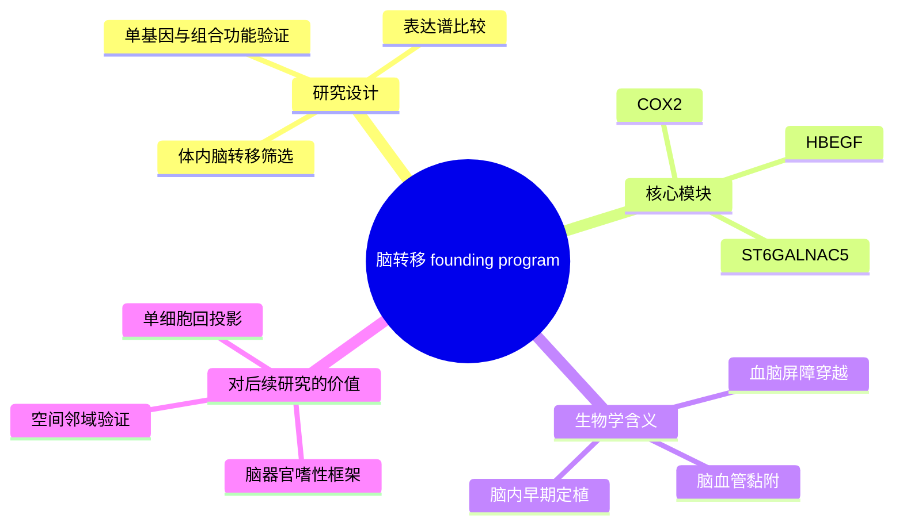

# 脑转移血脑屏障穿越代表性研究-2009

- 标题：Genes that mediate breast cancer metastasis to the brain
- 发表时间：2009-05
- 期刊：Nature
- PubMed/DOI 链接：
  - PubMed：https://pubmed.ncbi.nlm.nih.gov/19421193/
  - DOI：https://doi.org/10.1038/nature08021
- 研究类型：经典机制原始研究；体内筛选 + 基因表达比较 + 血脑屏障穿越功能验证

## 选择理由
本轮继续重查 2026-06-15 之后的相关窗口，没有看到一篇明显强于库内近几日条目的新乳腺癌远处转移原始研究，尤其在脑转移方向，新增结果大多只是局部补充而非真正值得替换的主线工作。因此按既定 fallback 规则，补入一篇仍然高度可复用的 brain-organotropism founding study。相较再增加一篇增量有限的新文，这篇文章更适合承担“脑转移器官嗜性起点”的角色，因为它把脑转移从泛泛的侵袭表型拆成了可验证的 BBB 穿越与脑内定植程序。

## 研究问题
乳腺癌细胞为什么能跨越血脑屏障并在脑内稳定定植？这种能力是否由一组可转移、可组合的基因程序驱动，而不是由单一驱动基因或单纯增殖优势解释？

## 摘要式结论
这篇文章最重要的贡献，是把“乳腺癌脑转移”具体化为一个与血脑屏障穿越直接相关的协同程序。作者从 MDA-MB-231 体系中体内筛选脑转移亚株，再与原始细胞和肺/骨方向的既有转移逻辑对照，提出 `COX2`、`HBEGF`、`ST6GALNAC5` 是脑转移尤其关键的模块。其中 `ST6GALNAC5` 最有代表性，因为它更直接对应脑血管内皮黏附与 BBB 穿越这一脑特异门槛。对用户课题最有价值的点，不只是记住这几个基因，而是接受它建立的范式：脑转移需要“先过屏障，再占位扩张”，因此后续单细胞、空间和免疫研究都应优先追问哪个细胞状态在支持这两步，而不只是终末病灶里哪个 marker 最高。

## 文章行文逻辑
1. 先通过体内反复筛选建立高脑转移能力亚株，而不是直接把原发灶与脑转移灶静态对比。
2. 再做表达谱比较，寻找与脑转移表型稳定伴随的候选程序。
3. 将候选基因逐个及组合验证，证明其对 BBB 穿越和脑定植的功能贡献。
4. 把脑转移与肺转移等既有器官嗜性程序对照，说明脑转移并不是泛转移增强，而是带有额外器官门槛。
5. 最后提出乳腺癌脑转移可由“跨屏障 + 黏附适配 + 脑内扩增”三段式框架理解。

## 主要创新点
- 把脑转移定义为包含器官特异门槛的协同程序，而不是简单的高侵袭性。
- 明确提出 `ST6GALNAC5` 这类更贴近脑环境适配的分子，而非只关注通用迁移因子。
- 用功能验证把“表达差异”推进为“跨血脑屏障能力”的可操作机制。

## 关键数据类型与是否可下载
- 论文核心是模型筛选、功能实验和表达程序提炼，本身更像机制锚点而不是现成大队列入口。
- 本轮未把原文内实验部分额外登记成独立公开 accession 资源。
- 更适合作为公开验证队列的外部入口是 [[乳腺癌脑转移表达队列GSE52604-2026-06-17]]，可用于检查脑转移相关程序是否在患者 bulk 层保持方向一致。

## 可借鉴的方法
- 先用器官定向体内筛选建立“位点偏好”模型，再回到分子比较。
- 不把脑转移理解成终点组织学，而是拆分为 BBB 穿越与脑内扩增两个步骤。
- 功能验证优先围绕“步骤模块”而不是单纯 top DEG 展开。

## 可借鉴的创新点
- 对用户后续脑转移分析，可先问候选程序更像“过屏障模块”还是“定植扩张模块”，避免把所有脑转移 marker 混成一个层面。
- 现代单细胞和空间数据可回投影这一经典框架，识别究竟是恶性细胞、内皮邻域、胶质细胞还是髓系细胞在支撑这些步骤。
- 这篇文献与近年的 `FGF2-NCAM1-FGFR1`、`ACSS2`、`TRM/TLS` 和 `TAM-MTC` 笔记能自然衔接成“跨屏障 -> 定植 -> 免疫/代谢适应”的连续主线。

## 与用户课题的潜在关联
- 脑转移：这是非常合适的上游骨架，可为近期脑转移免疫、代谢和空间笔记提供统一入口。
- 器官嗜性：它说明不同器官不是简单共享一套转移程序，脑转移需要额外处理 BBB 与脑内生态位。
- 方法层：若用户要做候选轴优先级排序，这篇文献提供了“先按步骤模块分层，再做公开数据验证”的思路。

## 局限性
- 时代较早，缺少单细胞、空间组学和免疫分层。
- 以模型驱动为主，患者异质性与治疗背景覆盖有限。
- 更像脑转移 founding study，而不是可直接照搬的现代临床定量框架。

## 相关笔记
- [[FGF2-NCAM1-FGFR1脑转移-2026]]
- [[脑转移TAM-MTC单细胞图谱-2026]]
- [[脑转移TRM与TLS景观-2026]]
- [[ACSS2抑制铁死亡驱动脑转移-2026]]
- [[乳腺癌脑转移表达队列GSE52604-2026-06-17]]
