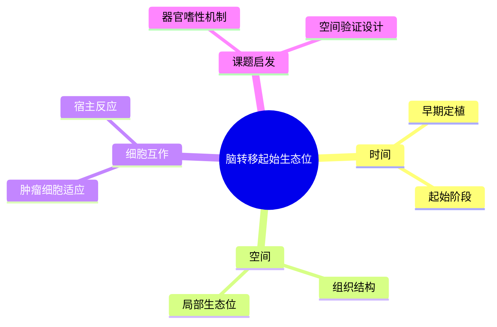

# 脑转移起始生态位与结构

- 发表时间：2024-06-26
- 期刊：Cancer Cell
- PubMed：[PMID: 38937299](https://pubmed.ncbi.nlm.nih.gov/38937299/)
- DOI：[10.1016/j.ccell.2024.06.010](https://doi.org/10.1016/j.ccell.2024.06.010)
- 研究类型：脑转移起始过程的空间结构与微环境机制研究

## 研究问题
乳腺癌细胞在脑内定植最早期，形成转移灶所需的局部结构和微环境条件是什么。

## 摘要式结论
这篇文章的价值在于把脑转移从“结果态病灶”拉回到“起始态生态位”。作者强调脑转移启动阶段并非单纯细胞落地，而是伴随特定组织结构、局部微环境重塑和细胞互作变化。对用户课题而言，它非常适合提供“器官嗜性为什么会发生”的叙事骨架，也适合指导空间层验证设计。

## 文章行文逻辑
1. 提出脑转移起始阶段信息缺失。
2. 用高分辨率组织结构与微环境手段定位早期病灶。
3. 比较不同脑内微环境区的肿瘤细胞状态和宿主反应。
4. 提炼出有利于转移启动的空间结构特征。

## 主要创新点
- 聚焦脑转移最早期，而非成熟病灶。
- 强调“结构 + 微环境”双维度解释。
- 为脑转移空间研究提供了更强的问题意识。

## 关键数据类型与是否可下载
- 空间/组织层数据：文章配套数据托管于 [Mendeley Data](https://data.mendeley.com/)，可下载但需核对具体子数据和格式。
- 图像与组织学结果：通常可在补充材料获得。
- 若包含单细胞或转录层附件，需逐项确认开放范围。

## 可借鉴的方法
- 若用户做脑转移验证，建议加入“早期定植 vs 成熟病灶”分层，而非只分析终末病灶。
- 空间验证上可借鉴“病灶边缘/核心/邻近脑组织”分区思路。

## 可借鉴的创新点
- 把器官嗜性问题具体化到“起始生态位”。
- 适合与单细胞结果互补，形成结构层和细胞层的闭环。

## 与用户课题的潜在关联
- 若课题希望解释脑嗜性，这篇文章比单纯终点图谱更关键。
- 若要设计空间转录组或多重免疫染色验证，本研究可直接提供分区逻辑。

## 局限性
- 起始态样本极难获取，因此模型系统与真实患者之间可能存在偏差。
- 空间数据解释力强，但通量和样本量通常受限。
