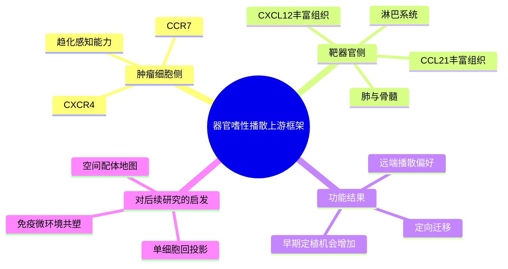

# 趋化因子受体器官嗜性播散代表性研究-2001

- 标题：Involvement of chemokine receptors in breast cancer metastasis
- 发表时间：2001-03-01
- 期刊：Nature
- PubMed/DOI 链接：
  - PubMed：https://pubmed.ncbi.nlm.nih.gov/11385596/
  - DOI：https://doi.org/10.1038/35065016
- 研究类型：经典机制研究；患者样本表达观察 + 体外趋化实验 + 小鼠转移模型

## 选择理由
截至 2026-06-18 再次复核最近几天的相关检索窗口后，没有看到一篇明确强于库内近一周条目的“新发表乳腺癌远处转移原始研究”。与其为了追新补一篇增量有限的新文，这篇 2001 年 Nature 更适合承担当前缺口：它提供的是器官嗜性转移最上游、最可迁移的“趋化轴入口”，能把最近已经积累的脑转移、肺转移、骨转移、卵巢转移笔记串成一条从播散偏好到生态位适应的连续主线。

## 研究问题
乳腺癌细胞为何会对特定器官产生定向播散偏好？这种偏好是否部分由肿瘤细胞表面的趋化因子受体决定，使其能够感知远端器官分泌的配体并发生趋化迁移，而不只是被动地“随血流到哪算哪”？

## 摘要式结论
这篇文章把乳腺癌器官嗜性转移从“结果描述”推进到了“可测试的受体-配体框架”。作者指出，乳腺癌细胞高表达的 `CXCR4` 与 `CCR7`，可分别响应肺、肝、骨髓、淋巴结等组织富集的配体环境，从而促进肿瘤细胞向这些器官迁移。对用户课题最有价值的，不只是 `CXCR4/CCR7` 这两个名字本身，而是它建立了一个长期有效的分析范式：器官嗜性不是单纯终末病灶的静态表型，而是“肿瘤细胞内在感知系统”与“目标器官配体地形”之间的匹配关系。后续单细胞、空间组学和免疫微环境研究，都可以回到这个框架下追问，到底是哪类肿瘤细胞状态保留了这种受体程序，哪类基质/免疫细胞在维持这些配体场。

## 文章行文逻辑
1. 先观察多种乳腺癌细胞和患者样本中的趋化因子受体表达谱，提出 `CXCR4`、`CCR7` 是候选关键轴。
2. 再把目标器官的配体分布纳入解释，强调肺、肝、骨髓、淋巴组织等转移常见位点本身就富含相应配体。
3. 用趋化和侵袭实验验证：表达这些受体的肿瘤细胞会沿配体梯度迁移。
4. 通过阻断受体信号削弱迁移和转移，证明这不是伴随现象，而是有功能贡献的播散模块。
5. 最终建立“受体-配体匹配决定器官播散偏好”的原型模型，为之后的器官嗜性研究提供上游逻辑。

## 主要创新点
- 用趋化因子受体解释乳腺癌的器官选择性转移，而不是把转移看成完全随机事件。
- 把目标器官的配体环境正式纳入肿瘤播散机制，而非只分析肿瘤细胞自身基因。
- 提供了一个可延展到后续免疫、基质、血管生态位研究的统一入口。

## 关键数据类型与是否可下载
- 文章核心证据来自受体表达、趋化实验和动物模型验证，更偏机制锚点，而不是现成的大型公开组学队列。
- 本轮未把原文实验部分单独登记为可直接复用的开放 accession。
- 更适合搭配现有公开队列做再验证，例如：
  - [[乳腺癌跨器官转移微阵列GSE14020-2026-06-16]]
  - [[乳腺癌多器官配对转移RNA队列-2026-06-02]]
  - [[乳腺癌肺转移调控图谱GSE295918-2026-06-18]]

## 可借鉴的方法
- 做器官嗜性分析时，不只看终点病灶差异表达，还要同时看肿瘤侧受体与靶器官侧配体。
- 可先从公开 bulk/scRNA 数据中提炼 `CXCR4/CCR7` 相关状态，再到空间层验证配体细胞来源。
- 适合把“播散倾向”和“定植扩张”拆开分析，避免把不同阶段程序混成一个 signature。

## 可借鉴的创新点
- 可以把脑、肺、骨、卵巢转移分别理解为不同“配体地形”下的播散筛选，而不是单一转移能力强弱。
- 后续若整理器官嗜性主线，建议把 `趋化受体感知 -> 血管/屏障通过 -> 生态位适应 -> 免疫逃逸` 作为层级框架。
- 对单细胞数据，可优先追问哪些肿瘤细胞亚群保留高 `CXCR4` / `CCR7`，以及这些状态是否与休眠、EMT、干性或免疫冷相关。

## 与用户课题的潜在关联
- 乳腺癌脑/肺/骨/卵巢转移都可以回到“器官配体环境是否筛选特定播散细胞状态”这一上游问题。
- 这篇文章尤其适合作为近期肺器官嗜性、脑转移血脑屏障、骨转移生态位等笔记的共同前置背景。
- 若后续要做跨器官 signature 归类，这篇文献能提供“播散入口层”标签，避免把晚期生态位适应误当作最初器官选择机制。

## 局限性
- 年代较早，缺少单细胞、空间组学和现代临床异质性分层。
- 更强调趋化播散入口，对后续器官内扩张、免疫逃逸和治疗压力演化覆盖不足。
- `CXCR4/CCR7` 解释的是重要一层，但不能替代后续脑/肺/骨/卵巢各自特异的定植与生态位机制。

## 相关笔记
- [[肺器官嗜性基因程序代表性研究-2005]]
- [[骨转移多基因程序代表性研究-2003]]
- [[脑转移血脑屏障穿越代表性研究-2009]]
- [[乳腺癌跨器官转移微阵列GSE14020-2026-06-16]]
- [[乳腺癌多器官配对转移RNA队列-2026-06-02]]
- [[乳腺癌肺转移调控图谱GSE295918-2026-06-18]]
