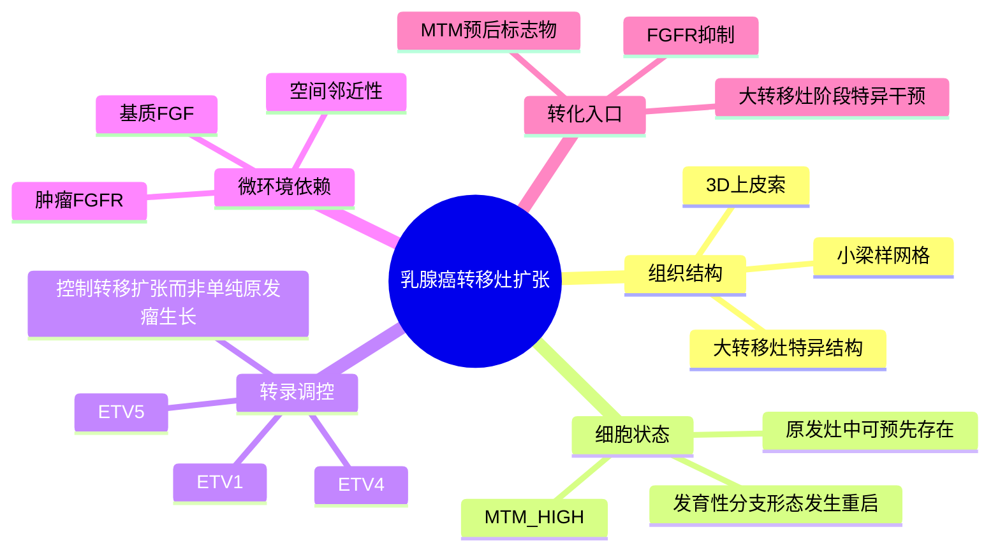

# 转移灶3D形态发生蓝图-2026

- 标题：A 3D morphogenetic blueprint for metastatic outgrowth in breast cancer
- 发表时间：2026-03-31
- 期刊：Cell
- PubMed：检索页显示已有 PubMed abstract，但本轮未能稳定解析到 PMID；后续可用 DOI 反查补齐
- DOI：[10.1016/j.cell.2026.03.009](https://doi.org/10.1016/j.cell.2026.03.009)
- 研究类型：机制研究 + 单细胞转录组 + 空间转录组 + AI 辅助 3D 成像 + 小鼠功能验证

## 研究问题
乳腺癌转移灶从微小播散细胞长成致死性大转移灶时，是否只是无序增殖，还是存在可定义、可预测、可干预的组织形态发生程序？

## 摘要式结论
文章提出“metastatic trabecular morphogenesis, MTM”这一转移灶扩张程序：大转移灶并非简单细胞团，而是由上皮索构成的三维小梁样网格结构。`MTM^HIGH` 状态可在部分原发灶中预先存在，并与后续转移风险相关；`ETV1/4/5` 是该程序的核心转录调控因子。空间与功能实验进一步指向基质来源 `FGF -> FGFR` 信号是 MTM 依赖点，提示 FGFR 抑制可作为阻断大转移灶扩张的候选策略。

## 文章行文逻辑
1. 先用 3D 成像和组织结构分析证明乳腺癌大转移灶具有重复出现的上皮索-小梁结构，而不是随机实心团块。
2. 再用单细胞转录组和空间转录组定义与该结构相伴随的 MTM 表达程序。
3. 将 MTM 状态回溯到原发肿瘤，提出部分将来转移的原发灶已经带有 `MTM^HIGH` 倾向。
4. 通过 ChIP-seq 和转录调控分析锁定 `ETV1/4/5`，并用功能实验区分“原发瘤生长”“初始播散”和“转移灶扩张”三个阶段。
5. 最后把空间配体-受体分析落到 `FGF/FGFR` 轴，提出可药物化的转移扩张依赖。

## 主要创新点
- 把“转移灶 outgrowth”从细胞增殖问题推进到组织形态发生问题，强调三维结构和发育程序。
- 将原发灶风险预测、转移灶结构、转录因子调控和微环境信号放在同一因果链条中。
- 区分了初始播散与宏转移扩张，提示某些靶点可能只在致死性大转移灶阶段真正关键。
- 将 `ETV1/4/5-MTM-FGF/FGFR` 作为可验证、可干预的轴线，而不是只给出描述性图谱。

## 关键数据类型与是否可下载
- 单细胞 RNA-seq：用于识别 MTM 相关肿瘤细胞状态和微环境组成；文章摘要明确使用，但本轮未在开放摘要中确认 accession。
- 空间转录组：用于定位 `FGF/FGFR` 依赖和肿瘤-基质关系；适合后续复现配体-受体空间邻近分析。
- AI 辅助 3D 成像/数字病理：用于定义小梁样结构和拓扑特征；可能需要依赖作者补充数据或代码。
- 小鼠功能实验与类器官/转移模型：用于验证 `ETV1/4/5` 和 FGFR 依赖。

## 可借鉴的方法
- 对转移灶不要只做细胞类型比例分析，应加入空间结构特征，例如 cord、trabecular lattice、compact/expansile growth 等形态指标。
- 单细胞状态可以与数字病理结构联合建模：先定义空间/结构 phenotype，再回推相应表达程序。
- 将原发灶中的预测性状态与转移灶中的功能性状态相互验证，有助于区分“转移风险标志物”和“转移执行程序”。
- 对脑、肺、骨等器官转移，可以测试是否存在器官共享的 MTM 程序，以及不同器官微环境是否通过不同配体驱动同一形态发生程序。

## 可借鉴的创新点
- 课题中若有乳腺癌脑转移或骨转移空间数据，可尝试构建“转移灶形态-细胞状态-配体来源”的三层框架。
- `ETV1/4/5`、FGFR 通路和发育性分支形态发生基因集可作为跨队列验证 signature。
- 对大转移灶和微转移灶分层分析，避免把 outgrowth 相关机制误判为播散或侵袭机制。

## 与用户课题的潜在关联
- 对乳腺癌脑/肺/骨转移研究非常相关：用户课题若关注器官嗜性，MTM 提供了“到达器官后如何扩张”的结构化问题。
- 可以与已有笔记中的肺泡巨噬细胞、神经-CAF、TRM/TLS、LCN2 肺转移前生态位形成互补：这些多偏微环境许可或免疫排斥，本文偏肿瘤细胞-组织结构扩张程序。
- 若后续整合公开 scRNA/spatial 数据，可把 MTM signature 与免疫排斥、CAF、内皮屏障、T 细胞耗竭等模块相关联。

## 局限性
- 本轮尚未核实到公开 accession，短期更适合作为机制框架和候选 signature 来源，而不是立即复算的数据入口。
- MTM 是否在脑、骨、卵巢等不同转移部位具有同等作用，需要独立队列验证。
- FGFR 抑制的转化潜力需要考虑分子亚型、毒性、给药窗口和宏转移阶段特异性。

## 相关笔记
- [[感觉神经-CAF免疫排斥-2026]]
- [[脑转移TRM与TLS景观-2026]]
- [[肺泡巨噬细胞与肺转移时序-2024]]

