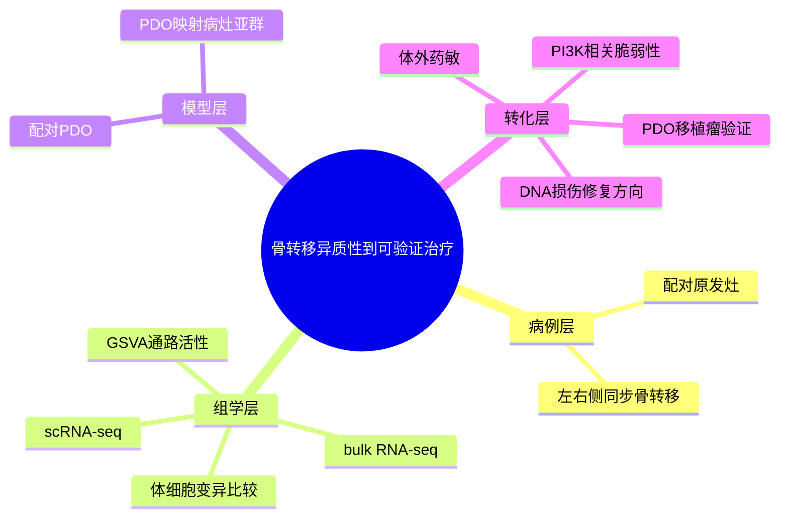

# 骨转移单细胞异质性与PDO-2022

- 标题：Single cell heterogeneity and evolution of breast cancer bone metastasis and organoids reveals therapeutic targets for precision medicine
- 发表时间：2022-10
- 期刊：Annals of Oncology
- PubMed/DOI 链接：
  - PubMed：https://pubmed.ncbi.nlm.nih.gov/35764274/
  - PMCID：https://pmc.ncbi.nlm.nih.gov/articles/PMC10007959/
  - DOI：https://doi.org/10.1016/j.annonc.2022.06.005
- 研究类型：代表性转化研究；人源骨转移单细胞 + 配对 bulk RNA-seq + PDO 药敏验证

## 选择理由
截至 2026-06-21，再次复核 `2026-06-19` 之后的 PubMed 相关窗口，仍未看到一篇明显强于库内近几日条目的新乳腺癌远处转移原创研究。与其继续补弱“最新”，这篇 `Ann Oncol 2022` 更值得落地，因为它正好填补当前档案里仍较薄的一层：**人源乳腺癌骨转移病灶内部异质性、双侧骨转移分化轨迹，以及 PDO 是否能保留病灶内关键状态并转向可测试药敏**。它比单纯经典骨转移奠基文更贴近后续验证与方法复用。

## 研究问题
同步双侧骨转移是否共享核心恶性细胞状态，还是会在不同骨位点继续分化？患者来源类器官是否能保留这些关键状态，并暴露可操作的精准治疗靶点？

## 摘要式结论
这篇研究围绕一例配对原发灶与双侧骨转移病例展开，结合单细胞、bulk RNA-seq 和 PDO 药敏，说明骨转移不是“一个统一终点”，而是**共享主干基础上的持续分化过程**。研究显示，不同骨病灶之间既有共同的肿瘤谱系背景，也有各自富集的转录程序；单细胞层面可拆出不同上皮细胞亚群；PDO 能部分保留这些病灶状态，并把 `PI3K`/`DNA damage repair` 方向转成可实验测试的治疗窗口。对当前课题最有价值的不是某一个药名，而是它给出了“病灶异质性 -> 单细胞分群 -> PDO 映射 -> 药敏验证”的一整条可迁移路径。

## 文章行文逻辑
1. 先对配对原发灶、左侧骨转移和右侧骨转移做病理与受体状态确认，保证比较对象成立。
2. 再用体细胞变异、表达增减和通路活性比较原发灶与双侧骨转移，界定共享主干和分支演化。
3. 随后对骨转移病灶做 scRNA-seq，拆分恶性上皮亚群和富集程序。
4. 再把对应 PDO 做单细胞映射，检验类器官是否保留病灶内关键状态。
5. 最后用 `Alpelisib`、`Talazoparib` 及 PDO 衍生移植瘤实验，把分子差异落到可测试药敏上。

## 主要创新点
- 把“骨转移异质性”从 bulk 相关性推进到单细胞分群和病灶间演化比较。
- 不是停留在病灶描述，而是进一步问 PDO 是否保留关键恶性状态，增强了转化可用性。
- 给出一条紧凑但完整的验证链：`患者病灶 -> 单细胞状态 -> PDO 保真 -> 药物脆弱性`。

## 关键数据类型与是否可下载
- 人源骨转移 scRNA-seq：有，GEO `GSE190772` 可下载。
- 配对原发灶与骨转移 bulk RNA-seq：有，包含在同一 GEO 条目中。
- PDO 单细胞与药敏：有，GEO 提供对应表达矩阵；药敏图和 PDO 移植瘤结果见论文。
- 下载判断：可下载且实用，适合作为骨转移“深描案例 + 方法模板”资源，但样本量小，不适合单独承担广泛统计结论。

## 可借鉴的方法
- 用“同一患者多病灶配对”优先替代跨患者混合比较，先锁定真正的病灶分化。
- 把病灶 scRNA 与 PDO scRNA 做锚定映射，而不是默认类器官天然代表原病灶。
- 在候选治疗方向上，优先从单细胞异质性出发找“哪一类恶性状态最值得打”，而不是只做平均表达差异。

## 可借鉴的创新点
- 后续若做脑/肺/骨跨器官比较，可以把“病灶内亚群保真度”作为 PDO 或模型系统是否可信的额外评价维度。
- 若用户后续整合骨转移单细胞资源，可先在 `GSE190772` 里定义恶性细胞状态，再回投到更大骨转移 atlas 或早期播散数据中检验。
- 这篇文章提示骨转移方向不一定只能问免疫抑制，也可以同时问“病灶内部是否存在可药物化的恶性细胞分支”。

## 与用户课题的潜在关联
- 适合连接当前库里的两条骨转移主线：[[骨转移多基因程序代表性研究-2003]] 提供上游骨嗜性框架，这篇文章提供病灶落地后的单细胞异质性与可治疗脆弱性。
- 可与 [[骨转移SAMENT生态位标记-2026]] 互补：前者偏恶性细胞状态与 PDO，后者偏生态位邻近细胞与免疫排斥。
- 如果后续要把骨、脑、肺、卵巢做统一比较，这篇文章可以承担“骨转移患者级高分辨率深描样本”的角色，而不是泛癌或模型替代。

## 局限性
- PubMed 记录显示本文为 `Letter`，且无摘要，信息密度高但展开有限。
- 设计非常强，但核心仍是少数深描样本，统计泛化能力有限。
- PDO 保留的是部分而非全部病灶状态，不能默认替代真实骨微环境。
- 药敏结论更适合作为个体化线索，不能直接外推为普适骨转移治疗策略。

## 相关笔记
- [[骨转移多基因程序代表性研究-2003]]
- [[骨转移SAMENT生态位标记-2026]]
- [[乳腺癌骨转移早期播散单细胞GSE241165-2026-06-20]]
- [[乳腺癌骨转移单细胞GSE190772-2026-06-21]]
