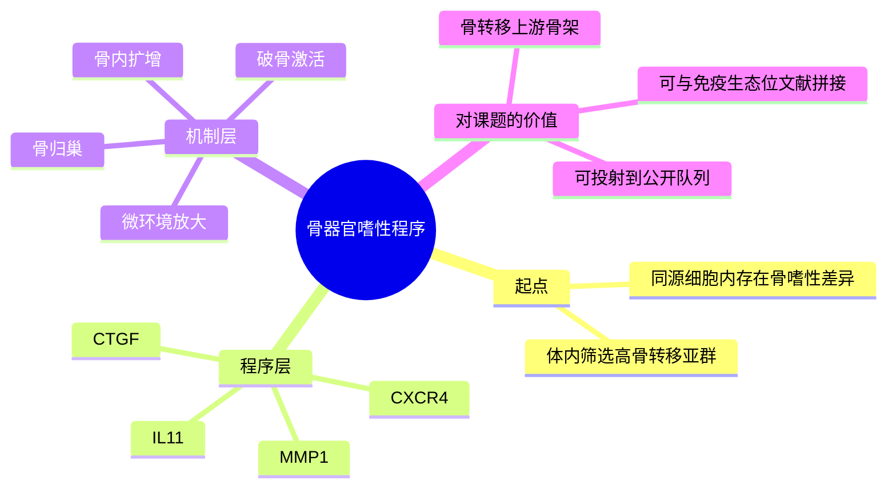

# 骨转移多基因程序代表性研究-2003

- 标题：A multigenic program mediating breast cancer metastasis to bone
- 发表时间：2003-06
- 期刊：Cancer Cell
- PubMed/DOI 链接：
  - PubMed：https://pubmed.ncbi.nlm.nih.gov/12842083/
  - PubMed 搜索页：https://pubmed.ncbi.nlm.nih.gov/?term=A+multigenic+program+mediating+breast+cancer+metastasis+to+bone
  - DOI：本次运行未再从期刊页稳定核到 DOI，正式引用前建议回原刊页补核
- 研究类型：经典机制原创研究；器官嗜性基因程序筛选 + 功能验证

## 选择理由
截至 2026-06-20，再次复核 2026-06-19 之后的最新窗口后，仍未见到一篇明显强于库内近几日条目的新乳腺癌远处转移原创研究。与其为了“最新”补一篇边际价值有限的文章，不如补上当前档案里仍缺的骨转移上游奠基文献。这篇 `Cancer Cell 2003` 的价值在于，它把“骨转移偏好”从现象描述推进到“可由协同基因程序驱动”的层面，正好能和近年的骨 niche、免疫排斥与早期播散笔记拼成上下游链条。

## 研究问题
乳腺癌为什么会偏向骨转移？这种骨嗜性是否由一组稳定、可筛选、可功能验证的多基因程序介导，而不是单个基因偶然变化？

## 摘要式结论
作者从体内筛选得到高骨转移能力的乳腺癌细胞群，结合表达谱和功能实验，提出并验证了一组协同促进骨定植和骨破坏的候选基因程序，核心包括 `CXCR4`、`IL11`、`CTGF`、`MMP1` 等。文章最关键的贡献不是证明某一个基因最强，而是提出“骨转移是多模块协同适应”的框架：肿瘤细胞需要同时具备归巢、微环境重塑和骨内扩增的能力。

## 文章行文逻辑
1. 先通过体内筛选证明同源乳腺癌细胞内存在稳定的骨嗜性差异。
2. 再比较高骨转移与低骨转移亚群的表达差异，提出候选骨转移程序。
3. 之后用 gain/loss-of-function 验证这些基因不是旁观者，而是实质影响骨转移负担。
4. 最后把候选程序放回骨微环境中解释，强调它们如何联动破骨、趋化和局部扩增。

## 主要创新点
- 早期明确提出“骨转移由多基因程序而非单基因决定”的框架。
- 把器官嗜性和骨微环境重塑放进同一因果链，而不是分开讲归巢与生长。
- 为后续所有“骨转移 signature / 器官特异转移模块”工作提供了可追溯的上游原点。

## 关键数据类型与是否可下载
- 体内筛选模型：有，属于经典功能模型证据。
- 基因表达谱：有；配套公开表达入口可见 GEO `GSE2603`，更适合作为程序回看入口而非现代高分辨率复用资源。
- 功能验证：有，包括候选基因组合对骨转移能力的影响。
- 下载判断：更适合承担“假设来源”角色；真正的现代验证仍需结合单细胞、空间或患者队列。

## 可借鉴的方法
- 先做器官定向体内筛选，再做表达差异和功能闭环，而不是只停留在相关性。
- 优先构建“程序”而非堆单基因列表，这更适合后续对单细胞或 bulk 队列做模块投射。
- 把肿瘤细胞内在程序与器官微环境响应放在同一分析框架中。

## 可借鉴的创新点
- 在当前课题里可把骨转移拆成“上游骨嗜性程序”与“下游免疫/基质生态位维持”两层。
- 后续整合骨转移单细胞资源时，可先投射这组经典程序，再看是否叠加 `ER+ macrophage`、`T cell exclusion` 等新近生态位信号。

## 与用户课题的潜在关联
- 这篇文献非常适合做骨转移主线的最上游骨架，和 [[骨转移SAMENT生态位标记-2026]] 形成互补：前者回答“哪些肿瘤内在程序使其偏向骨”，后者回答“到了骨里后由谁维持排斥性生态位”。
- 若要比较脑/肺/骨器官嗜性，骨位点不应只看免疫抑制，还应先问经典 `CXCR4 / IL11 / CTGF / MMP1` 程序是否仍可见。
- 可与 [[乳腺癌骨转移早期播散单细胞GSE241165-2026-06-20]] 联用，形成“经典程序 -> 现代单细胞时序”的两段式验证链。

## 局限性
- 年代较早，数据层以当时表达谱和模型实验为主，分辨率远低于单细胞/空间研究。
- 更强于提出骨转移程序，不足以单独解释后续骨微环境中的免疫异质性。
- 程序来自特定模型筛选，迁移到不同分型、不同治疗背景的人样本时仍需再验证。

## 相关笔记
- [[骨转移SAMENT生态位标记-2026]]
- [[乳腺癌骨转移早期播散单细胞GSE241165-2026-06-20]]
- [[肺器官嗜性基因程序代表性研究-2005]]
- [[转移生物学新原则综述-2017]]
