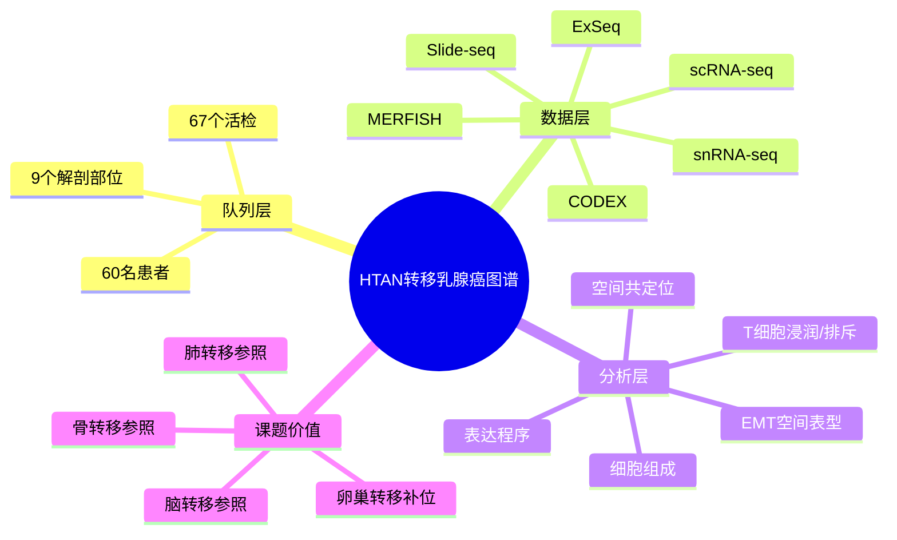

# HTAN转移乳腺癌多模态图谱-2024

- 标题：A multi-modal single-cell and spatial expression map of metastatic breast cancer biopsies across clinicopathological features
- 发表时间：2024-10-30
- 期刊：Nature Medicine
- PubMed/DOI 链接：
  - DOI: https://doi.org/10.1038/s41591-024-03215-z
  - PubMed: https://pubmed.ncbi.nlm.nih.gov/39478111/
- 研究类型：患者队列图谱研究；单细胞与空间多模态整合

## 选择理由
本轮再次复查 2026-06-11 之后的 PubMed 窗口，没有发现一篇在“乳腺癌远处转移直接相关性 + 可复用资源增量 + 机制深度”上明显优于近几天已入库 2026 文献的新条目。与其补一篇边际收益有限的新文献，不如补齐当前 repo 版 vault 中尚缺失、但后续复用价值极高的代表性患者图谱。HTAN 这篇文章最重要的价值不在单一通路，而在于它提供了一个跨器官、跨平台、带空间层的统一参照系。

## 研究问题
在真实世界转移性乳腺癌患者样本中，不同受体分型、不同转移部位、不同测序/空间平台下，哪些细胞状态和空间组织规律是稳定可复用的？这些规律能否为脑、肺、骨、卵巢等器官转移研究提供统一背景坐标，而不是各做各的局部故事？

## 摘要式结论
作者构建了 60 名转移性乳腺癌患者、67 个活检样本的多模态图谱，整合了 `scRNA-seq`、`snRNA-seq` 以及 `Slide-seq / MERFISH / ExSeq / CODEX` 等空间层数据。文章的核心产出不是“某一个新 marker”，而是三个高复用结论：
1. 转移灶的细胞组成和表达程序具有明显异质性，但在 macrophage、EMT、T cell infiltration/exclusion 等模块上仍可归纳出跨样本可比较的状态轴。
2. 不同空间技术各有分辨率与覆盖深度取舍，但在统一分析框架下可以相互补位，适合做患者样本的空间验证。
3. 该图谱可作为跨器官转移研究的“参考坐标系”，尤其适合先提炼候选状态，再回投到器官特异队列中做验证。

## 文章行文逻辑
1. 先说明转移性乳腺癌微环境长期缺少高质量、临床注释充分、且能比较不同技术的患者图谱。
2. 随后搭建 HTAN 队列，纳入多器官、多分型、多技术平台样本。
3. 再把单细胞与空间数据放进同一整合框架，比较细胞组成、表达程序和空间邻域关系。
4. 最后抽取对临床和机制最有价值的共性轴，例如 macrophage 共定位、EMT 空间模式、局部 T 细胞浸润与排斥。

## 主要创新点
- 把多种空间技术真正放到同一患者级框架里比较，而不是各自独立展示。
- 队列覆盖多器官转移位点，可作为“跨器官对照底板”。
- 给出了局部免疫浸润/排斥、macrophage 邻域、EMT 空间表型等后续最容易迁移到乳腺癌转移课题的状态轴。

## 关键数据类型与是否可下载
- 患者样本：67 个活检，来自 60 名转移性乳腺癌患者。
- 部位覆盖：`liver 37`、`axilla 9`、`breast 7`、`bone 5`、`chest wall 3`、`neck 3`、`brain 1`、`lung 1`、`skin 1`。
- 单细胞/单核层：`30` 个 `scRNA-seq`，`37` 个 `snRNA-seq`。
- 空间层：最多 `15` 个病灶有匹配空间数据。
- 下载入口：
  - dbGaP：`phs002371`
  - Broad Single Cell Portal：`SCP2702`
  - CELLxGENE：`a96133de-e951-4e2d-ace6-59db8b3bfb1d`
- 下载性判断：
  - 处理后矩阵和浏览入口较友好，可直接用于 signature/marker 复核。
  - 原始层需要经 `dbGaP` 授权访问，不属于“即点即下”的公开原始数据。

## 可借鉴的方法
- 先做“统一参考图谱”，再把器官特异问题投回专门队列验证，而不是一开始就在小样本器官队列里过拟合。
- 用跨平台整合方式比较空间结果，避免把技术差异误判为生物差异。
- 用患者级 metadata 做分层，优先比较器官、分型、免疫浸润状态三类轴。

## 可借鉴的创新点
- 把“跨器官共享程序”和“器官特异放大程序”分开处理。
- 把空间免疫排斥和 EMT 表型放到同一张图谱中读，而不是割裂分析。
- 将处理后公开入口与受控原始层并行保留，便于先做快速验证再决定是否申请受控数据。

## 与用户课题的潜在关联
- 脑转移：可作为 [[脑转移TRM与TLS景观-2026]]、[[TIMP1星形胶质细胞脑转移免疫抑制-2025]]、[[FGF2-NCAM1-FGFR1脑转移-2026]] 的统一患者参照底板。
- 肺转移：可作为 [[棕榈酸中性粒细胞肺转移-2026]]、[[CHI3L1中性粒细胞肺转移-2026]]、[[糖皮质激素-FAS转移播散免疫逃逸-2026]] 的外部状态字典来源。
- 骨转移：可与 [[骨转移SAMENT生态位标记-2026]] 对照，先看 macrophage/CAF/免疫排斥程序是否方向一致。
- 卵巢转移：虽然该图谱没有卵巢直接样本，但它能提供患者级跨器官参照，弥补卵巢公开单细胞样本稀缺的问题。

## 局限性
- brain 和 lung 直接样本都只有 `1`，bone 也只有 `5`，不适合做器官频率或稳定效应量判断。
- 多平台混合会引入技术差异，跨方法比较必须保留谨慎。
- 这是“参考图谱型”研究，强在可复用底板，不强在某条可以直接照搬的单一新机制。

## 相关笔记
- [[AURORA多组学转移图谱-2023]]
- [[乳腺癌时空异质性单细胞空间综述-2026]]
- [[乳腺癌脑转移单细胞图谱-2026]]
- [[乳腺癌卵巢转移公开数据线索-2026-06-08]]
