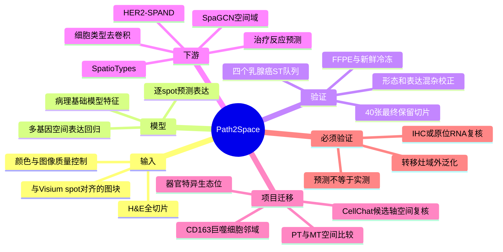

# Path2Space病理预测空间转录组-2026

## 标题

AI-predicted spatial transcriptomics unlocks breast cancer biomarkers from pathology

## 发表信息

- 发表时间：2026-05-08（online ahead of print）
- 期刊：Cell
- PubMed：https://pubmed.ncbi.nlm.nih.gov/42105763/
- DOI：https://doi.org/10.1016/j.cell.2026.04.023
- 代码与示例：https://doi.org/10.5281/zenodo.20171390
- 扩展复现代码：https://github.com/eldadshulman/path2space-extended

## 本轮选择理由

检索 2026-06-29 至 2026-06-30 新增 PubMed 记录后，乳腺癌转移相关命中主要是治疗队列、影像预测、病例报告或低复用生信研究，没有超过近期已收录的 MED4、脑转移空间免疫和 ESR1/CDK4/6 克隆演化研究。本文虽发表于 5 月，但属于尚未收录的 Cell 方法学代表作，可把常规 H&E 队列扩展为“预测的空间表达层”，对稀缺的转移灶空间组学尤其有复用价值，因此按回退规则精读。

## 研究类型

计算方法开发、外部验证与临床队列回顾性转化研究。核心任务不是从 H&E 预测一个整张切片标签，而是为切片内每个位置预测空间基因表达，再推断细胞组成、空间亚型和治疗反应。

## 研究问题

能否用常规 H&E 图像近似重建乳腺癌空间转录组，从而把昂贵、小样本的实验空间组学信号迁移到大规模病理队列，并发现生存和治疗反应相关的空间生物标志物？

## 摘要式结论

Path2Space 以与 Visium spot 对齐的 H&E 图块为输入，使用病理基础模型提取形态特征，再预测每个 spot 的多基因表达。模型在多个人源乳腺癌空间转录组队列中验证，并用于 976 例 TCGA 乳腺癌肿瘤，得到三类具有不同生物学和生存结局的 SpatioTypes。由预测表达推断的细胞类型组成和空间异质性可用于预测化疗及曲妥珠单抗反应；HER2 信号的空间混合程度提示，单一全切片平均值会遗漏与旁观者效应相关的结构信息。该方法适合大队列假设生成，但输出仍是图像驱动的估计，不能替代实验空间转录组或原位验证。

## 文章行文逻辑

1. 指出空间转录组成本高、公开队列小，限制空间标志物的统计验证。
2. 将 H&E 切成与 Visium spot 对应的图块，经颜色标准化和病理特征编码后，训练多基因空间表达回归模型。
3. 在独立乳腺癌空间转录组队列中检验跨患者、跨队列和 FFPE/新鲜冷冻组织的泛化，并与多种方法比较。
4. 从预测表达反推肿瘤、免疫和基质细胞比例，检验模型是否保留 TME 结构而非仅复现染色强度或肿瘤含量。
5. 对 976 例 TCGA 病理切片进行大规模空间推断，建立 SpatioTypes，并在 METABRIC 等队列验证生存分层。
6. 在多个新辅助治疗队列中评估化疗和曲妥珠单抗反应，提出 HER2-SPAND 等空间异质性指标。
7. 公开核心推断、QC、细胞去卷积、空间聚类、反应预测和基准比较流程，并讨论其研究用途和临床前限制。

## 主要创新点

- 输出是逐位置、多基因空间表达图，而不是单一分型或预后分数，使下游空间域、细胞组成和通路分析可在大规模 H&E 队列中进行。
- 将小规模实测空间转录组作为监督信号，再迁移到 976 例 TCGA，建立从“高成本小队列训练”到“低成本大队列验证”的路径。
- 用 SpatioTypes 和 HER2-SPAND 把空间组织方式转化为患者层指标，并与生存和治疗反应关联。
- 扩展代码公开了组织质量控制、混杂校正、细胞去卷积、跨队列投影和反应预测，不只提供一个不可解释的终点模型。

## 关键数据类型与是否可下载

- 实测空间转录组训练/验证：4 个队列共检查 101 张切片，作者最终 QC 表保留 40 张，包括 Bassiouni 22、HTAN 9、HEST 5、Martinez 4；元数据和部分示例可直接下载。
- 大队列病理推断：TCGA 976 例用于 SpatioTypes；原始 H&E 与临床/组学数据需从 TCGA/GDC 按相应许可获取。
- 治疗反应数据：扩展仓库提供 343 条队列反应标签和多种患者层预测结果；其中 HER2-SPAND 表覆盖 186 例，来自 TransNEO、IMPRESS、PBCP 和 Cedars-Sinai。
- 软件与示例：Zenodo v1.0.1 约 4.1 GB，包含 3.8 GB 输入示例、232.8 MB 输出、脚本、教程和固定环境；扩展 GitHub 仓库另提供处理后的 QC、空间聚类和反应预测表。
- 注意：Zenodo/GitHub 主要是软件、示例与处理结果，不等同于所有原始 ST、WSI 和临床数据的统一开放下载包。

## 可借鉴的方法

- 对 PT 和不同器官 MT 的 H&E 切片先做统一染色归一化与图像质量控制，再预测空间表达，避免把批次染色差异误解释为器官差异。
- 把已有单细胞定义的巨噬细胞、CAF、T/NK 和肿瘤细胞程序转换成 gene set，在预测表达图上计算局部活性和空间共定位。
- 将 CellChat 候选轴拆成发送细胞、接收细胞和配体/受体局部表达三个空间条件；仅在三者邻近且方向一致时提高候选优先级。
- 用真实空间转录组或多重 IHC/IF 作为小规模锚点，对模型在每个器官转移灶中的误差单独校准，再扩展至大病理队列。
- 参考 SPAND 思路，同时量化信号均值与空间自相关，区分“全局高表达”与“高低信号混合的异质生态位”。

## 可借鉴的创新点

- 为脑、肺、骨、卵巢转移分别建立器官特异的预测/校准层，而不是直接使用原发乳腺癌模型比较所有转移灶。
- 将“MT 新出现的细胞状态”作为空间域发现问题：先定位该状态的形态邻域，再检验是否稳定邻接特定巨噬细胞、CAF 或血管结构。
- 把预测地图用于样本筛选而非最终证据：优先挑选高置信度、空间模式相反的切片进行 RNAscope、IHC 或实验空间组学验证，可显著降低验证成本。

## 与用户课题的潜在关联

- 用户关注 PT/MT 细胞通讯与器官嗜性。Path2Space 可把现有转移灶 H&E 变成低成本的候选空间层，检验脑转移 CD163+ 巨噬细胞、肺转移中性粒细胞/血管生态位、骨转移巨噬细胞-骨细胞界面等是否具有稳定空间邻域。
- 对单细胞中 MT 特异、但 PT 无可比状态的细胞群，预测空间图可帮助定位其可能的组织学位置；结论应写成“预测支持的空间假设”，不能称为实测共定位。
- 可用于跨器官优先级排序：先比较同一 gene set 的空间聚集、邻域多样性和组织学区域，再决定哪些器官进入高成本空间组学或多重染色验证。

## 局限性

- 训练主体来自原发乳腺癌空间数据；脑、肺、骨和卵巢转移灶在基质、细胞形态和组织保存方式上均可能发生域偏移，不能直接假设泛化成立。
- 55 μm 级 Visium spot 通常包含多细胞，预测表达不是单细胞分辨率，也无法可靠区分形态相似但转录状态不同的亚群。
- 预测结果受到染色、扫描仪、坏死、治疗后纤维化和组织制备影响；作者的 QC 和混杂校正降低但不能消除这些偏差。
- 生存和疗效分析主要是回顾性关联，尚不能替代前瞻性临床验证。
- 核心 Zenodo 模型仅限非商业学术研究；扩展仓库虽为 Apache-2.0，使用时仍需同时核对模型权利与原始队列数据许可。

## 相关笔记

- [[乳腺癌脑转移空间多组学线索-2026-05-26]]
- [[脑转移空间免疫CD163巨噬细胞-2026]]
- [[HTAN转移乳腺癌多模态图谱-2024]]
- [[Path2Space代码与处理数据-2026-06-30]]
