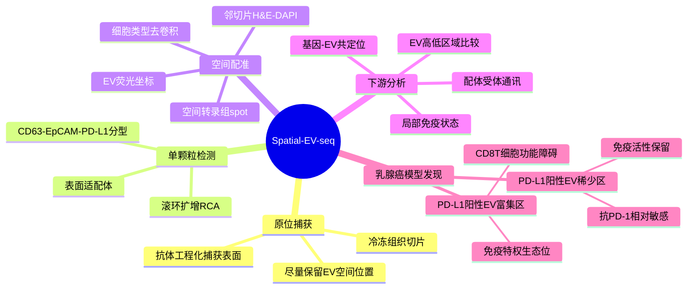

# Spatial-EV-seq空间胞外囊泡-2026

## 标题

Spatially resolved profiling of extracellular vesicles in tissues with Spatial-EV-seq

## 发表时间与期刊

- 发表时间：2026-06-26
- 期刊：Nature Biotechnology
- PubMed：https://pubmed.ncbi.nlm.nih.gov/42362724/
- DOI：https://doi.org/10.1038/s41587-026-03192-3
- 代码：https://github.com/BuckyEv/Spatial-EV-seq

## 研究类型

空间多组学方法开发与概念验证研究。作者将组织来源胞外囊泡（extracellular vesicles, EV）的原位捕获、单颗粒表面蛋白检测、空间定位和邻切片空间转录组整合为一套工作流，并在抗 PD-1 处理的乳腺癌小鼠模型中验证其免疫学用途。

## 研究问题

常规组织 EV 分离会丢失原始空间位置，空间转录组又主要测量细胞或 spot 内 RNA，因而难以回答“哪一类 EV 在组织的什么位置富集、它邻近哪些发送/接受细胞、局部免疫状态如何变化”。本文尝试建立一套可把 EV 表面分子、组织位置和空间转录状态对齐的方法。

## 摘要式结论

Spatial-EV-seq 先用抗体工程化捕获界面从冷冻组织切片中转移并固定 EV，再用识别 EV 表面分子的适配体和滚环扩增（RCA）放大单颗粒荧光信号，实现 CD63、EpCAM、PD-L1 等 EV 亚群的空间检测。随后将 EV/荧光坐标与邻切片空间转录组进行配准，分析局部细胞组成、基因表达和配体-受体关系。在抗 PD-1 处理的乳腺癌小鼠肿瘤中，PD-L1+ EV 富集区呈现更强的 CD8+ T 细胞功能障碍和免疫特权特征，而 PD-L1+ EV 稀少区相对保留免疫活性及治疗敏感性。核心贡献不是证明“PD-L1 表达越高越抑制”这一简单关系，而是把 EV 介导的免疫抑制定位到可测量的组织空间生态位。

## 文章行文逻辑

1. 先定义技术缺口：EV 研究缺少空间保真度，现有组织分离法无法追溯亲本和受体细胞。
2. 建立捕获与检测体系：组织切片贴合捕获表面，EV 被固定后用适配体-RCA 进行灵敏成像和亚型检测。
3. 用细胞来源和正常组织来源 EV 验证特异性、定量范围、空间位移和信号分辨能力。
4. 在肿瘤组织中绘制 EV 异质性，区分不同 EV 表面标志物组合和区域分布。
5. 将 EV 图像与邻切片空间转录组配准，建立 EV 富集区与细胞类型、基因状态及细胞通讯的联系。
6. 在抗 PD-1 乳腺癌模型中提出并验证“PD-L1+ EV 富集区—CD8 T 细胞功能障碍—局部治疗耐受”的空间免疫轴。

## 主要创新点

- 将组织 EV 从“离体混合液中的平均信号”转换为空间可定位的单颗粒/亚群信号。
- 用邻切片配准把 EV 表面蛋白图谱与空间转录组连接，可直接比较 EV 富集和稀少区域的细胞状态。
- 提供完整计算工具链，包括三点仿射配准、荧光通道配准、stLearn 细胞通讯分析、基因-EV 共可视化和区域差异分析。
- 把抗 PD-1 反应异质性解释为局部 EV 生态位问题，为仅依赖细胞 PD-L1 染色的分析增加了新的空间层级。

## 关键数据类型与是否可下载

- 空间转录组原始测序：GSA `CRA039683`，公开下载；14 个实验、28 个 FASTQ 文件，总量约 493.65 GB。
- EV/RCA 荧光图像、H&E/DAPI 图像和统计源数据：论文 Source Data 与 Supplementary Data 提供，具体原始显微图像的完整程度需下载后逐项检查。
- 代码：GitHub `BuckyEv/Spatial-EV-seq`，包含 Python、R 和 shell 脚本。
- 数据主体是小鼠模型和方法学验证，不是人源乳腺癌远处转移队列。

## 可借鉴的方法

- 对空间转录组相邻切片上的 IF/IHC、原位测序或 EV 信号，可借用三点仿射配准和人工地标复核流程。
- 可把组织分为 EV-high 与 EV-low 区域，再比较细胞组成、耗竭/细胞毒模块、差异表达和配体-受体网络，避免只做全组织平均相关。
- 对用户的 PT/MT CellChat 结果，可增加“EV 可能承担或放大部分配体/检查点信号”的解释层；但必须有 EV 实验或空间共定位支持，不能从转录本表达直接推断 EV 载荷。
- 论文代码支持把 Visium `filtered_feature_bc_matrix.h5`、spot 坐标、组织图像、EV/蛋白荧光坐标和去卷积结果放入同一坐标系，可作为定制分析框架参考。

## 可借鉴的创新点

- 将“细胞通讯”从细胞膜配体-受体扩展到 EV 介导的非接触通讯，并保留空间约束。
- 在不同器官转移灶之间比较时，可设计器官特异 EV 面板，如脑转移的 PD-L1/NECTIN2、肺转移的整合素/ECM 相关 EV、骨转移的 CXCR4/RANK 轴相关 EV；这些仅是待验证设计，不应直接当作本文结论。
- 可按 EV-rich niche 而不是按整张切片分组，建立“局部免疫抑制生态位”指标，随后与疗效或生存关联。

## 与用户课题的潜在关联

- 用户关注 PT 与多器官 MT 的细胞通讯。Spatial-EV-seq 提醒：部分 MT 特异通讯可能不是由发送细胞直接接触完成，而由 EV 在局部富集后持续作用；这尤其适合解释转移灶中相邻细胞表达不完全匹配、但免疫抑制仍很强的现象。
- 对脑转移 CD163+ 巨噬细胞抑制生态位，可进一步提出“PD-L1+ 或其他髓系相关 EV 是否与 CD163+ 区域共定位”的可检验问题。
- 对器官嗜性研究，EV 的空间分布、表面整合素和免疫检查点可作为连接“远处器官定植”和“局部免疫逃逸”的中间层；需要在具体脑/肺/骨/卵巢转移样本中重新验证。

## 局限性

- 相邻切片配准不能等同于同一切片共测量；组织形变、切片厚度、折叠和局部结构差异会引入定位误差。
- 当前适配体/抗体面板有限，只能观测预先选择的 EV 表面分子，不能代表完整 EV 货物组。
- 小鼠乳腺肿瘤抗 PD-1 模型不是远处转移模型，也不是人源患者队列；不能直接推断脑、肺、骨或卵巢转移中的 EV 生态位。
- GSA 元数据对 `sample1`–`sample9` 的生物学分组描述较弱，正式复用前需结合论文补充表和 Source Data 建立准确样本表。
- 配准和区域阈值选择具有人工参数，发表级结果需要盲法复核、敏感性分析和独立实验验证。

## 相关笔记

- [[外泌体整合素器官嗜性转移-2015]]
- [[TNBC癌症干细胞外泌体免疫逃逸-2026]]
- [[脑转移空间免疫CD163巨噬细胞-2026]]
- [[Spatial-EV-seq乳腺肿瘤CRA039683-2026-06-28]]
