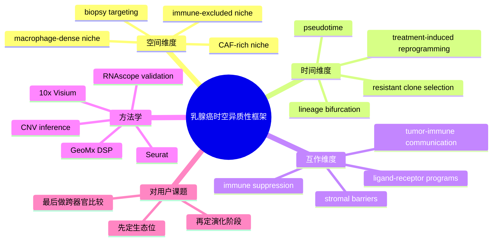

# 乳腺癌时空异质性单细胞空间综述-2026

- 标题：Spatial and temporal intratumoral heterogeneity in breast cancer: a systematic and conceptual review of single-cell and spatial omics studies
- 发表时间：2026-04-06
- 期刊：BMC Cancer
- 链接：[BMC Cancer 正文](https://link.springer.com/article/10.1186/s12885-026-15928-0)
- DOI：[10.1186/s12885-026-15928-0](https://doi.org/10.1186/s12885-026-15928-0)
- 研究类型：系统综述 + 概念整合；聚焦人乳腺癌单细胞/空间组学中的时空异质性

## 研究问题
近几年乳腺癌的 `scRNA-seq`、空间转录组和多模态研究越来越多，但这些工作通常各讲各的“局部故事”。这篇综述试图回答：从人乳腺癌真实样本出发，空间异质性、时间演化和肿瘤-微环境互作三条线能否被整合成一个可复用的分析框架？

## 摘要式结论
这篇综述的价值不在于提供新数据，而在于把 2018-2025 年间 19 篇人乳腺癌单细胞/空间研究放到同一个时空框架里重排。作者按 PRISMA 2020 检索 PubMed、Scopus 和 Web of Science，筛了 1037 条记录后纳入 19 项原始研究。整合后的稳定共识是：乳腺癌的侵袭和耐药并不是孤立基因事件，而是空间上由 immune-excluded niche、CAF-rich niche、macrophage-dense niche 组织起来，时间上又被 therapy-induced reprogramming、lineage bifurcation 和 subclonal plasticity 推动。对用户课题最有价值的是，这篇综述给出了一个很清晰的再利用框架：以后看到任意一套脑/肺/骨/卵巢转移数据，都可以先问它属于哪种空间生态位、哪种时间演化阶段、以及哪种细胞互作程序，而不是直接做无方向的差异分析。

## 文章行文逻辑
1. 先界定问题：传统 bulk 测序无法解析乳腺癌的空间和时间异质性。
2. 按 PRISMA 流程系统检索并筛选 19 项人源原始研究。
3. 将结果重组为三个维度：`spatial heterogeneity`、`temporal dynamics`、`microenvironmental interactions`。
4. 进一步总结方法学趋势，指出多数 scRNA 工作用 `Seurat` 聚类与 CNV 推断，空间研究常用 `10x Visium`、`GeoMx DSP`、RNAscope 验证，多模态研究开始联合 enhancer-gene 或代谢层。
5. 最后提出一个概念模型：空间限制的免疫排斥和时间上的克隆适应并不是两件事，而是同一肿瘤生态过程的不同切面。

## 主要创新点
- 不是泛综述，而是明确把“空间”“时间”“微环境互作”三条线合并成一个分析框架。
- 强调多数重要机制在不同平台、不同队列中呈现收敛，而不是完全碎片化。
- 明确指出目前领域仍缺标准化空间量化指标，这对后续方法学改进很重要。
- 把“高分辨率 profiling 应服务于临床取样和适应性治疗”讲得比较具体，不停留在概念层。

## 关键数据类型与是否可下载
- 本文不生成新的原始组学数据，本身不可作为下载型数据集使用。
- 它纳入的 19 项原始研究大多提供原始数据、处理流程或代码，作者在偏倚评估里专门把 raw data access 和 code availability 当作质量指标之一。
- 因此，这篇综述更适合作为“找研究入口”和“统一比较框架”，不适合作为直接复现对象。

## 可借鉴的方法
- 先按问题拆维度：空间结构、时间演化、细胞互作，而不是一上来就把所有 DEGs 混成一个列表。
- 在用户后续的数据整合里，可以仿照这篇综述的结构，给每个数据集标注 `空间分辨率 / 时间信息 / 微环境互作强度`。
- 文中对方法学的总结也很实用：scRNA 常用 `Seurat + CNV inference`，空间层常用 `Visium/GeoMx + RNAscope` 验证，多模态层逐步加入代谢和 enhancer 信息。
- 若用户后续自己写综述或项目设计书，这篇文章的 PRISMA 式筛选和证据重组方式可直接借鉴。

## 可借鉴的创新点
- 用“证据加权的概念模型”替代简单罗列文献，适合用户后续整理跨器官转移故事线。
- 将空间生态位和治疗诱导重编程放在同一张图里思考，有助于避免把“器官特异性”和“治疗史效应”分开看。
- 提醒后续工作加入量化空间指标，而不是只用定性术语如 immune exclusion 或 niche。

## 与用户课题的潜在关联
这篇综述虽然不是专门讲乳腺癌转移到 brain / lung / bone / ovary 的某一个器官，但非常适合作为用户整个课题的数据解读总框架。尤其在用户已经积累了脑转移、肺转移、骨转移和多器官图谱后，这篇综述能帮助把这些零散资源统一成“空间微域 + 时间演化 + 免疫互作”的三轴分析模型。对于后续单细胞、空间转录组或多组学数据的优先级排序，它也给出了明确方向：优先选择既有空间信息、又有治疗或进展时间信息、同时能解析髓系/淋巴/基质互作的队列。

## 局限性
- 这是系统综述，不提供新实验或新原始数据，证据强度受纳入研究质量限制。
- 纳入研究仍以 TNBC 为主，ER+ 和罕见转移部位代表性不足。
- 结论更多是“概念收敛”，不能替代器官特异、疾病阶段特异的直接证据。
- 空间量化指标和跨队列标准化仍不足，做真实整合时还需要用户自行统一注释和分析流程。

## 相关笔记
- [[HTAN乳腺癌转移多模态单细胞图谱-2026-06-07]]
- [[mTNBC时空TME与ICI响应-2026]]
- [[感觉神经-CAF免疫排斥-2026]]
