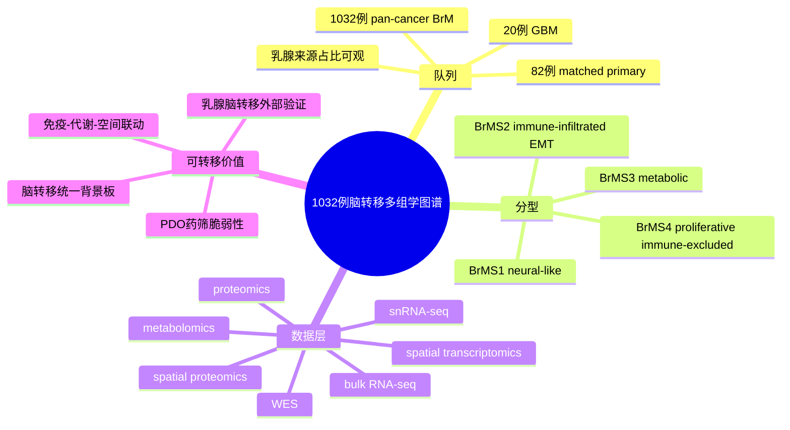

# 脑转移1032例多组学图谱-2026

- 标题：A proteogenomic atlas of 1032 brain metastases identifies molecular subtypes, immune landscapes, and therapeutic vulnerabilities
- 发表时间：2026-01-26
- 期刊：Nature Communications
- PubMed/DOI 链接：
  - DOI：https://doi.org/10.1038/s41467-026-68748-y
  - Nature 文章页：https://www.nature.com/articles/s41467-026-68748-y
  - PubMed 检索入口：https://pubmed.ncbi.nlm.nih.gov/?term=A+proteogenomic+atlas+of+1032+brain+metastases+identifies+molecular+subtypes%2C+immune+landscapes%2C+and+therapeutic+vulnerabilities
- 研究类型：pan-cancer 脑转移患者多组学整合图谱，含 bulk RNA-seq、WES、蛋白组、代谢组、snRNA-seq、空间转录组、空间蛋白组与 PDO 药筛

## 选择理由
截至 2026-06-15 重新检查最近 PubMed 窗口后，仍未看到一篇“乳腺癌远处转移直接相关性 + 资源增量 + 机制/方法复用价值”同时明显强于库内近几日条目的新文章。这篇 `Nature Communications 2026` 虽不是专门的乳腺癌文章，但它把脑转移做成了真正可复用的多层级底座：样本量大、分型框架清楚、开放与受控数据边界明确，而且乳腺来源在 discovery cohort 与 validation cohort 中都占了可观比例，足够作为乳腺癌脑转移后续验证的高层参照系。

## 研究问题
脑转移是否存在跨原发肿瘤来源、但可稳定复现的分子亚型；这些亚型能否同时连接免疫景观、代谢程序、空间结构和潜在治疗脆弱性；乳腺癌来源脑转移能否放入这个统一框架中理解，而不是只靠单篇小队列机制文献各讲各话。

## 摘要式结论
文章最重要的贡献不是再描述“脑转移很异质”，而是把 `1032` 例 pan-cancer 脑转移压缩成 4 个可解释、可复用的 BrMS 亚型：`BrMS1` 偏 neural-like，`BrMS2` 偏 immune-infiltrated/EMT，`BrMS3` 偏 metabolic，`BrMS4` 偏 proliferative/immune-excluded。对用户课题最有价值的是三点。第一，它给乳腺癌脑转移提供了一个比单篇小样本研究更高层的背景板，提醒后续不要把所有 BCBM 都视为同一种免疫或代谢状态。第二，文章把免疫状态、代谢状态和空间/单核层验证连了起来，适合把已有 `FGF2-NCAM1-FGFR1`、`TIMP1`、`TRM/TLS`、`TAM/MTC` 等脑转移线索放回统一分型框架。第三，数据可得性相对清晰：人类测序层多为受控访问，但蛋白组、代谢组和处理结果已有公开入口，适合先做方向性外部验证。

## 文章行文逻辑
1. 先指出既往脑转移研究多聚焦单一癌种、单一组学或小样本，缺少能同时解释分型、微环境和药物脆弱性的统一框架。
2. 随后整合公开数据与新生成样本，构建 `1032` 例脑转移总图谱，并在 discovery / validation 双队列中做共识分型。
3. 再用转录组、蛋白组、基因组和代谢组分别解释 4 个 BrMS 亚型的生物学内涵与生存差异。
4. 接着下沉到 snRNA-seq、空间组学和细胞互作，说明不同亚型为何呈现不同免疫生态和脑生态位互作。
5. 最后用 PDO 和靶向药筛把分型往“可干预脆弱性”推进，提出 `BrMS3` 的 mTOR 依赖与 `BrMS4` 的 CDK4/6 轴活化。

## 主要创新点
- 不是停留在“按原发肿瘤来源分脑转移”，而是提出跨来源可复现的 BrMS 分型框架。
- 将 transcriptome、proteome、metabolome、single-nucleus 与 spatial 层面串联，减少单组学结论过拟合。
- 不只做描述性图谱，还把分型推进到潜在药物脆弱性，给出 `BrMS3-mTOR` 和 `BrMS4-CDK4/6` 这类更接近转化研究的锚点。
- 明确展示乳腺来源脑转移在大队列中的比例，适合作为用户后续 BCBM 假设的外部背景板，而非零散引用。

## 关键数据类型与是否可下载
- bulk RNA-seq / WES / snRNA-seq / ST：有 accession，但属于受控访问的人类遗传资源。
- 蛋白组：`PXD059751`，公开可得。
- 靶向代谢组：`MTBLS13554`，公开可得。
- 处理后的分析输出：Zenodo `10.5281/zenodo.17879312`，公开可得。
- 适合的复用顺序：
  1. 先用公开蛋白组、代谢组和处理结果做 hypothesis-oriented 复核。
  2. 再决定是否申请 `HRA010095 / HRA010679 / HRA010723 / HRA015579`。

## 可借鉴的方法
- 先做跨来源共识分型，再回头解释乳腺子集，而不是一开始就把小样本乳腺脑转移硬拆成很多不稳亚群。
- 用多组学一致性确认亚型，而不是只靠 bulk RNA signatures。
- 将空间与单核层作为“解释亚型”的证据层，而非与 bulk 平行堆砌。
- 结合 PDO 药筛，把分型结果直接转译为可测的治疗脆弱性。

## 可借鉴的创新点
- 对用户自己的多器官转移课题，可以先建立“跨器官公共分型/状态轴”，再看脑、肺、骨、卵巢是否在这些公共轴上投影不同。
- 对脑转移方向，可把现有小样本单细胞研究先映射到 `BrMS1-4` 背景，再讨论具体机制，减少单篇文章之间难以对齐的问题。
- 可以借鉴其“受控原始数据 + 公开处理结果 + 公共组学补充”的复用策略，先跑通外部验证，再决定是否申请受控数据。

## 与用户课题的潜在关联
- 脑转移：这是当前最直接的高层参照框架。后续可测试现有脑转移笔记更接近 `BrMS2` 还是 `BrMS3/4`，以及免疫冷/热是否伴随代谢重编程差异。
- 肺/骨/卵巢转移：虽然本文不直接覆盖这些位点，但其“先建统一状态轴，再看器官投影”的分析思路可迁移到跨器官课题设计。
- 免疫微环境：`BrMS2` 与 `BrMS4` 的对照尤其适合为“免疫浸润型 vs 免疫排斥型”脑转移验证提供模板。
- 临床转化：若后续要把脑转移假设往治疗端推进，这篇文章比单纯描述性 atlas 更有用，因为它给了 subtype-specific dependency 的接口。

## 局限性
- 这是 pan-cancer 脑转移图谱，不是乳腺癌专属队列；所有乳腺癌结论都必须明确限定为 breast subset 背景。
- 公开可直接下载的主要是蛋白组、代谢组和处理结果；最关键的人类测序原始层仍需申请。
- 大队列强在分型和背景板，弱在某一单一器官/单一分型的深描；不能替代专门的 BCBM 机制研究。
- 文章强调跨来源共性，但用户使用时仍要警惕“原发来源效应”与“脑生态位效应”混杂。

## 相关笔记
- [[脑转移多组学空间图谱-2026-06-06]]
- [[脑转移单细胞空间免疫图谱-2023]]
- [[脑转移TRM与TLS景观-2026]]
- [[FGF2-NCAM1-FGFR1脑转移-2026]]
- [[TIMP1星形胶质细胞脑转移免疫抑制-2025]]
