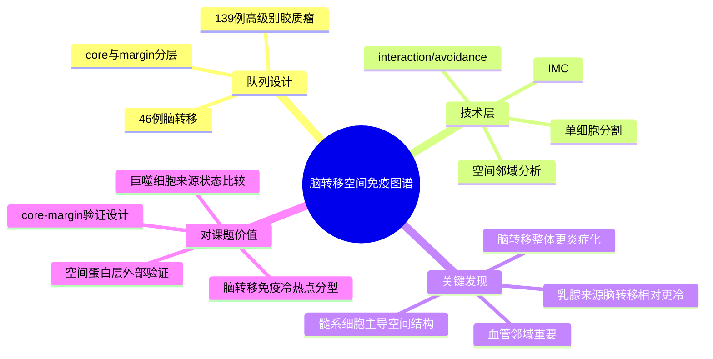

# 脑转移单细胞空间免疫图谱-2023

- 标题：Single-cell spatial immune landscapes of primary and metastatic brain tumours
- 发表时间：2023-02-01
- 期刊：Nature
- PubMed/DOI 链接：
  - DOI：https://doi.org/10.1038/s41586-022-05680-3
  - PubMed 检索入口：https://pubmed.ncbi.nlm.nih.gov/?term=Single-cell+spatial+immune+landscapes+of+primary+and+metastatic+brain+tumours
- 研究类型：患者空间组学图谱；高维影像质谱流式（IMC）免疫微环境研究

## 选择理由
本轮重新检查到 2026-06-14 的检索窗口后，仍未看到一篇在“乳腺癌远处转移直接相关性 + 机制增量 + 可复用公共数据”三个维度上同时明显超过库内近几天条目的新文献。相比继续补一篇边际收益有限的新近文章，这篇 `Nature 2023` 更适合补齐当前 vault 中相对缺少的“脑转移空间免疫拓扑”参考层。它不是乳腺癌专属文章，但包含乳腺癌来源脑转移子集，且同时给出 `core-margin` 空间框架、免疫细胞邻域分析和可公开访问的 IMC 源数据，能直接服务用户后续脑转移免疫冷/热、巨噬细胞来源与血管邻域分析。

## 研究问题
原发脑瘤和脑转移瘤的免疫微环境在细胞组成、空间邻域和临床相关性上有什么稳定差异？脑转移中，不同原发来源尤其乳腺来源脑转移是否呈现可复用的空间免疫特征？

## 摘要式结论
作者对 `139` 例高级别胶质瘤和 `46` 例脑转移患者肿瘤做了 IMC 空间单细胞分析，总计超过 `1.1 million` 个细胞和 `389` 张高维病理图像。对用户课题最有价值的结论有三层。第一，脑转移整体比胶质母细胞瘤更炎症化，但不同原发来源差异很大，乳腺来源脑转移的炎症程度低于黑色素瘤来源，提示“脑转移”不能被当作单一免疫状态。第二，脑转移中髓系细胞和血管邻域是解释空间结构的关键轴，尤其适合承接乳腺癌脑转移中 TAM/微胶质细胞、血脑屏障和免疫排斥相关假设。第三，这篇文章把 `core` 与 `margin` 分开分析，说明肿瘤中心与边缘的空间拓扑本身就是一个需要保留的分析维度，而不是简单把脑转移样本合并后做平均。

## 文章行文逻辑
1. 先说明脑肿瘤单细胞研究已有不少，但缺少保留空间结构、且能直接比较原发脑瘤与脑转移瘤的大队列患者级研究。
2. 随后建立 IMC 流程，对胶质瘤与脑转移样本做高维空间免疫图谱，并按 `core` / `margin`、原发来源和临床变量分层。
3. 再比较不同样本中的免疫细胞组成、髓系细胞谱系和细胞间 interaction/avoidance 关系。
4. 最后把空间邻域特征回连到生存、复发和不同原发来源差异，形成一套“空间免疫拓扑 -> 临床相关性”的解释框架。

## 主要创新点
- 把脑转移研究从“细胞比例比较”推进到“空间邻域与细胞相互作用”层面。
- 同时比较原发脑瘤与多来源脑转移，突出乳腺脑转移并不是默认的高炎症状态。
- 将 `core` 与 `margin` 分层保留下来，这对用户后续解释脑转移边缘免疫排斥、血管共定位和治疗后重塑非常关键。

## 关键数据类型与是否可下载
- 数据类型：IMC 高维空间蛋白数据、单细胞分割结果、对应临床信息
- 样本规模：`46` 例脑转移患者肿瘤；其中脑转移图像包含乳腺来源子集，图像层面显示 `breast core n=17`、`breast margin n=12`
- 可下载性：
  - 可直接下载：Zenodo `10.5281/zenodo.7383719`，含高维 TIFF 图像和临床信息
  - 需申请/联系作者：raw primary imaging data
  - 代码公开：GitHub `walsh-quail-labs/IMC-Brain`

## 可借鉴的方法
- 用 `core` / `margin` 分层而不是只看整块病灶平均值。
- 用 cell-cell interaction / avoidance 分析替代简单细胞丰度比较。
- 在空间层优先比较髓系细胞、血管和 T 细胞相对位置，再决定是否值得下沉到转录层机制验证。

## 可借鉴的创新点
- 将“脑转移来源器官差异”写成可检验的空间免疫命题，而不是泛泛讨论脑微环境特殊性。
- 把髓系谱系来源和空间血管位点绑在一起解释，适合迁移到乳腺癌脑转移中的 TAM/微胶质细胞假设。

## 与用户课题的潜在关联
- 可作为 [[脑转移TRM与TLS景观-2026]]、[[乳腺癌脑转移免疫景观-2026]] 的空间蛋白层外部参照。
- 若用户后续要解释乳腺来源脑转移为何常呈免疫冷状态，这篇文章提供了跨原发来源的比较背景，能帮助避免把“脑位点效应”和“乳腺来源效应”混为一谈。
- 对 [[HTAN转移乳腺癌多模态图谱-2024]] 是互补关系：HTAN 强在转移乳腺癌多模态底座，这篇强在脑转移空间拓扑和 core-margin 设计。

## 局限性
- 不是乳腺癌专属队列，乳腺来源脑转移只是多原发来源中的一个子集。
- 页面能直接确认的乳腺子集是图像数而非患者数，做频率或效应量解释时必须谨慎。
- 公开层主要是 IMC 图像与临床信息，不是可直接替代 scRNA-seq 的开放转录组资源。
- 原始 primary imaging data 仍需向作者申请，公共可下载层更适合做空间模式复核，而非完全重建全流程。

## 相关笔记
- [[乳腺癌脑转移免疫景观-2026]]
- [[脑转移TRM与TLS景观-2026]]
- [[HTAN转移乳腺癌多模态图谱-2024]]
- [[脑转移多组学空间图谱-2026-06-07]]
