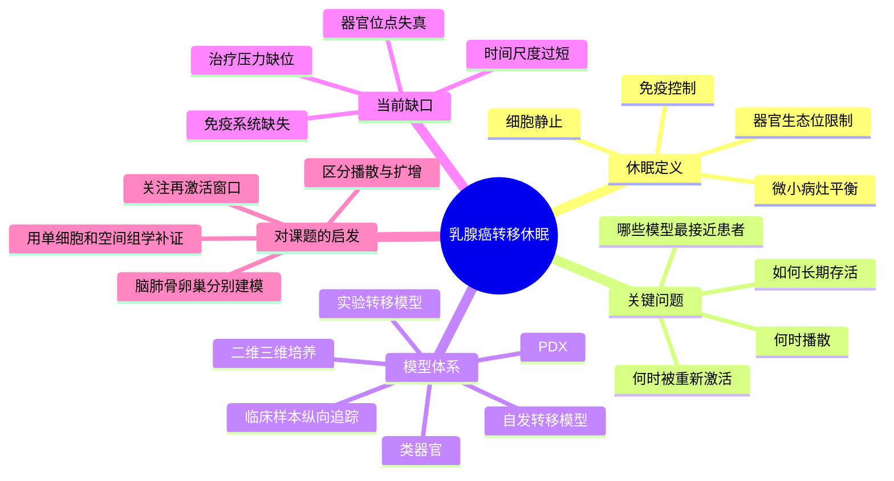

# 乳腺癌休眠模型综述-2021

## 标题
Breast cancer dormancy: need for clinically relevant models to address current gaps in knowledge

## 发表时间
2021-05-28

## 期刊
NPJ Breast Cancer

## PubMed / DOI
- PubMed: https://pubmed.ncbi.nlm.nih.gov/34050189/
- DOI: https://doi.org/10.1038/s41523-021-00270-7
- 期刊页面: https://www.nature.com/articles/s41523-021-00270-7

## 研究类型
经典综述；乳腺癌转移休眠的模型体系、证据空白与转化路线总结

## 本次选择理由
本轮继续检索了 2026-06-05 到 2026-06-07 新近 PubMed 命中，但没有发现一篇同时满足“与用户课题高度贴合、信息增量明显高于已记录 2026 笔记、且公开数据入口清晰”的更强新文献。与其补一篇边际价值有限的新文章，不如补上一个此前笔记中仍然缺位的框架层：这篇综述专门讨论乳腺癌休眠的证据链、模型局限和临床相关性，正好承接已记录的器官嗜性综述与 Cell 2013 休眠框架，把“为什么晚期复发”和“该用什么模型验证”连接起来。

## 研究问题
乳腺癌转移休眠为什么难以被可靠研究；现有体内外模型在哪些关键环节失真；要想解释晚期复发、微转移残留和器官特异性再激活，最需要补齐哪些临床相关模型与读出体系。

## 摘要式结论
- 乳腺癌休眠不是单一静止状态，而是 DTC、生存生态位、免疫监视、血管稳定性和治疗压力共同塑造的动态平衡。
- 该领域最大的瓶颈不是“缺少候选通路”，而是缺少能同时覆盖播散、长期潜伏、器官特异微环境和再激活窗口的临床相关模型。
- 常见快速成瘤模型更擅长研究扩增阶段，而不擅长解释长期无病期后的复发。
- 若要提高课题可验证性，应把模型选择、时间尺度、器官位点和再激活触发条件作为与分子机制同等重要的设计变量。

## 文章行文逻辑
1. 先界定休眠的临床背景：乳腺癌可在多年无病后复发，说明早期播散与晚期再激活之间存在长期隐匿阶段。
2. 再拆解休眠的生物学层次，包括细胞周期停滞、微小病灶平衡、免疫控制和器官微环境限制。
3. 系统梳理现有模型：二维/三维体系、类器官、实验转移模型、自发转移模型、PDX 与临床样本。
4. 逐一指出模型与真实患者场景的偏差，尤其是时间尺度过短、免疫系统缺失、器官生态位不完整和治疗史缺位。
5. 最后给出未来方向：建立更临床相关的休眠模型，并把单细胞、空间组学和纵向追踪整合到再激活研究中。

## 主要创新点
- 它把“休眠研究为什么总难落地”明确归结为模型与临床情境错配，而不只是机制复杂。
- 明确区分了细胞层面的 quiescence、病灶层面的 equilibrium dormancy 与器官生态位约束，避免把所有“低增殖”都叫休眠。
- 强调应把治疗暴露、器官位点与再激活触发因素纳入同一研究框架，这对用户后续做脑/肺/骨/卵巢比较很重要。

## 关键数据类型与是否可下载
- 本文为综述，本身不提供新原始数据。
- 但文中高度强调后续应优先结合的证据类型：DTC 检测、长期体内追踪、免疫完整模型、单细胞与空间组学、患者纵向临床队列。
- 对用户课题的价值主要是“如何挑数据和挑模型”，而不是直接作为分析输入。

## 可借鉴的方法
- 建假设时区分三个层面：播散成功、休眠维持、再激活失败或成功，不要把它们混成一个终点。
- 评价模型时同步记录四个维度：器官位点、免疫完整性、时间长度、是否包含治疗压力。
- 在公共数据筛选时，不只看是不是单细胞，还要看是否能对应休眠某一阶段的真实问题，比如早期肺定植、脑内长期存活、骨髓免疫约束等。

## 可借鉴的创新点
- 可把已有文献和数据集重新按“早期播散 -> 微环境约束 -> 再激活”重排，而不是只按器官分类。
- 对每个器官位点分别构建“休眠维持因子”和“再激活触发因子”两个候选模块，再做跨器官比较。
- 后续若做方法学流程，可优先围绕时间窗设计 signature，而不只围绕终末转移灶差异表达。

## 与用户课题的潜在关联
- 对脑转移：提醒不要只研究显性脑转移灶，还要区分早期定植与晚期扩增，和已记录 `FGF2-NCAM1-FGFR1`、`ACSS2` 等脑适应机制能形成前后层次。
- 对肺转移：与肺前转移生态位、肺驻留巨噬细胞和中性粒细胞线索直接相关，适合重新组织 `CHI3L1`、`LCN2`、肺巨噬细胞资源。
- 对骨转移：可把 `SAMENT` 和 `ERα+ macrophage` 视为“骨内局部休眠/再激活生态位”候选，而非仅仅视作终末免疫抑制。
- 对卵巢转移：在公开单细胞稀缺的情况下，这篇综述提供了一个合理的分析顺序，先问“是否存在休眠与再激活窗口”，再决定接受哪种数据层级。

## 局限性
- 发表时间为 2021 年，无法覆盖 2024-2026 年快速增长的单细胞、空间和多模态证据。
- 更偏“模型与概念综述”，不直接给出某个器官位点的最新强证据。
- 对卵巢转移讨论仍有限，更多提供方法论而非现成答案。

## 思维导图

## 相关笔记
- [[转移休眠与再激活综述-2013]]
- [[乳腺癌器官嗜性转移综述-2018]]
- [[转移器官嗜性调控综述-2025]]
- [[FGF2-NCAM1-FGFR1脑转移-2026]]
- [[CHI3L1中性粒细胞肺转移-2026]]
- [[ERa巨噬细胞骨转移生态位-2026]]
