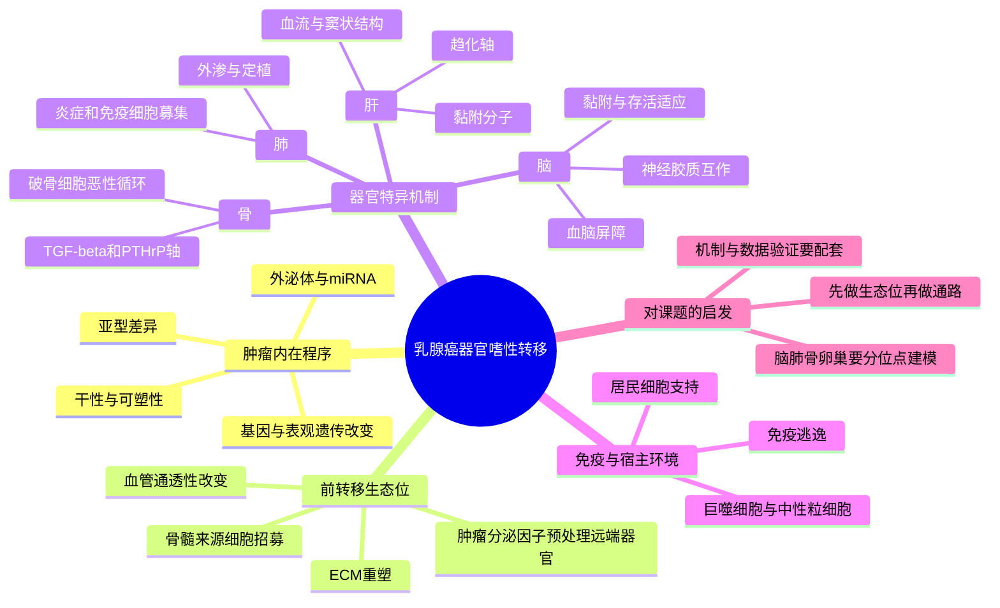

# 乳腺癌器官嗜性转移综述-2018

## 基本信息

- 标题：Organotropism: new insights into molecular mechanisms of breast cancer metastasis
- 发表时间：2018-02-16
- 期刊：npj Precision Oncology
- PubMed：https://pubmed.ncbi.nlm.nih.gov/29872722/
- DOI：https://doi.org/10.1038/s41698-018-0047-0
- PMCID：https://pmc.ncbi.nlm.nih.gov/articles/PMC5871901/
- 研究类型：经典综述；乳腺癌器官嗜性转移机制框架

## 选择理由

本轮继续检索了 2026-06-02 之后的新文献，但没有发现一篇同时满足“与用户课题高度贴合、信息增量明显高于现有笔记、期刊与机制深度都足够强”的新文章。与其补一篇边际价值有限的新文，不如回到一篇仍然高复用的经典综述：它系统串联了脑、肺、骨、肝等器官嗜性转移的肿瘤内在程序、前转移生态位、外泌体/miRNA、免疫和宿主微环境，是后续把零散新机制笔记整合成课题框架的合适“总纲”。

## 研究问题

这篇综述回答的核心问题不是“某一条单独通路如何驱动转移”，而是：乳腺癌为什么会呈现明确的器官嗜性；这种器官偏好由肿瘤亚型、肿瘤细胞内在基因程序、宿主器官微环境、前转移生态位和免疫互作如何共同决定；不同器官位点的机制有没有可归纳的共性和差异。

## 摘要式结论

作者的总体判断很清楚：乳腺癌器官嗜性转移不是单因素现象，而是“肿瘤细胞状态 + 宿主器官土壤 + 远端预处理信号”共同筛选的结果。骨转移最依赖破骨细胞驱动的恶性循环，脑转移更受血脑屏障穿越、神经胶质互作和适应性代谢限制，肺转移更强调外渗、炎症和免疫细胞招募，肝转移则更依赖趋化轴、血流结构和黏附分子。外泌体、miRNA、循环肿瘤细胞、干性和免疫逃逸并不是附属现象，而是器官嗜性建立中的功能模块。

## 文章行文逻辑

1. 先从 Paget “seed and soil” 和乳腺癌常见转移位点切入，定义器官嗜性转移。
2. 按器官逐一梳理骨、脑、肺、肝等位点的代表性分子机制和微环境限制。
3. 再把器官特异性现象提升到更一般的层面，总结肿瘤干性、基因/表观遗传改变、外泌体、miRNA、CTC 和免疫参与。
4. 最后把这些机制收束到临床意义：预测、分层、早期干预与靶向治疗。

## 思维导图

## 主要创新点

- 它把器官嗜性从“不同器官各有一堆零散机制”提升为一个可操作的统一框架。
- 它较早把前转移生态位、外泌体、miRNA、免疫和 CTC 纳入同一叙事，而不只停留在肿瘤细胞内在驱动。
- 它对不同转移器官的限制条件做了并列梳理，适合直接指导后续分器官假设构建。

## 关键数据类型与是否可下载

- 综述本身不产生原始组学数据。
- 文章核心价值在于整合既有机制研究和经典证据链，而不是提供新的可重分析 accession。
- 适合作为后续筛选公共数据和解释已有单细胞/空间结果的框架参考。

## 可借鉴的方法

- 综述中的“器官位点 -> 宿主限制 -> 肿瘤适应 -> 可检测标志物/干预轴”写法，适合直接迁移到用户课题笔记结构。
- 后续做数据验证时，可以把候选机制拆成三层：肿瘤内在程序、宿主生态位输入、免疫/基质协同模块，而不是只盯单基因。
- 对卵巢等稀缺位点，先借用器官嗜性框架定位“应该验证什么”，再去接受数据层级较低的资源。

## 可借鉴的创新点

- 不把脑、肺、骨、卵巢简单视作“不同标签”，而是视作不同生境选择压力。
- 把转移研究的时间维度前移到前转移生态位和早期定植，而不是只分析终末病灶。
- 把外泌体/miRNA/免疫细胞等“跨细胞通讯模块”纳入器官嗜性核心，而非外围现象。

## 与用户课题的潜在关联

- 用户课题聚焦乳腺癌远处转移及微环境，这篇综述正好提供脑、肺、骨、卵巢等位点应如何分层思考的总框架。
- 它特别适合和近几次新增笔记对照使用：脑转移 `FGF2-NCAM1-FGFR1`、肺转移 `CHI3L1`/`LCN2`、骨转移 `SAMENT`/`ERa+ macrophage` 都可以视为该框架在不同器官中的新实例。
- 对公共数据搜集也有直接指导意义：优先找能同时读出肿瘤状态、宿主细胞、免疫生态位和器官特异线索的数据，而不是只看是否“是单细胞”。

## 局限性

- 发表年份较早，不能覆盖近几年快速增加的单细胞、空间组学和免疫治疗相关证据。
- 卵巢转移在文中并非重点，更多需要借其框架而非直接借其证据。
- 综述整合度高，但具体结论仍需回到各器官的原始研究和公开队列逐条验证。

## 相关笔记

- [[FGF2-NCAM1-FGFR1脑转移-2026]]
- [[CHI3L1中性粒细胞肺转移-2026]]
- [[ERa巨噬细胞骨转移生态位-2026]]
- [[脑转移TAM-MTC单细胞图谱-2026]]
- [[乳腺癌脑转移单细胞与脑生态位数据-2026-05-30]]
