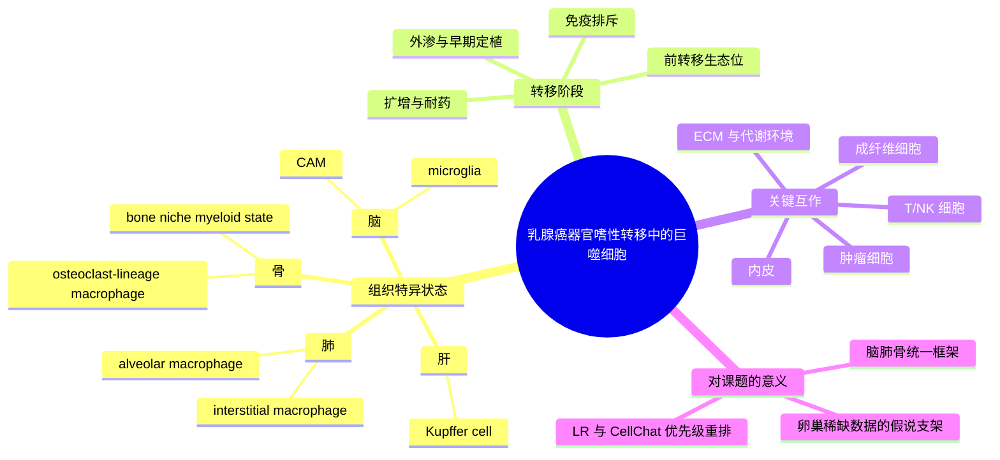

# 乳腺癌转移器官嗜性巨噬细胞综述-2025

- 标题：Heterogeneous tissue-specific macrophages orchestrate metastatic organotropism of breast cancer: implications for promising therapeutics
- 发表时间：2025-06-20
- 期刊：Journal of Translational Medicine
- PubMed：[PMID 40542349](https://pubmed.ncbi.nlm.nih.gov/40542349/)
- DOI：[10.1186/s12967-025-06660-7](https://doi.org/10.1186/s12967-025-06660-7)
- 研究类型：综述；聚焦 tissue-specific macrophage, seed-and-soil, organotropism 与可干预靶点

## 选择理由
本轮再次检索 2026-06-05 之后的 PubMed 新条目后，没有发现质量和课题贴合度都明显超过近几天已入库 2026 原始研究的新文。与其补一篇边际价值有限的新原始研究，不如补这篇更适合作为项目框架层的 2025 综述。它把脑、肺、骨、肝等器官中的组织特异巨噬细胞放进同一套器官嗜性转移叙事里，正好可作为后续串联脑转移、肺转移、骨转移以及卵巢稀缺数据线索的上位骨架。

## 研究问题
不同器官中的组织特异巨噬细胞如何在乳腺癌转移过程中同时塑造 "seed" 和 "soil"，并驱动脑、肺、骨、肝等部位的器官嗜性定植、免疫逃逸与扩增？

## 摘要式结论
文章的核心不是再讲一遍 TAM 促进转移，而是强调不同器官中的 macrophage 来源、代谢状态、极化方向和邻近互作不同，因此不能把一个器官里的巨噬细胞机制直接外推到全部转移部位。作者将 brain microglia/CAM、lung alveolar macrophage、bone osteoclast-lineage macrophage 和 liver Kupffer cell 等并列讨论，指出它们既参与前转移生态位形成，也影响外渗、早期存活、免疫抑制和后续扩增。对治疗来说，真正值得优先考虑的不是泛巨噬细胞清除，而是按器官背景锁定趋化、吞噬检查点、代谢互作和 ECM/血管重塑等模块。

## 文章行文逻辑
1. 先从 seed-and-soil 与乳腺癌器官嗜性背景切入，提出巨噬细胞是连接肿瘤细胞与局部生态位的关键节点。
2. 随后梳理不同组织特异巨噬细胞的来源、驻留属性、极化和代谢特征，强调它们不是同质细胞群。
3. 再按脑、肺、骨、肝等转移器官展开，分别讨论各类 macrophage 如何影响前生态位建立、外渗、免疫排斥和扩增。
4. 最后收束到潜在治疗策略，如 `CSF1R`、`CXCR4`、`TGF-beta`、吞噬检查点和代谢相关轴，并讨论转化局限。

## 主要创新点
- 把“器官嗜性”与“组织特异巨噬细胞异质性”明确绑定，而不是把巨噬细胞仅视为泛免疫抑制背景。
- 强调应区分前转移生态位、早期定植和已形成病灶扩增三个阶段，避免时间尺度混淆。
- 将器官来源、驻留属性、代谢状态和跨细胞互作同时纳入巨噬细胞比较框架。

## 关键数据类型与是否可下载
- 本文为综述，本身不提供新的原始组学数据。
- 可下载资源主要来自其引用的原始研究与公共数据库。
- 价值在于帮助后续按“器官 x 巨噬细胞状态 x 转移阶段”组织公开数据验证，而不是直接充当分析输入。

## 可借鉴的方法
- 用“器官 x 巨噬细胞状态 x 转移阶段”三维框架组织文献与数据验证，而不是按单篇论文堆积。
- 在单细胞/空间分析里，不把所有 macrophage 合并解释，优先追问其器官来源、驻留属性和代谢程序。
- 将 LR/CellChat 分析从“谁表达更多”推进到“哪些巨噬细胞状态在特定器官邻域里与肿瘤、内皮、成纤维和 T/NK 细胞稳定互作”。

## 可借鉴的创新点
- 每个器官先定义一个“巨噬细胞主轴假说”，再寻找配套公开数据做分层验证。
- 把器官特异巨噬细胞与免疫排斥、血管通透性、ECM 改造和代谢适应放进同一条因果链。
- 对卵巢等公开单细胞稀缺位点，也可先从 macrophage-ecology 假说出发设计替代性 bulk/空间验证。

## 与用户课题的潜在关联
这篇综述与当前脑转移、肺转移、骨转移笔记高度兼容。脑转移部分可与 [[脑转移TRM与TLS景观-2026]]、[[乳腺癌脑转移单细胞图谱-2026]] 对读；肺转移部分可与 [[肺泡巨噬细胞与肺转移时序-2024]]、[[糖皮质激素-FAS转移播散免疫逃逸-2026]]、[[棕榈酸-中性粒细胞-LCN2肺转移前生态位-2026]] 对接；骨转移部分可与 [[骨转移SAMENT生态位标记-2026]] 形成强互补。对后续跨器官比较，建议把 `Mph-MARCO`、`Mph-SPP1`、肺泡巨噬细胞、骨 niche macrophage 等看作器官特异状态，而不是默认共享终末程序。

## 局限性
- 这是综述，不是单一器官的直接证据整合；部分机制来自跨癌种或模型研究。
- 对卵巢转移的直接公开高分辨率证据仍然偏弱，更多提供的是分析框架而非现成答案。
- 文中治疗策略多停留在前临床或泛癌试验层面，不能直接等同为乳腺癌器官特异疗效证据。

## 思维导图

## 相关笔记
- [[转移休眠与再激活综述-2013]]
- [[器官嗜性转移营养需求-2026]]
- [[肺泡巨噬细胞与肺转移时序-2024]]
- [[骨转移SAMENT生态位标记-2026]]
