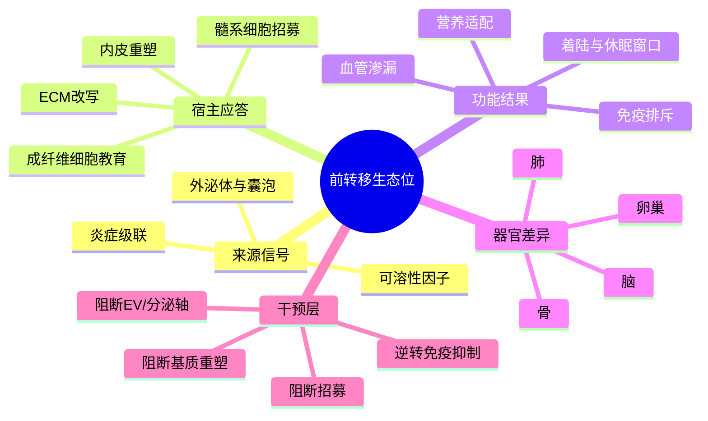

# 前转移生态位形成与干预综述-2024

- 发表时间：2024
- 期刊：Signal Transduction and Targeted Therapy
- PubMed：<https://pubmed.ncbi.nlm.nih.gov/?term=Pre-metastatic+niche%3A+formation%2C+characteristics+and+therapeutic+implication>
- DOI：<https://doi.org/?q=Pre-metastatic+niche%3A+formation%2C+characteristics+and+therapeutic+implication>
- 研究类型：机制综述 / 方法框架综述

## 选择理由
本轮重新检查了 2026-06-09 之后的相关检索窗口，没有看到明显强于近几日已入库笔记的乳腺癌远处转移新原始研究。与其补一篇增量有限的新文，不如补上当前库里仍缺的一层总纲：前转移生态位。它正好把肺、脑、骨、卵巢等器官位点笔记串成同一条因果链，尤其适合和已经积累的中性粒细胞、巨噬细胞、星形胶质细胞、代谢适应与免疫排斥线索合并使用。

## 研究问题
肿瘤细胞在真正定植前，远端器官如何被宿主细胞、分泌因子、外泌体、ECM 重塑和代谢变化预先改造成“可着陆”的生态位？哪些环节最适合做预防性干预，而不是等转移灶形成后再处理？

## 摘要式结论
这类综述的核心价值不在于再列一遍“谁促进转移”，而在于把前转移生态位拆成可操作模块：原发灶发出的可溶性因子和 EV，骨髓来源细胞与局部基质细胞的招募/教育，血管通透性和 ECM 重塑，局部免疫抑制，以及器官特异的营养和炎症背景。对乳腺癌课题最直接的启发是，肺、脑、骨、卵巢的差异不能只看到达后的肿瘤细胞表型，还要前移到“到达前谁先铺路、谁先排斥免疫、谁先改写基质”。

## 文章行文逻辑
1. 先把转移解释为“肿瘤细胞能力 + 远端器官可接受性”的联合结果。
2. 再拆解前转移生态位的组成：炎症因子、趋化轴、髓系细胞、成纤维细胞、内皮细胞、ECM 和代谢环境。
3. 然后强调器官差异：肺更偏血管和炎症通路，脑更偏血脑屏障与胶质/星形胶质互作，骨更偏骨髓髓系与破骨生态，卵巢/腹腔更偏脂质与腹膜微环境。
4. 最后把干预思路落到“阻断生态位建立”而不只是“杀死已成灶肿瘤细胞”。

## 主要创新点
- 把“转移前就已发生的宿主重编程”从现象学提升为可分模块验证的机制框架。
- 强调不同器官位点共享若干基本构件，但组合方式和优先级不同，适合做跨器官比较。
- 对实验设计很有用：提示不要只采成熟转移灶，也要关注早期播散、血管周围位点和未见病灶器官。

## 关键数据类型与是否可下载
- 文章本身是综述，不提供独立原始队列。
- 但它对应的证据类型很明确：单细胞转录组、空间组学、外泌体/蛋白组、血管通透性成像、骨髓来源细胞追踪、器官特异代谢组。
- 可下载性取决于被综述的原始研究，因此更适合作为“数据搜集路线图”而不是单一数据入口。

## 可借鉴的方法
- 以“原发灶信号 -> 远端器官宿主应答 -> 播散细胞进入/存活 -> 扩增”作为统一分析骨架，整理不同器官位点结果。
- 做公共数据验证时，不要只比转移灶和原发灶，还要尽量分层到早期播散、前转移组织、免疫排斥边界和基质反应区。
- 单细胞/空间分析可优先围绕髓系细胞、成纤维细胞、内皮、ECM 和免疫排斥模块建 signature，而不是只盯肿瘤细胞内源程序。

## 可借鉴的创新点
- 将“前转移生态位”当作跨器官公共比较坐标系，而不是每个器官各讲各的故事。
- 将弱样本位点如卵巢转移放入前转移生态位框架后，更容易接受“小单细胞发现 + bulk/甲基化/多器官队列验证”的组合策略。

## 与用户课题的潜在关联
- 可作为当前脑、肺、骨、卵巢多条笔记的上层组织框架。
- 对肺转移可直接连接 [[棕榈酸-中性粒细胞-LCN2肺转移前生态位-2026]]、[[糖皮质激素-FAS转移播散免疫逃逸-2026]]。
- 对脑转移可连接 [[脑转移放疗重塑细胞免疫-2026]]、[[ACSS2抑制铁死亡驱动脑转移-2026]]、[[TIMP1星形胶质细胞脑转移免疫抑制-2025]]。
- 对骨/卵巢位点可帮助把 [[骨转移SAMENT生态位标记-2026]] 与 [[卵巢转移免疫单细胞-2026]] 放到同一机制坐标里比较。

## 局限性
- 综述强在框架，不强在单一证据强度；真正使用时仍要回到原始研究逐条核实。
- 器官差异常被跨癌种证据拼接而成，乳腺癌特异部分需要再用乳腺癌数据落地。
- “前转移生态位”很容易被过度泛化，必须区分播散前、早期播散、休眠、再激活和成熟转移灶几个阶段。

## 相关笔记
- [[转移休眠与再激活综述-2013]]
- [[乳腺癌转移器官嗜性巨噬细胞综述-2025]]
- [[器官嗜性转移营养需求-2026]]
- [[棕榈酸-中性粒细胞-LCN2肺转移前生态位-2026]]
