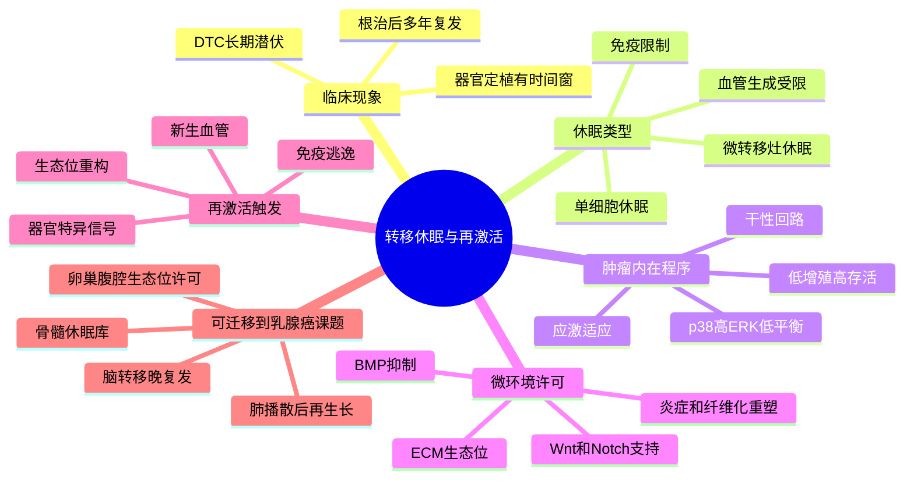

# 转移休眠与再激活综述-2013

- 标题：Mechanisms Governing Metastatic Dormancy and Reactivation
- 发表时间：2013-11-07
- 期刊：Cell
- PubMed：[PMID 24209616](https://pubmed.ncbi.nlm.nih.gov/24209616/)
- DOI：[10.1016/j.cell.2013.10.029](https://doi.org/10.1016/j.cell.2013.10.029)
- 研究类型：经典机制综述；聚焦播散肿瘤细胞（DTC）休眠、微转移灶停滞与再激活

## 选择理由
本轮检索到的最新条目里，没有一篇明显强过最近几天已入库的 2026 年乳腺癌转移原始研究，若继续追逐“最新”容易牺牲质量。因此改写一篇经典高价值综述，补上当前笔记体系里相对缺失的“休眠-再激活”机制框架。这个框架对解释乳腺癌脑/肺/骨/卵巢转移中的晚复发、微环境许可、治疗后残存病灶和器官特异性定植都很关键。

## 研究问题
为什么一部分播散后的肿瘤细胞可以在远处器官长期存活却不立即形成可见转移灶？这些休眠细胞在什么条件下会再次进入增殖、完成器官定植并导致临床复发？

## 摘要式结论
文章把“转移”拆成了更贴近临床复发过程的连续谱：早期播散、长期休眠、微环境许可、再激活扩增。作者强调，休眠并不是被动停滞，而是由肿瘤内在程序与器官生态位共同维持的动态平衡。对用户课题最有用的启发是：解释脑/肺/骨/卵巢转移时，不能只看已经长大的转移灶，还要单独建模“谁能活下来”“谁被局部生态位压住”“谁又被重新唤醒”这三个阶段。

## 文章行文逻辑
1. 先从临床现象出发，说明根治术后多年复发提示远处播散细胞可能长期处于休眠状态。
2. 再区分单细胞休眠与微转移灶休眠，强调细胞周期停滞、血管生成限制和免疫限制并不完全等价。
3. 接着讨论肿瘤内在程序与干性相关回路，提出再激活往往伴随“转移起始细胞样”状态恢复。
4. 然后把重点转到器官微环境，讨论 ECM 生态位、BMP/Wnt/Notch 等信号如何决定抑制还是许可再生长。
5. 最后把这些机制收束到可干预窗口：维持休眠、清除休眠细胞或阻断再激活。

## 主要创新点
- 把“转移后是否立刻长大”从结果描述推进到机制层，系统化提出休眠与再激活是独立、可分解的生物学阶段。
- 将转移起始能力与干细胞样生态位联系起来，提示再激活不仅是增殖恢复，还可能是状态重编程。
- 强调 ECM 和局部微环境不是背景板，而是决定休眠维持或逃逸的主动调控器。

## 关键数据类型与是否可下载
- 本文是综述，本身不提供新的 GEO/SRA accession。
- 可直接获取的资源主要是开放全文与其梳理的经典机制文献，适合作为后续“按机制追 accession”的导航图。
- 若后续要把这篇综述落到数据验证，建议优先把文中提到的“休眠/再激活”轴映射到已记录的脑转移、肺播散、骨转移和多器官 bulk 队列中。

## 可借鉴的方法
- 将转移研究拆成“播散存活”“休眠维持”“再激活扩增”三段，而不是简单做 `primary vs metastasis` 二分类。
- 在单细胞或空间分析里，给恶性细胞额外建立“低增殖-高应激适应-干性恢复”的状态轴，而不只做 EMT 或免疫评分。
- 联合器官微环境信息解释再激活窗口，例如 ECM 重塑、血管邻近性、BMP/Wnt/Notch 相关配体来源。
- 对治疗相关转移研究，单独考虑“治疗诱导休眠”与“治疗后再激活”两类机制，不要混成同一组耐药信号。

## 可借鉴的创新点
- 用“休眠失败/再激活成功”替代单纯“是否转移成功”的终点定义，更贴近晚复发问题。
- 可将 DTC 状态与生态位状态做双轴建模：一轴是肿瘤细胞内在可塑性，另一轴是器官微环境许可度。
- 对器官嗜性转移可引入“器官特异再激活门槛”概念，而不只分析到达率或免疫冷热点。

## 与用户课题的潜在关联
这篇综述非常适合作为用户课题的上层机制框架。脑转移可以用它解释为何部分病灶表现出长期潜伏后爆发；肺转移可结合已有 `GR-FAS`、`LCN2` 和免疫排斥笔记，区分早期播散存活与后续扩增；骨转移可连接骨髓生态位和免疫排斥型 niche；卵巢转移虽然公开高分辨率数据稀缺，但同样可以先从“腹腔/卵巢微环境是否提供再激活许可”来构建假设。

## 局限性
- 这是跨癌种综述，不是乳腺癌专属证据，落地时必须回到乳腺癌与具体转移器官验证。
- 文章成文时间较早，后续单细胞、空间组学和谱系追踪技术尚未全面进入其框架。
- 综述提出的多个轴线很有启发，但不同器官间触发再激活的条件并不统一，不能机械套用。

## 相关笔记
- [[乳腺癌器官嗜性转移综述-2018]]
- [[器官嗜性转移营养需求-2026]]
- [[ER+内分泌治疗-P-Rex1-Rac1转移逃逸-2026]]
- [[糖皮质激素-FAS转移播散免疫逃逸-2026]]
