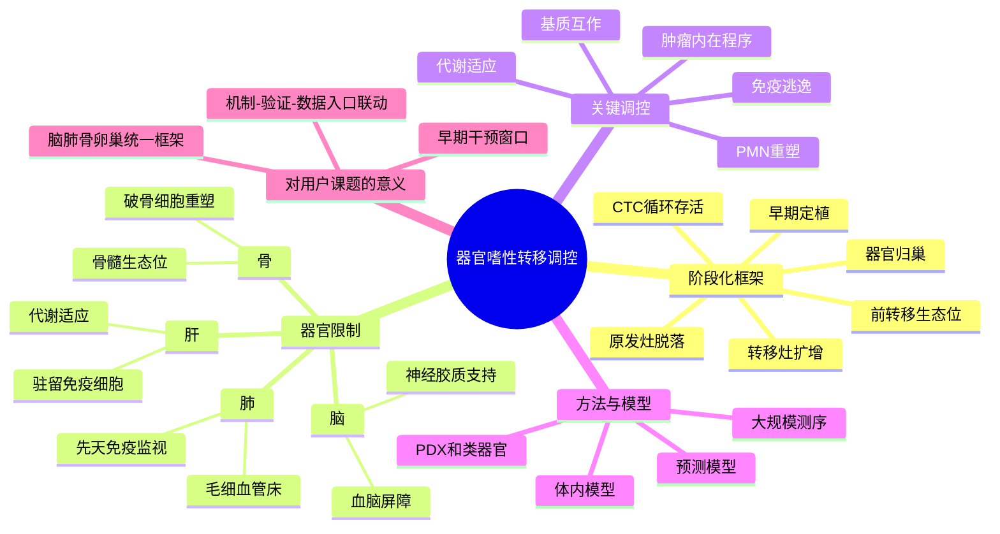

# 转移器官嗜性调控综述（2025）

## 标题
Regulation of metastatic organotropism

## 发表时间
2025-03（Epub 2024-12-27）

## 期刊
Trends in Cancer

## PubMed / DOI
- PubMed: https://pubmed.ncbi.nlm.nih.gov/39732596/
- DOI: https://doi.org/10.1016/j.trecan.2024.11.012
- PMCID: https://pmc.ncbi.nlm.nih.gov/articles/PMC11903188/

## 研究类型
综述；跨癌种转移生物学与器官嗜性框架总结

## 本次选择理由
近几天能检索到的“最新”乳腺癌远处转移原始研究里，真正兼具期刊质量、机制深度、可迁移方法价值且未与既有笔记重复者不多。相比勉强记录一篇边际增量有限的新文，这篇 `Trends in Cancer` 综述更适合本轮作为高价值补充：它把肺、肝、脑、骨等器官嗜性的调控层次、前转移生态位、循环阶段、定植与扩增阶段、以及模型体系放到同一张框架图里，能直接服务用户后续整合脑/肺/骨/卵巢转移线索。

## 研究问题
器官嗜性转移并非单一“种子-土壤”匹配事件，而是在哪些阶段、通过哪些肿瘤内在程序与宿主微环境重塑，被逐步建立并稳定化？

## 摘要式结论
- 器官嗜性由多个连续阶段共同塑造，而非仅由终末定植阶段决定。
- 前转移生态位（PMN）是关键中介层，决定后续循环肿瘤细胞能否黏附、外渗和存活。
- 不同器官既共享若干普适机制，也保留器官特异限制，如脑屏障、骨重塑、肺毛细血管床与局部免疫生态。
- 未来最值得推进的方向不是继续罗列单个因子，而是把多组学、谱系追踪、体内模型和预测模型串起来，做“可预测、可干预”的器官嗜性研究。

## 文章行文逻辑
1. 先提出器官嗜性转移不是随机分布，而是受肿瘤细胞与宿主器官环境双向调控。
2. 再按转移级联分阶段梳理：原发灶脱落、循环存活、前转移生态位形成、器官归巢、早期定植、转移灶扩增。
3. 随后分器官讨论肺、肝、脑、骨等环境中的代表性限制条件与支持信号。
4. 最后总结 organoid、PDX、体内示踪、大规模测序等模型体系的优缺点，并指向预测与早干预的未来方向。

## 主要创新点
- 把器官嗜性研究从“器官特异分子列表”提升为“按转移阶段组织问题”的框架。
- 强调 PMN、CTC 归巢与早期定植窗口的重要性，这一点与用户当前关注的早期播散、免疫逃逸和器官生态位验证高度一致。
- 对模型体系的讨论较实用，便于判断哪些结论适合迁移到患者队列，哪些只适合机制探索。

## 关键数据类型与是否可下载
- 本文为综述，本身不提供新原始组学数据。
- 可下载内容主要是文中汇总的已发表研究和可追溯公共资源线索。
- 价值在于框架整合与方法导航，而非直接作为分析输入数据集。

## 可借鉴的方法
- 按“阶段”而不是按“器官”构建用户自己的文献和数据整理表：PMN、循环/归巢、定植、扩增、治疗耐受。
- 将单细胞/空间/bulk/代谢组资源放回同一器官嗜性框架中，而不是各做各的。
- 对每个假设同时准备“机制模型证据 + 患者验证队列 + 公共数据入口”三层证据链。

## 可借鉴的创新点
- 用统一逻辑连接脑、肺、骨、卵巢等不同器官，而不是分别写零散故事。
- 在验证时显式区分“器官选择”与“器官内扩增”两个问题，避免把后期增殖信号误当作早期归巢机制。
- 以“可干预窗口”组织假设，例如 PMN 阶段、早期 DTC 存活阶段、免疫排斥建立阶段。

## 与用户课题的潜在关联
- 适合做用户现有脑转移、肺转移、骨转移笔记的总框架层。
- 有助于把不同来源的数据集映射到同一问题树，例如：
  - 脑转移：BBB/星形胶质细胞/神经胶质互作
  - 肺转移：毛细血管床、先天免疫、血管通透性
  - 骨转移：破骨细胞、成骨细胞、骨髓免疫生态位
  - 卵巢转移：若公开单细胞仍稀缺，可先用多器官 bulk 或模型资源做方向性验证
- 也适合作为后续“为什么同一乳腺癌在不同器官形成不同免疫生态位”的写作底稿。

## 局限性
- 不是乳腺癌专属综述，部分机制来自其他癌种，迁移时要做乳腺癌语境筛选。
- 框架完整，但不替代具体原始研究；真正做分析仍需回到器官和模型匹配的数据集。
- 对卵巢转移等稀缺场景，综述提供的是思路，不等于已经有足够公开患者级数据支撑。

## 思维导图

## 相关笔记
- [[乳腺癌器官嗜性转移综述-2018]]
- [[器官嗜性转移营养需求-2026]]
- [[FGF2-NCAM1-FGFR1脑转移-2026]]
- [[ERa巨噬细胞骨转移生态位-2026]]
- [[CHI3L1中性粒细胞肺转移-2026]]
