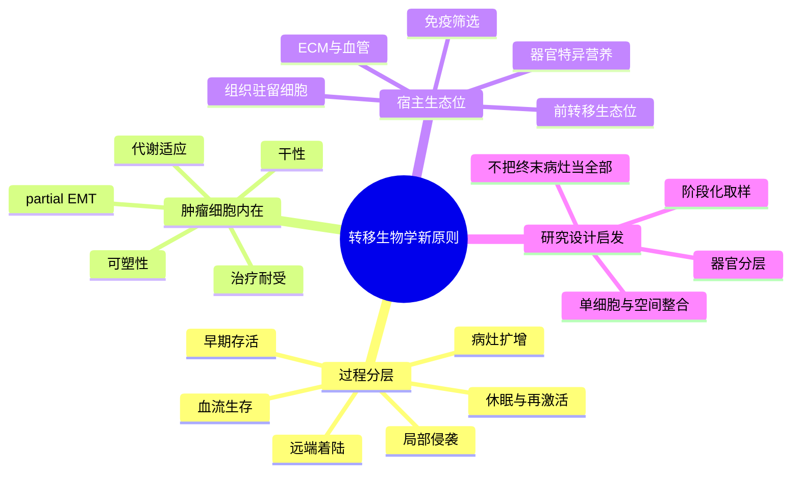

# 转移生物学新原则综述-2017

- 发表时间：2017
- 期刊：Cell
- PubMed：https://pubmed.ncbi.nlm.nih.gov/?term=Emerging+Biological+Principles+of+Metastasis
- DOI：https://doi.org/?q=Emerging+Biological+Principles+of+Metastasis
- 研究类型：经典综述；肿瘤转移生物学总纲

## 选择理由
本轮继续检查了 2026-06-09 之后的检索窗口，没有看到一篇同时满足“乳腺癌远处转移高度相关、机制增量明显高于本库 6 月上旬已入库原始研究、且公开数据入口更清晰”的更强新文献。与其补一篇边际价值有限的新文章，不如补上一层当前库里仍缺位、但后续复用率极高的经典总纲：这篇综述把转移从“播散结果”重新组织为“细胞状态切换、生态位许可、免疫筛选、克隆适应、治疗压力”共同驱动的连续过程，适合拿来统领脑、肺、骨、卵巢等器官位点的分散笔记。

## 研究问题
转移为什么不是一个单一终点，而是一串彼此耦合但可以拆开研究的阶段事件？哪些概念最值得作为后续乳腺癌器官嗜性转移研究的统一分析坐标，而不是继续把每个器官写成互不相连的单篇机制故事？

## 摘要式结论
这篇综述最重要的价值，不是再列一遍“哪些基因促进转移”，而是把转移拆成几个必须区分的层次：局部侵袭与脱离、血流中生存、远端器官着陆、早期存活/休眠、免疫与基质筛选、最终扩增。作者强调，转移成功并不等于增殖更快，而更像是一种高度可塑的状态切换能力，既需要肿瘤细胞自身的表型弹性，也需要远端器官提供可接受的生态位。对用户课题最直接的启发是：脑、肺、骨、卵巢转移不能只比较“成熟病灶里谁高谁低”，而应先问每条候选轴更接近哪一个阶段，是播散许可、早期定植、休眠维持，还是再激活扩增。

## 文章行文逻辑
1. 先纠正“转移只是晚期扩增结果”的旧叙事，强调它是多阶段、低效率但高选择性的过程。
2. 再把肿瘤细胞内在能力拆解为 EMT/partial EMT、干性、可塑性、代谢适应和治疗耐受。
3. 接着把宿主端拆解为前转移生态位、血管与 ECM、免疫清除与免疫逃逸、器官特异信号。
4. 然后讨论休眠、再激活和转移克隆演化，解释为什么“播散成功”不等于“最终形成病灶”。
5. 最后回到治疗学，提出真正值得干预的不只是已形成的大病灶，也包括早期生态位许可和状态切换窗口。

## 主要创新点
- 把“转移能力”从单个驱动基因叙事提升为“状态可塑性 + 宿主许可”的双轴模型。
- 明确区分播散、休眠、再激活和扩增，避免把所有 metastatic phenotype 混成一个终点。
- 把免疫、基质、血管和器官生态位放进同一框架，而不是只盯肿瘤细胞本身。

## 关键数据类型与是否可下载
- 本文为综述，不直接提供独立原始数据。
- 但它对应的证据类型非常清晰：单细胞转录组、空间转录组、谱系追踪、转移模型、循环肿瘤细胞分析、器官特异微环境实验。
- 下载性判断：更适合作为“后续挑选与组织公共数据的导航框架”，而非单一下载入口。

## 可借鉴的方法
- 做器官转移分析时，先把问题映射到阶段：播散、早期定植、免疫清除失败、休眠、再激活，再决定用哪类数据验证。
- 单细胞和空间数据优先围绕“邻近谁、处于什么阶段、是否伴随免疫排斥或基质改写”组织，而不是仅做差异表达。
- 对公开数据进行跨器官比较时，先找共享框架，再看器官特异偏移，避免把脑、肺、骨、卵巢各自分析成孤岛。

## 可借鉴的创新点
- 将“阶段问题”前置，能显著减少后续假设混乱。
- 允许把高分辨率小样本和低分辨率大队列放进同一个研究设计里：前者定义状态，后者做方向性外部验证。

## 与用户课题的潜在关联
- 对脑转移：可把 [[FGF2-NCAM1-FGFR1脑转移-2026]]、[[TIMP1星形胶质细胞脑转移免疫抑制-2025]]、[[脑转移放疗重塑细胞免疫-2026]] 重排为“适应/免疫/干预”三层。
- 对肺转移：可把 [[棕榈酸-中性粒细胞-LCN2肺转移前生态位-2026]]、[[糖皮质激素-FAS转移播散免疫逃逸-2026]]、[[CHI3L1中性粒细胞肺转移-2026]] 重排为“前生态位/早期清除失败/成熟病灶炎症”三层。
- 对骨转移：可把 [[骨转移SAMENT生态位标记-2026]] 与 [[乳腺癌骨转移单细胞生态位资源-2026-06-02]] 放在“局部免疫排斥与扩增许可”框架里看。
- 对卵巢转移：在高分辨率数据稀缺时，这篇综述尤其有用，因为它提供了先定义阶段、再接受不同数据层级验证的顺序。

## 局限性
- 这是跨癌种经典综述，不是乳腺癌专属文章；乳腺癌特异结论仍需回到具体队列。
- 它强在概念组织，不强在任何单一实验证据。
- 2017 之后单细胞和空间组学大幅发展，因此应用时必须与近年的高分辨率研究结合，而不能停留在概念层。

## 相关笔记
- [[乳腺癌器官嗜性转移综述-2018]]
- [[前转移生态位形成与干预综述-2024]]
- [[乳腺癌休眠模型综述-2021]]
- [[转移休眠与再激活综述-2013]]
- [[器官嗜性转移营养需求-2026]]
