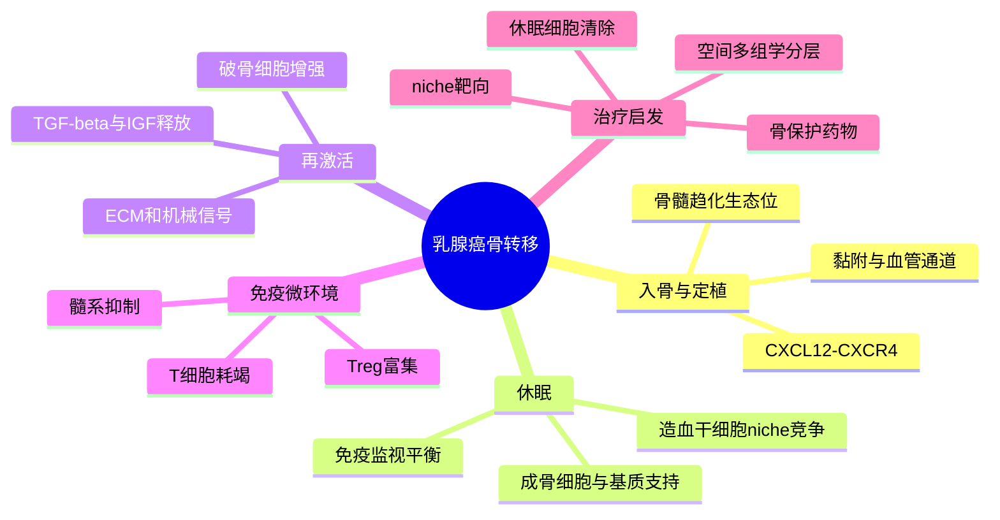

# 骨转移骨生态位机制综述-2026

## 标题

Hijacking the bone niche: mechanistic insights into bone metastasis in breast cancer

## 发表时间与期刊

- 发表时间：2026-06-10
- 期刊：Bone Research
- PubMed：https://pubmed.ncbi.nlm.nih.gov/42271153/
- DOI：https://doi.org/10.1038/s41413-026-00547-z
- PMC：https://pmc.ncbi.nlm.nih.gov/articles/PMC13254371/

## 研究类型

乳腺癌骨转移机制综述。重点不是提出一个新队列，而是把肿瘤细胞、骨髓 niche、成骨/破骨轴、免疫细胞、血管与神经调控整合成一个可用于解释骨嗜性转移的机制框架。

## 研究问题

乳腺癌细胞为什么能在骨髓中长期存活、休眠并重新生长？骨转移不是单纯的“肿瘤细胞到达骨组织”，而是肿瘤细胞逐步劫持造血、骨重塑、免疫抑制、血管和神经信号，使骨髓生态位从稳态支持系统转为转移灶扩增平台。

## 摘要式结论

文章把乳腺癌骨转移理解为一个多阶段生态位重编程过程：循环肿瘤细胞首先利用骨髓趋化轴和血管通道进入骨髓；随后在造血干细胞 niche、成骨细胞、破骨细胞、间充质基质细胞和内皮细胞之间获得休眠或存活支持；当破骨-成骨平衡被打破后，骨基质释放 TGF-beta、IGF、钙离子等因子，进一步推动肿瘤增殖和骨破坏，形成“恶性循环”。免疫层面，髓系细胞、Treg、耗竭 T 细胞和骨髓免疫耐受共同降低清除效率；治疗层面，骨靶向药物、内分泌/靶向治疗、免疫治疗和 niche 干预需要按阶段组合，而不能只盯肿瘤细胞本身。

## 文章行文逻辑

1. 先定义乳腺癌骨转移的临床重要性：骨是乳腺癌最常见远处转移部位之一，且与疼痛、骨折、脊髓压迫和长期治疗负担相关。
2. 接着解释骨髓生态位为什么适合转移细胞存活：造血 niche、成骨细胞 niche、血管 niche 和免疫 niche 本来用于维持组织稳态，却可被肿瘤细胞借用。
3. 然后拆解肿瘤细胞入骨、休眠、再激活和扩增的阶段性机制，包括趋化、黏附、骨重塑和 ECM/机械信号。
4. 进一步讨论肿瘤细胞与破骨细胞、成骨细胞、骨髓基质细胞、内皮细胞、免疫细胞之间的双向作用。
5. 最后转向治疗和转化：骨保护药物只能处理部分骨破坏环节，更值得发展的方向是识别休眠/再激活窗口、靶向骨髓免疫抑制与基质依赖性，并用多组学和空间技术定义患者分层。

## 主要创新点

- 把骨转移从“骨破坏终末事件”前移为“骨髓生态位被逐步劫持”的连续过程，适合连接早期 DTC、休眠、再激活和临床骨病灶。
- 强调骨髓本身的造血/免疫/血管/神经调控不是背景噪音，而是乳腺癌细胞能否在骨内存活和扩增的决定性变量。
- 对用户课题有价值的一点是：骨转移不应只比较肿瘤细胞 marker，还应纳入 osteoclast/osteoblast、CAF/MSC、内皮、髓系免疫和 T 细胞状态的配体-受体网络。

## 关键数据类型与是否可下载

这是一篇综述，本身不产生新的测序数据。可下载内容主要是开放全文、图表和参考文献。文章适合作为机制索引，用来反查其中引用的原始研究、单细胞/空间组学队列和骨转移模型数据。

## 可借鉴的方法

- 将骨转移分析拆成阶段：入骨、微小残留/休眠、再激活、溶骨/成骨病灶扩增。
- 单细胞分析中不要只按肿瘤细胞聚类，应建立骨 niche 细胞模块：osteoclast-like、osteoblast-lineage、MSC/perivascular、endothelial、myeloid、T/NK。
- 结合 ligand-receptor 分析验证骨转移机制时，优先检查 CXCL12-CXCR4、RANKL-RANK、TGF-beta、IGF、integrin/ECM、CSF1/CSF1R、TAM/T cell checkpoint 轴。
- 对休眠相关假设，建议把 DTC/早期骨髓样本和 overt bone metastasis 分开，不要把骨转移作为单一终末状态处理。

## 可借鉴的创新点

- 可把“器官嗜性”写成生态位依赖，而不是肿瘤细胞单向决定：骨转移细胞的优势来自与骨髓稳态系统的适配和劫持。
- 对 Figure5D/互作网络类分析，可把骨转移中的关键问题表述为“哪些配体-受体边从稳态支持转为转移支持”，而不是只找差异表达基因。
- 适合在讨论部分补充“骨转移的免疫抑制不是独立模块，而是与骨重塑和造血 niche 共享空间结构”的观点。

## 与用户课题的潜在关联

- 若用户比较 PT 与不同器官 MT 的细胞通讯，骨转移应特别关注肿瘤-基质-破骨/成骨轴，而不是照搬脑或肺转移的免疫逻辑。
- 对跨器官转移嗜性，可把骨作为“骨髓稳态系统被肿瘤利用”的代表，与脑转移的血脑屏障/髓系重编程、肺转移的血管外渗/炎症生态位形成对照。
- 对公共数据验证，建议把已记录的骨转移单细胞资源与该综述的机制轴对齐，优先检查骨 niche 相关配体-受体边是否在 MT 侧增强。

## 局限性

- 综述型文章不能替代原始队列验证，部分机制来自动物模型或不同癌种外推。
- 骨转移内部存在溶骨型、成骨型和混合型病灶差异，单一机制框架可能掩盖患者异质性。
- 对卵巢、脑、肺等器官转移的可迁移性有限；骨髓 niche 的造血和骨重塑特征不能直接套用到其他器官。

## 相关笔记

- [[骨转移多基因程序代表性研究-2003]]
- [[骨转移单细胞异质性与PDO-2022]]
- [[乳腺癌骨转移单细胞GSE190772-2026-06-21]]
