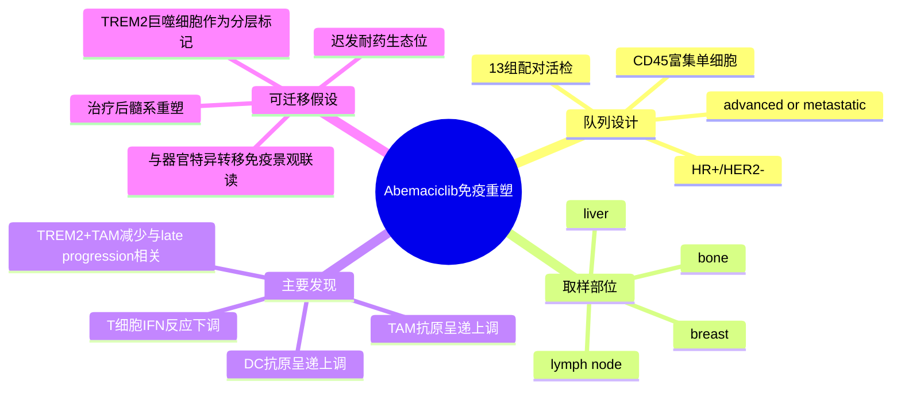

# Abemaciclib免疫重塑单细胞-2026

- 标题：Single-cell transcriptomics reveals immune landscape dynamics in metastatic hormone receptor-positive breast cancer treated with abemaciclib and endocrine therapy
- 发表时间：2026-05-13
- 期刊：Clinical Cancer Research
- PubMed：[PMID 42126533](https://pubmed.ncbi.nlm.nih.gov/42126533/)
- DOI：[10.1158/1078-0432.CCR-25-0946](https://doi.org/10.1158/1078-0432.CCR-25-0946)
- 研究类型：转移性 HR+/HER2- 乳腺癌治疗前后配对活检单细胞研究；聚焦 CD45 富集免疫细胞

## 研究问题
在转移性 HR+/HER2- 乳腺癌中，`abemaciclib + endocrine therapy` 不只是抑制肿瘤细胞周期，是否还会系统性重塑免疫微环境？哪些免疫状态与“进展较晚”而不是“快速耐药”相关？

## 摘要式结论
这篇文章的核心价值不在于再证明一次 CDK4/6 抑制剂“有免疫作用”，而在于把这种作用拆到了免疫细胞亚群层面。作者对 13 组配对晚期/转移性 ER+/HER2- 活检做 `CD45-enriched scRNA-seq`，共分析 170,798 个细胞，样本来自 bone、breast、lymph node 和 liver。主要结果是：治疗后多类 T 细胞的 interferon-response 基因下调，而 TAM 和树突细胞的 antigen-presentation 程序上调；更重要的是，`TREM2+ TAM` 比例在“late progressors”中下降，而较低的 `TREM2+ TAM` signature 与更好的总生存相关。对用户课题最有用的地方在于，它提供了一个“治疗压力 -> 免疫髓系重塑 -> 转移灶耐药时序分层”的框架，可迁移到脑/肺/骨等转移灶的免疫生态分析中。

## 文章行文逻辑
1. 先提出临床问题：`abemaciclib + ET` 已是 HR+/HER2- 转移性乳腺癌一线标准，但其免疫效应在真实转移灶中的细胞级证据不足。
2. 用 13 组治疗前后配对活检构建免疫单细胞图谱，并且限定为 `CD45+` 富集，集中看 T 细胞、巨噬细胞、树突细胞等免疫组分。
3. 比较治疗前后转录状态，发现 T 细胞 interferon 程序和髓系 antigen-presentation 程序发生方向不同的改变。
4. 再把细胞状态与临床进展时序联系起来，提出 `TREM2+ TAM` 是更值得继续追踪的耐药/迟发进展相关髓系状态。
5. 最后把单细胞 signature 投射到公开生存数据，形成“单细胞发现 -> 临床相关性”的闭环。

## 主要创新点
- 不是单次横断面，而是治疗前后配对活检，能直接观察治疗诱导的免疫状态迁移。
- 不是泛泛而谈“肿瘤免疫被激活或抑制”，而是把差异收敛到具体免疫亚群，尤其是 `TREM2+ TAM`。
- 把单细胞发现与公开生存数据关联，提升了 signature 的转化价值。
- 研究对象是晚期/转移性 HR+ 疾病而非早期原发灶，更贴近用户的转移课题。

## 关键数据类型与是否可下载
- `CD45-enriched scRNA-seq`：文章明确给出 13 组配对活检、170,798 个细胞和取样部位信息。
- 临床配对活检：真实世界转移灶样本，价值高，但从公开摘要与期刊页面暂未直接确认稳定的 GEO/SRA accession。
- 公共生存数据再分析：可复核思路，但不是本文自产单一原始队列。
- 当前判断：这篇文章值得做机制与 signature 迁移，但若后续要下载原始单细胞矩阵，需再专门追踪 `data availability` 或补充材料。

## 可借鉴的方法
- 在治疗研究里优先使用“治疗前后配对活检”而不是仅比较 responder / non-responder 的横断面设计。
- 将 scRNA 分析聚焦到 `CD45+` 免疫分量，可减少肿瘤细胞高丰度信号对免疫问题的稀释。
- 把候选髓系状态做成 signature 后，再投射到公开队列验证生存相关性，是很适合用户课题复用的分析套路。
- 后续若分析脑/肺/骨转移，可优先追踪 `TREM2`, antigen presentation, interferon-response 这三类模块，而不是只看传统 M1/M2 二分。

## 可借鉴的创新点
- 以“进展时序”而不是单纯“是否进展”来分层，适合识别迟发耐药和慢演化转移生态位。
- 把髓系生态变化放到治疗响应框架里，而不是只盯肿瘤细胞内在通路。
- 采用单细胞发现和公开生存数据互证的轻量转化闭环，适合用户后续在公开数据中快速试错。

## 与用户课题的潜在关联
这篇文章虽然不直接聚焦脑/肺/骨/卵巢转移中的某一个器官，但它非常适合补足“治疗史如何塑造转移灶免疫生态”的维度。用户后续若整合不同器官转移单细胞数据，可以把 `TREM2+ TAM` 是否在治疗后富集、`antigen presentation` 是否上调、T 细胞 `interferon-response` 是否被压低，作为跨器官可比较的分析轴。它尤其适合和 [[ER+内分泌治疗-P-Rex1-Rac1转移逃逸-2026]] 联读：前者强调肿瘤细胞在内分泌压力下的转移逃逸，本篇则强调免疫生态在 CDK4/6i + ET 下的并行重塑。

## 局限性
- 取样部位虽然覆盖 bone、breast、lymph node、liver，但不包含用户最关心的 brain / lung / ovary，器官外推要谨慎。
- 研究重点是免疫细胞，因此不适合直接回答肿瘤上皮细胞和基质细胞的全生态问题。
- 从当前可见公开页面尚未确认原始单细胞 accession，短期更适合做机制借鉴而非立刻下载复现。
- `late progressor` 相关结论很有启发，但仍需在更大、更多器官的独立转移队列中验证。

## 相关笔记
- [[ER+内分泌治疗-P-Rex1-Rac1转移逃逸-2026]]
- [[乳腺癌脑转移单细胞图谱-2026]]
- [[HTAN乳腺癌转移多模态单细胞图谱-2026-06-07]]
