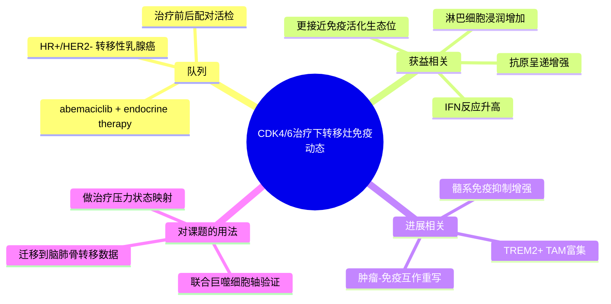

# CDK4/6治疗免疫重塑转移ER+乳腺癌-2026

- 发表时间：2026-05-13（Epub 2026-05）
- 期刊：Clinical Cancer Research
- PubMed：[PMID: 42126533](https://pubmed.ncbi.nlm.nih.gov/42126533/)
- DOI：[10.1158/1078-0432.CCR-25-0946](https://doi.org/10.1158/1078-0432.CCR-25-0946)
- 研究类型：人转移性 HR+/HER2- 乳腺癌纵向单细胞转录组研究（治疗前后配对活检，结合空间免疫荧光与临床疗效）

## 研究问题
在接受 abemaciclib 联合内分泌治疗的转移性 HR+/HER2- 乳腺癌中，哪些免疫生态位和细胞状态与早期获益、后期进展和耐药演化相关？

## 摘要式结论
这篇文章的价值不在于再说一遍“CDK4/6 抑制剂会影响免疫”，而是把转移灶中的免疫动态拆成了可复用的几个状态轴：治疗获益样本更接近抗原呈递增强、干扰素反应激活和淋巴细胞浸润增加；后期进展样本则更偏向免疫抑制性髓系重塑，尤其是 `TREM2+ TAM` 富集。对用户课题的直接意义是，它提供了一个“治疗压力如何改写转移灶免疫微环境”的真实患者模板，适合迁移到脑/肺/骨等器官转移数据里做状态映射，而不是仅停留在药敏二分类。

## 文章行文逻辑
1. 从临床问题出发：HR+/HER2- 转移性乳腺癌广泛使用 CDK4/6 抑制剂，但耐药后的免疫生态位变化仍不清楚。
2. 对治疗前、治疗中获益和后期进展的转移病灶做单细胞转录组和组织层面的配对解析。
3. 先定义肿瘤细胞、髓系细胞、T/NK 细胞等主要 compartment 的状态变化，再把这些变化映射到疗效分组。
4. 提炼出与获益相关的免疫激活特征，以及与进展相关的 `TREM2+ TAM` 等免疫抑制模块。
5. 回到临床意义：提示 CDK4/6 联合治疗后的失败并非单纯肿瘤细胞内在耐药，而是伴随可识别的转移灶免疫重塑。

## 主要创新点
- 不是横截面比较，而是围绕同一治疗策略观察转移灶免疫状态如何演化。
- 将 `TREM2+ TAM` 从泛泛的“免疫抑制巨噬细胞”具体化为治疗后期进展的核心伴随状态之一。
- 把临床获益/进展与单细胞生态位变化直接挂钩，便于后续做 signature 外部验证和转移器官比较。

## 关键数据类型与是否可下载
- 单细胞转录组、组织免疫荧光、临床疗效分组：论文已明确存在。
- 截至 2026-06-09，本次检索未直接确认该 2026 论文自身的公开 GEO/EGA accession。
- 因此当前更适合把它当作高质量“机制与状态模板”文献，而不是立即作为可下载原始队列。

## 可借鉴的方法
- 用“治疗前 vs 获益中 vs 进展后”的纵向分组替代简单 responder/non-responder 二分法。
- 在单细胞层面先做髓系和淋巴系状态定义，再回连临床疗效，而不是直接从差异基因堆叠结论。
- 把 `TREM2+ TAM`、抗原呈递和 IFN 反应做成模块分数，投射到其他器官转移或 bulk 队列中验证。

## 可借鉴的创新点
- 将治疗压力视为“转移微环境塑形器”，这对理解晚期转移灶差异尤其重要。
- 强调真实患者配对样本的动态设计，比单时间点转移图谱更适合生成可干预假设。

## 与用户课题的潜在关联
- 若用户想研究转移灶中巨噬细胞主导的免疫抑制，这篇文章给出了可迁移的 `TREM2+ TAM` 框架，可与已有肺转移 `TREM2` 数据和脑转移免疫分型联动。
- 若后续要比较不同转移器官对治疗压力的响应差异，可把“抗原呈递/IFN 反应增强”与“髓系免疫抑制回潮”作为两个主轴。
- 对计算分析来说，它特别适合作为 HR+ 转移病灶免疫状态注释参考，而不是只做文献背景。

## 局限性
- 当前未确认该 2026 队列的公开原始 accession，数据复用便利性不如已开放 GEO/HTAN 资源。
- 研究聚焦 HR+/HER2- 和 abemaciclib 联合内分泌治疗，不能直接外推到 TNBC 或其他治疗背景。
- 转移器官异质性与治疗史往往耦合，做跨器官解释时要避免把治疗效应误判成器官特异性。

## 相关笔记
- [[ER+内分泌治疗-P-Rex1-Rac1转移逃逸-2026]]
- [[HTAN乳腺癌转移多模态单细胞图谱-2026-06-06]]
- [[乳腺癌肺转移TREM2巨噬细胞单细胞-2026-05-31]]
- [[脑转移免疫生态分型-2026]]
