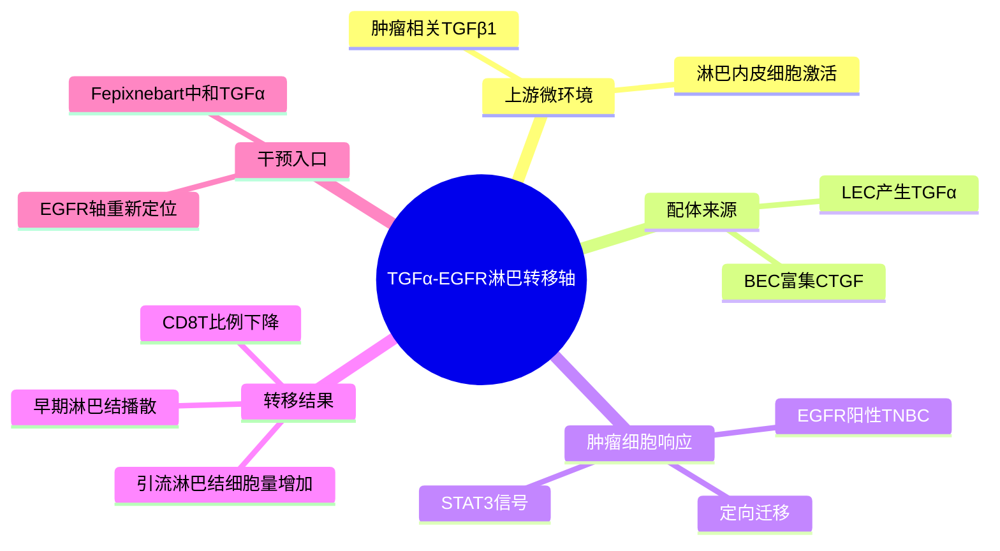

# TGFα-EGFR淋巴转移轴-2026

- 标题：TGF-α/EGFR-mediated lymphatic metastasis reveals a repositionable therapeutic target in breast cancer
- 发表时间：2026-04-03
- 期刊：npj Breast Cancer
- PubMed：[PMID: 41932901](https://pubmed.ncbi.nlm.nih.gov/41932901/)
- DOI：[10.1038/s41523-026-00941-0](https://doi.org/10.1038/s41523-026-00941-0)
- 研究类型：机制研究 + 淋巴转移模型 + 内皮来源配体分析 + 药物再定位

## 研究问题
EGFR 在乳腺癌中的临床靶向效果长期不稳定，但是否存在一个更早、更特异的适用场景：促进 EGFR 阳性 TNBC 细胞经淋巴系统播散，而非直接驱动原发瘤生长？

## 摘要式结论
文章证明 EGFR 主要促进三阴性乳腺癌的选择性淋巴播散。淋巴内皮细胞在肿瘤相关环境中产生 `TGF-α`，尤其受到 `TGF-β1` 刺激后更明显；`TGF-α-EGFR` 通过 `STAT3` 诱导肿瘤细胞定向迁移。与之相对，血管内皮富集的 `CTGF` 对迁移有抑制作用。使用中和 `TGF-α` 的抗体 Fepixnebart 可抑制早期 EGFR 阳性肿瘤细胞淋巴结转移，并且 EGFR 过表达还伴随肿瘤引流淋巴结细胞量增加和 CD8+ T 细胞比例下降。

## 文章行文逻辑
1. 从 EGFR 靶向治疗在乳腺癌中效果有限这一矛盾切入，重新定义 EGFR 的作用阶段和转移路径。
2. 证明 EGFR 过表达不显著改变原发瘤生长，却增强淋巴结播散。
3. 比较淋巴内皮与血管内皮来源信号，定位 `TGF-α` 为促迁移配体，`CTGF` 为相对抑制配体。
4. 将肿瘤微环境中的 `TGF-β1` 放在上游，解释为什么淋巴内皮会成为 `TGF-α` 来源。
5. 用迁移实验、STAT3 机制和 Fepixnebart 阻断实验闭合因果链。
6. 扩展到肿瘤引流淋巴结免疫状态，提示该轴不仅促播散，也可能塑造早期免疫抑制。

## 主要创新点
- 将 EGFR 在乳腺癌中的作用从“驱动原发瘤增殖”重新定位为“早期淋巴播散和引流淋巴结免疫塑形”。
- 明确区分淋巴内皮和血管内皮的配体生态位：`TGF-α` 促迁移，`CTGF` 抑制迁移。
- 将 `TGF-β1`、淋巴内皮、EGFR 阳性肿瘤细胞、STAT3 和 CD8+ T 细胞变化串成一条可干预链条。
- 提出 Fepixnebart 的肿瘤适应症再定位思路，比泛泛使用 EGFR 抑制剂更精确。

## 关键数据类型与是否可下载
- 小鼠乳腺癌淋巴转移模型和流式/免疫荧光数据：支撑 EGFR 对淋巴结转移的阶段性作用。
- 迁移、趋化和 STAT3 机制实验：可借鉴为验证内皮来源配体功能的实验流程。
- 人类乳腺癌内皮亚群表达分析：文章利用已有单细胞资源辅助定位 `TGFA` 和 `CTGF` 的内皮来源。
- 可下载公共数据：与淋巴结转移微环境最直接相关的数据可使用 `GSE167036` / `GSE190870`，包含 8 例乳腺癌原发灶与配对淋巴结转移单细胞 RNA/TCR，并含部分 Visium 空间转录组。

## 可借鉴的方法
- 分析淋巴转移时，不只比较原发灶和 LNM 的肿瘤细胞状态，还要单独提取 `LEC/BEC` 内皮亚群，测试 `TGFA`、`CTGF`、`TGFB1` 响应和 EGFR 靶细胞空间邻近。
- 配体-受体分析应区分“促定向迁移”的功能轴和“表达相关但方向不清”的候选轴。
- 用肿瘤引流淋巴结的 T 细胞组成作为早期转移生态位 readout，特别关注 CD8+ T 细胞比例、耗竭和抗原呈递变化。
- 对 EGFR 靶向治疗的解释应按分子亚型、EGFR 表达、转移路径和治疗时点分层。

## 可借鉴的创新点
- 在用户课题中可将“血行器官转移”和“淋巴结转移/淋巴通路”分开建模，避免把 EGFR 轴简单外推到肺、脑、骨所有转移。
- `TGFA-EGFR-STAT3` 可作为淋巴结转移验证轴；`CTGF` 可作为血管内皮相反方向对照。
- 若使用单细胞数据，可构建 `LEC TGFA score -> malignant EGFR/STAT3 score -> LNM T cell suppression` 的三段式验证。

## 与用户课题的潜在关联
- 虽然用户优先关注脑、肺、骨、卵巢等远处器官转移，但淋巴结常是乳腺癌转移和免疫教育的重要中间生态位；该文可帮助解释早期播散路径。
- 该机制可与脑转移 TRM/TLS、肺转移前生态位和骨转移免疫排斥笔记互补：它强调的是淋巴内皮来源配体和引流淋巴结免疫改变。
- 对计算分析而言，`GSE167036/GSE190870` 是当前可直接复用的患者配对 LNM 单细胞/空间资源，适合做方法验证和假设预筛。

## 局限性
- 机制重点是 TNBC 与淋巴转移，不能直接等同于 ER+ 或 HER2+ 乳腺癌，也不能直接外推到血行远处器官转移。
- Fepixnebart 的抗肿瘤再定位仍处于机制和前临床层面，临床疗效、适用人群和安全性需要进一步验证。
- 公开配对 LNM 单细胞数据样本量有限，且多为治疗前/手术样本；用于因果推断时需谨慎。

## 相关笔记
- [[脑转移TRM与TLS景观-2026]]
- [[乳腺癌脑转移免疫景观-2026]]
- [[棕榈酸-中性粒细胞-LCN2肺转移前生态位-2026]]

