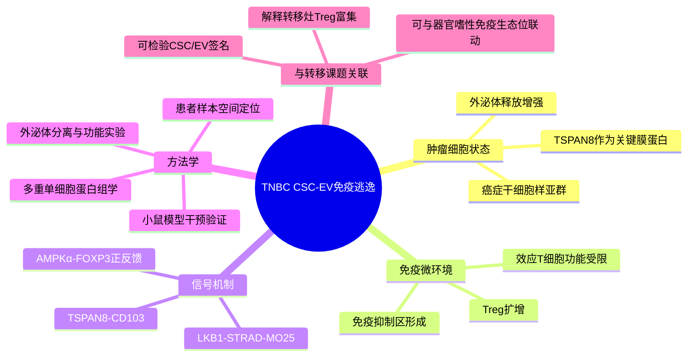

# TNBC癌症干细胞外泌体免疫逃逸-2026

## 基本信息

- 标题：Cancer stem cells orchestrate immune evasion through extracellular vesicle-mediated non-canonical signaling pathways
- 发表时间：2026-05-07 online
- 期刊：Cancer Cell
- PubMed：https://pubmed.ncbi.nlm.nih.gov/42102811/
- DOI：https://doi.org/10.1016/j.ccell.2026.04.004
- 研究类型：机制研究；患者样本空间/多重单细胞蛋白组学 + 小鼠模型 + 外泌体功能验证

## 研究问题

三阴性乳腺癌中，具有癌症干细胞特征的肿瘤细胞是否可以主动重塑免疫微环境，而不是仅通过增殖优势或治疗耐受实现进展？如果可以，具体由哪类细胞外囊泡膜蛋白驱动，最终落到哪一类免疫抑制细胞和通路上？

## 摘要式结论

文章提出一个清晰轴线：TNBC 癌症干细胞来源的 `TSPAN8+` 细胞外囊泡与 T 细胞上的 `CD103` 相互作用，触发 `LKB1-STRAD-MO25 -> AMPKα -> FOXP3` 信号级联，形成 `CD103+FOXP3+` Treg 扩增和免疫抑制生态位。这个结论对转移课题的价值不在于直接证明某一远处器官转移，而在于提供了一个可迁移的“干性肿瘤细胞-外泌体膜拓扑-Treg”框架，可用于解释转移灶中免疫冷区、Treg 富集和治疗抵抗。

## 文章行文逻辑

1. 从 TNBC 患者样本的空间/单细胞蛋白组学入手，识别癌症干细胞样肿瘤细胞与免疫抑制区的空间共现。
2. 进一步追踪癌症干细胞分泌的细胞外囊泡，锁定 `TSPAN8` 作为关键膜蛋白和通讯线索。
3. 在功能实验中验证 `TSPAN8+` EV 可以改变 T 细胞状态，促进 `CD103+FOXP3+` Treg 分化与克隆扩增。
4. 将机制落到 `CD103-LKB1-AMPKα-FOXP3` 信号级联，而不是把外泌体效应笼统归因于 cargo 内吞。
5. 通过中和 `EV-TSPAN8+` 评估治疗意义，提示该策略可与 anti-PD-1 协同。

## 思维导图

## 主要创新点

- 把 TNBC 癌症干细胞的免疫逃逸功能具体化为外泌体通讯，而不是停留在“干性更强、免疫更冷”的相关性。
- 将外泌体膜蛋白 `TSPAN8` 与 T 细胞 `CD103-LKB1-AMPKα-FOXP3` 信号连接起来，提供了一个可验证的分子轴。
- 使用患者样本的空间/高维蛋白组学支持细胞间关系，再用模型系统做因果验证，证据链比单纯转录组关联更完整。

## 关键数据类型与是否可下载

- 患者 TNBC 肿瘤样本的多重单细胞蛋白组学/空间蛋白组学：摘要提示使用高维单细胞蛋白组学，需从论文 Data availability 或期刊补充材料确认原始矩阵入口。
- 外泌体相关实验数据：多为功能实验和补充表，适合抽取候选分子、抗体面板和实验流程。
- 小鼠模型干预数据：用于验证 CSC-EV-Treg 轴，但不应直接替代人源转移队列。

## 可借鉴的方法

- 用空间共定位先确定 CSC-like 肿瘤细胞与 Treg/免疫抑制区的邻近关系，再做外泌体功能实验，避免只靠 bulk 相关性推断通讯。
- 对用户的转移灶数据，可构建 `CSC signature / TSPAN8 / EV biogenesis / CD103+FOXP3+ Treg score / LKB1-AMPK pathway` 组合模块，比较脑、肺、骨、卵巢转移灶是否存在相同免疫逃逸结构。
- 若有 CellChat/NicheNet 结果，可把 `TSPAN8-CD103` 作为候选轴单独检查，但要注意外泌体膜拓扑不一定完全符合经典分泌配体-受体模型。

## 可借鉴的创新点

- 把“肿瘤干性”从细胞内状态扩展为可塑造微环境的通讯状态。
- 将外泌体膜蛋白、Treg、FOXP3 正反馈放在同一条因果链上，适合迁移到转移前生态位或转移灶免疫抑制研究。
- 文章给用户课题提供了一个可以跨器官比较的假设：远处转移中 CSC-like 肿瘤细胞是否通过 EV 货物塑造局部 Treg/髓系免疫抑制。

## 与用户课题的潜在关联

- 脑转移：可检查 CSC-like 肿瘤细胞是否与 Treg、MDSC、边界巨噬细胞共定位，并比较 `TSPAN8` 高表达肿瘤细胞邻近区域是否富集 `ITGAE/CD103` 与 `FOXP3`。
- 肺转移：可与中性粒细胞/巨噬细胞生态位数据联用，测试 `TSPAN8` 或 EV 生成模块是否伴随免疫排斥。
- 骨转移：可与骨髓免疫抑制和 Treg 富集相结合，判断 CSC-EV 轴是否参与骨髓免疫生态位改造。
- 卵巢转移：公共单细胞资源稀缺，可先在 bulk 或模型数据中做签名层面的初筛。

## 局限性

- 该文主轴是 TNBC 原发/模型免疫逃逸，不是远处器官转移专门研究；迁移到脑、肺、骨、卵巢转移时需要独立验证。
- 外泌体膜拓扑介导的 `TSPAN8-CD103` 通讯可能不完全被常规 scRNA ligand-receptor 工具捕获，需要结合蛋白、空间或功能实验。
- 公开数据入口本轮尚未核验到稳定 accession；在正式复用前应回到期刊 Data availability、补充材料或数据库页面确认原始数据层级。

## 相关笔记

- [[感觉神经-CAF免疫排斥-2026]]
- [[mTNBC时空TME与ICI响应-2026]]
- [[乳腺癌免疫学综述-2026]]
