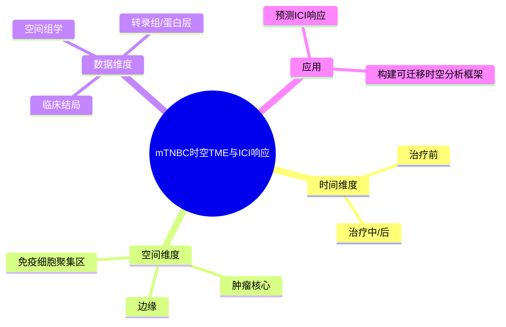

# mTNBC时空TME与ICI响应-2026

- 发表时间：2026-02-26
- 期刊：Nature Cancer
- PubMed：[PMID: 41708895](https://pubmed.ncbi.nlm.nih.gov/41708895/)
- DOI：[10.1038/s43018-026-01114-5](https://doi.org/10.1038/s43018-026-01114-5)
- 研究类型：临床队列分析 + 空间多组学/计算方法资源

## 研究问题
转移性三阴性乳腺癌在免疫检查点治疗前后，其肿瘤微环境的时间和空间组成是否能够预测疗效；是否存在可复用的临床队列与分析框架来支持这一问题？

## 摘要式结论
这篇文章的价值在于把 TONIC 这类经典临床试验资源从“药物结局队列”升级为“时空微环境分析资源”。作者表明，mTNBC 对 ICI 的响应，不仅取决于单个免疫 marker，而与治疗前后的空间组织结构、细胞组合与微环境演化轨迹有关。对用户课题的现实意义很强：即便研究重点不是 ICI，本研究依然提供了一个可迁移的方法模板，即把治疗前后、病灶不同区域和多层数据放进同一框架中分析微环境变化。

## 文章行文逻辑
1. 先指出 mTNBC 免疫治疗响应异质性高，单变量 biomarker 解释力有限。
2. 借助 TONIC 队列整合临床结局、空间层和分子层信息。
3. 比较 responder 与 non-responder 在治疗前后和空间位置上的微环境差异。
4. 归纳可复用的时空特征组合，而不是依赖单一 marker。
5. 讨论其对后续队列设计、预测模型和组合疗法的意义。

## 主要创新点
- 强调“时间 + 空间 + 临床结局”一体化，而不是单时点静态分析。
- 让 TONIC 这类著名临床资源具备了更高的微环境复用价值。
- 适合作为转移灶空间分析和治疗响应预测的模板。

## 关键数据类型与是否可下载
- 临床试验样本及结局：公开层级通常是汇总与处理后结果；细粒度患者级信息可能受控。
- 空间成像/空间组学：部分可通过公开数据库获取，部分需受控申请。
- 转录组和蛋白层：常见为 GEO、EGA、Zenodo、S-BIAD 等多入口分发。
- 下载性判断：中等到偏高。适合做方法迁移和验证框架，不一定适合零门槛全量复现。

## 可借鉴的方法
- 按“治疗前后配对 + 空间区域 + 响应分组”组织分析矩阵。
- 用组合特征替代单变量 marker，例如髓系状态、T 细胞空间进入程度、基质致密化和抗原呈递状态联合判断。
- 若用户后续处理脑/肺/骨转移空间数据，可复用这一时间-空间联合分析视角。

## 可借鉴的创新点
- 在转移性疾病队列中保留时间信息，而不是只做终点样本比较。
- 将临床响应问题转化为时空微环境重构问题，利于后续机制研究承接。

## 与用户课题的潜在关联
- 若用户关注转移灶免疫微环境，本文可作为空间与临床结局结合的模板。
- 若用户准备建立公共数据验证流程，TONIC 资源适合做“疗效相关微环境特征”外部参考。
- 若课题未来会延展到空间转录组或多重免疫染色，这篇文章的方法组织方式值得直接复用。

## 局限性
- 临床队列样本常伴随批次、取样时间和治疗暴露差异，分析需要严格配对。
- 受控数据库较多，获取门槛高于普通 GEO 队列。
- 预测模型的可迁移性仍需在非 TONIC 队列验证。

## 相关笔记
- [[感觉神经-CAF免疫排斥-2026]]
- [[乳腺癌脑转移免疫景观-2026]]

