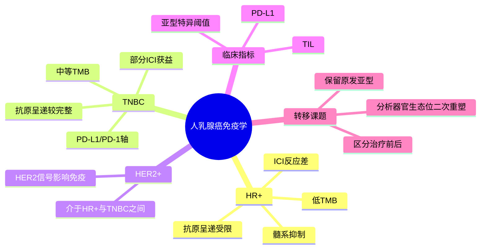

# 乳腺癌免疫学综述-2026

## 标题
The immunology of human breast cancer

## 发表时间与期刊
- 发表时间：2026-05-18
- 期刊：Nature Reviews Immunology
- PubMed：<https://pubmed.ncbi.nlm.nih.gov/42120710/>
- DOI：<https://doi.org/10.1038/s41577-026-01307-0>

## 研究类型
高影响力综述。选择理由：这是最新的乳腺癌免疫学框架性综述，虽然不是单一转移机制研究，但能为用户课题中“不同乳腺癌亚型为何形成不同免疫微环境、为何对 ICI 反应差异巨大”提供解释框架。

## 研究问题
人乳腺癌不同分子亚型的免疫生态位如何不同？这些差异如何影响免疫检查点抑制剂、TIL/PD-L1 解释、内分泌信号、HER2 信号和转移风险研究？

## 摘要式结论
综述强调乳腺癌在免疫生物学上高度异质：HR+ 乳腺癌通常 TMB 低、抗原加工呈递受限，TME 偏冷且富集免疫抑制性髓系细胞，因此对 ICI 反应差；TNBC 通常 TMB 中等、抗原呈递能力较完整，部分病例由 PD-L1/PD-1 轴主导并可从 ICI 获益；HER2+ 介于两者之间。TIL 与 PD-L1 仍是临床最常用免疫指标，但不足以解释所有亚型、治疗阶段和转移场景。

## 文章行文逻辑
1. 先按 HR+、TNBC、HER2+ 建立乳腺癌免疫异质性的主轴。
2. 再讨论 TMB、抗原呈递、TIL、PD-L1 与疗效/预后的关系，指出这些指标不能跨亚型简单套用。
3. 接着强调激素受体、HER2 信号、肥胖/妊娠等系统因素会重塑局部和全身免疫环境。
4. 最后把免疫治疗策略放回亚型和微环境背景中理解，避免“所有乳腺癌都应免疫激活”的泛化判断。

## 主要创新点
- 将“乳腺癌免疫冷/热”从单一 TIL 指标扩展到 TMB、抗原呈递、髓系抑制、激素信号和 HER2 信号的组合框架。
- 明确提示 HR-low、HER2-low 不是简单的中间标签，而可能具有不同免疫行为，需要单独建模。
- 对用户课题有用之处在于，它提供了跨器官转移分析时必须保留“原发亚型免疫背景”的理由。

## 关键数据类型与是否可下载
综述本身不产生新数据。可追踪的数据资源包括文中引用的 TCGA、METABRIC、SCAN-B、TIL/PD-L1 临床队列、空间/单细胞乳腺癌免疫图谱，以及转移灶免疫差异研究。适合用作数据选择和变量分层框架，而不是直接下载入口。

## 可借鉴的方法
- 分层策略：按 HR+/TNBC/HER2+、HR-low/HER2-low、治疗前后、原发/转移分开解释免疫状态。
- 指标组合：不要单独用 TIL 或 PD-L1 判断免疫活性，应联合抗原呈递、髓系状态、T 细胞功能、B/TLS 结构和治疗背景。
- 转移研究迁移：在分析脑、肺、骨、卵巢转移时，先记录原发亚型，再比较器官微环境诱导的二次重塑。

## 可借鉴的创新点
用户课题可以把该综述作为“免疫解释底座”：先判断转移样本属于 HR+ 冷肿瘤、TNBC 热肿瘤或 HER2+ 中间状态，再解释器官特异性 TAM、T cell exhaustion、TLS、neutrophil 或 CAF 变化。这样能避免把器官差异误判为亚型差异。

## 与用户课题的潜在关联
- 脑转移：若 BCBM 样本多为 HER2+ 或 TNBC，不能直接外推 HR+ 原发灶的免疫冷结论。
- 肺转移：近期 LCN2/中性粒细胞轴应放到 TNBC 或高转移风险免疫背景下解释。
- 骨转移：ERa+ macrophage 生态位与 HR+ 乳腺癌的激素-免疫互作框架高度相关。
- 卵巢转移：公开数据稀缺时，可先用亚型和免疫变量建立可检验假设，再寻找 bulk 或模型数据验证。

## 局限性
- 综述对乳腺癌整体免疫框架很强，但对脑、肺、骨、卵巢等具体器官转移生态位的细节覆盖有限。
- Nature Reviews 文章页面可见内容有限，部分深层论述需要机构全文或 PDF 才能逐段核对。
- 综述型证据不能替代具体队列验证，尤其不能直接证明某个免疫轴在某个转移器官中具有因果作用。

## 思维导图

## 相关笔记
- [[棕榈酸中性粒细胞肺转移-2026]]
- [[ERa巨噬细胞骨转移生态位-2026]]
- [[脑转移TAM-MTC单细胞图谱-2026]]
