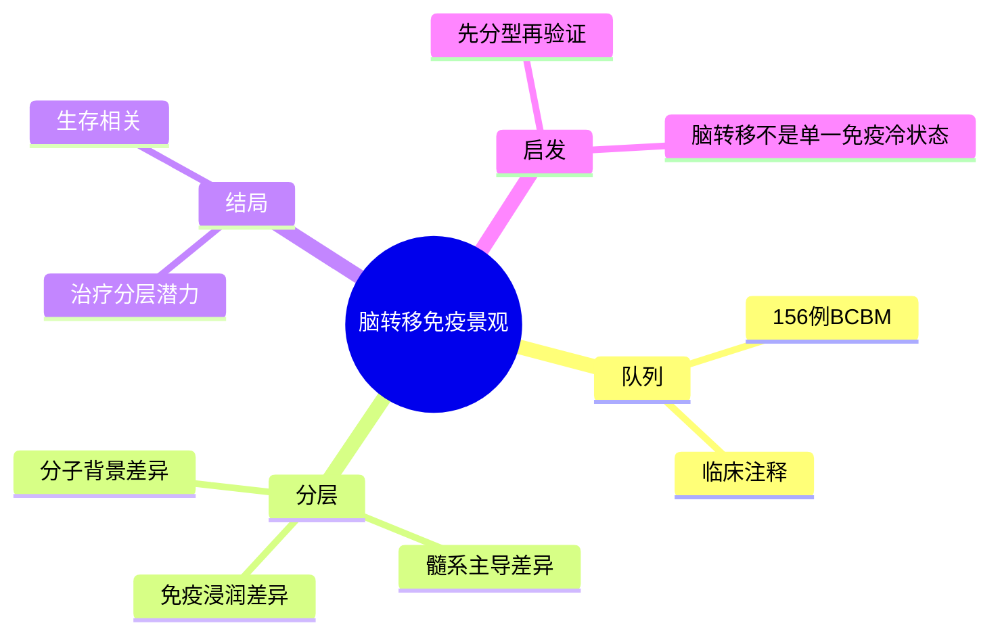

# 乳腺癌脑转移免疫景观

- 发表时间：2026-05-14
- 期刊：Cancer Cell
- PubMed：[检索页](https://pubmed.ncbi.nlm.nih.gov/?term=Comprehensive+immune+landscapes+of+breast+cancer+brain+metastases+unveil+distinct+microenvironmental+subtypes)
- DOI：[10.1016/j.ccell.2026.04.010](https://doi.org/10.1016/j.ccell.2026.04.010)
- 研究类型：大队列脑转移多模态免疫图谱

## 研究问题
在足够大的脑转移临床队列中，乳腺癌脑转移的免疫生态是否能分成稳定的微环境亚型，这些亚型是否与生存和基因组特征相连。

## 摘要式结论
作者对 156 例乳腺癌脑转移进行多模态 profiling，核心产出不是单一 marker，而是“脑转移免疫微环境亚型”框架。研究提示脑转移并非统一的免疫冷肿瘤，不同亚型在免疫浸润、髓系主导程度、基因组背景和生存上存在系统差异。这对用户课题最重要的启发是：脑转移验证不能只做单一基因比较，更应先分亚型，再看机制或疗效关联。

## 文章行文逻辑
1. 以大样本临床队列解决既往脑转移研究样本碎片化问题。
2. 用转录组、免疫表型和临床结局联合建模。
3. 从数据中归纳微环境亚型。
4. 把亚型与生存、分子特征和潜在治疗窗口关联起来。
5. 讨论其对脑转移精准分层和免疫治疗设计的意义。

## 主要创新点
- 规模大，显著优于常见十几例到几十例的脑转移图谱。
- 将免疫亚型、生存和基因组特征放在同一研究框架中。
- 更接近“可转化分层工具”而不是单纯描述型图谱。

## 关键数据类型与是否可下载
- bulk RNA-seq：GEO 线索为 [GSE322943](https://www.ncbi.nlm.nih.gov/geo/query/acc.cgi?acc=GSE322943)，可下载。
- 配套分析代码与更大多模态资源：文中同时提到 [GSE324453](https://www.ncbi.nlm.nih.gov/geo/query/acc.cgi?acc=GSE324453) 和 [GHGA](https://www.ghga.de/) 受控数据入口；下载难度中等到高。
- 临床生存注释：通常可获取到去标识化层面，但详细治疗信息可能受限。

## 可借鉴的方法
- 对脑转移 bulk 或单细胞数据，先做微环境分型，再做差异和生存。
- 可借鉴“免疫亚型 -> 基因组关联 -> 生存关联”的三段式验证路线。
- 若用户已有公共队列，可先用本文亚型相关基因集做 ssGSEA/GSVA 或去卷积验证。

## 可借鉴的创新点
- 把“脑转移微环境异质性”从概念变成可计算的分型变量。
- 用大队列减少个案研究的不稳定性。

## 与用户课题的潜在关联
- 适合做脑转移验证总框架参考。
- 若课题后续比较脑/肺/骨不同器官生态位，可把这里的亚型逻辑迁移到其他器官。
- 若用户关心免疫治疗反应或免疫逃逸，这篇文章可作为分层出发点。

## 局限性
- 虽然队列大，但不同平台和不同中心来源仍可能引入批次效应。
- bulk RNA-seq 对少数细胞群的解释力不如单细胞。
- 受控数据库部分可能增加复现门槛。
