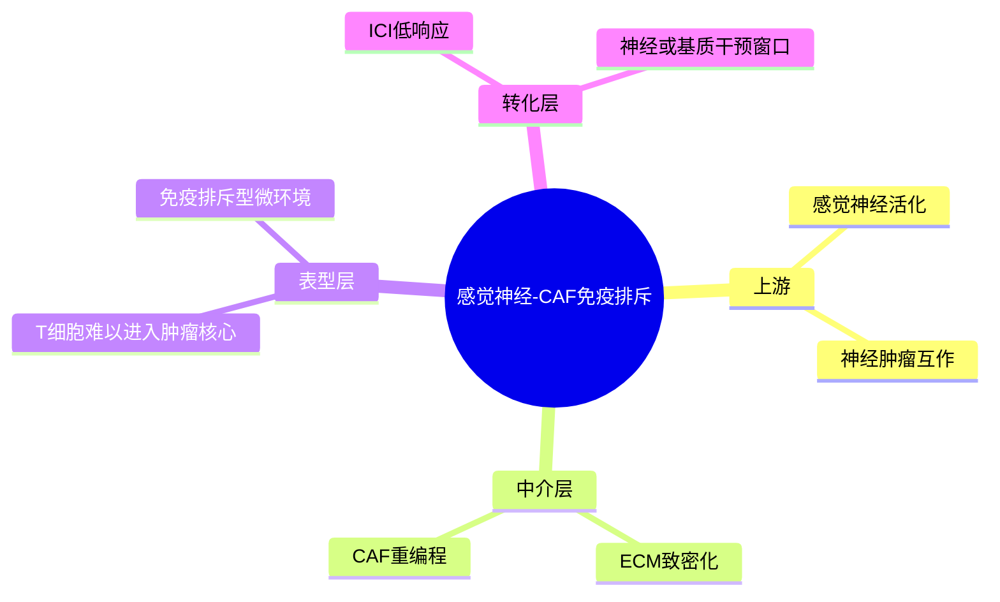

# 感觉神经-CAF免疫排斥-2026

- 发表时间：2026-01-15
- 期刊：Cell
- PubMed：[PMID: 41650969](https://pubmed.ncbi.nlm.nih.gov/41650969/)
- DOI：[10.1016/j.cell.2026.01.001](https://doi.org/10.1016/j.cell.2026.01.001)
- 研究类型：机制研究 + 单细胞/空间多模态整合

## 研究问题
乳腺癌尤其是三阴性乳腺癌的免疫排斥微环境，是否部分由肿瘤周围感觉神经驱动；这种神经信号是否通过成纤维细胞和细胞外基质重塑，间接塑造免疫检查点治疗不敏感状态？

## 摘要式结论
这篇 Cell 的核心不是再讲一遍“基质多就免疫冷”，而是把上游触发器明确到了感觉神经。作者提出一条较完整的轴线：感觉神经信号增强后，癌相关成纤维细胞被重编程，沉积更致密的细胞外基质，继而限制 T 细胞进入肿瘤核心，形成免疫排斥型微环境。对课题最有价值的地方在于，它把“神经-基质-免疫”从相关性拼图推进成了可实验拆解的因果链，适合迁移到转移灶微环境研究，尤其适合解释为什么某些转移器官出现明显免疫冷区。

## 文章行文逻辑
1. 先从 TNBC 免疫排斥和免疫治疗低响应切入，指出单看肿瘤细胞或免疫细胞都不足以解释问题。
2. 用单细胞和空间层面的证据定位感觉神经与 CAF 富集区域。
3. 将神经信号与基质致密化、T 细胞排斥建立关联。
4. 通过功能干预验证，说明阻断神经相关通路可重塑基质并改善免疫进入。
5. 最后把这一轴线连接到免疫治疗敏感性，形成转化意义。

## 主要创新点
- 把感觉神经明确拉入乳腺癌免疫排斥的因果链，而不只是伴随现象。
- 同时连接神经、成纤维细胞、细胞外基质和 T 细胞分布，叙事完整度高。
- 对免疫治疗耐受提出了新的上游可干预节点，优于只盯免疫检查点分子。

## 关键数据类型与是否可下载
- 单细胞转录组：文中用于解析 CAF 和免疫细胞状态；是否完整公开需结合正文数据可得性说明逐项核对。
- 空间转录组/空间成像：用于显示神经、基质与免疫排布；通常可获得处理后矩阵或图像级附件。
- 动物模型与功能实验：可复现实验思路，但不是公共大队列型资源。
- 下载性判断：中等。更适合作为机制与分析框架，而不是快速验证的标准公开队列。

## 可借鉴的方法
- 用“空间邻近关系 + 单细胞状态注释 + 功能干预”三段式建立微环境因果链。
- 分析免疫排斥时，不只看 CD8/Treg 比例，而要同步量化 ECM 致密化和 CAF 亚群。
- 若做转移灶研究，可优先比较神经丰富区、基质边界区和肿瘤核心区，而不是将整块病灶平均化。

## 可借鉴的创新点
- 将神经信号作为微环境分层变量引入乳腺癌转移研究。
- 可把“免疫冷”拆成神经驱动型、基质驱动型、髓系驱动型等不同上游来源，避免把低浸润现象过度简化。

## 与用户课题的潜在关联
- 若课题关注乳腺癌脑/肺/骨转移微环境，这篇文献提供了一个值得跨器官验证的上游机制框架。
- 若后续要结合单细胞或空间组学，可直接借鉴“神经-CAF-ECM-T 细胞”多层注释思路。
- 若用户关心免疫治疗耐药或免疫逃逸，这篇文章可作为解释转移灶免疫排斥的重要候选机制。

## 局限性
- 重点仍然是 TNBC 和免疫排斥背景，向其他亚型或全部转移器官外推需谨慎。
- 神经信号相关机制在不同器官的可迁移性未必一致，脑和骨的宿主环境差异很大。
- 若公开数据层级有限，外部复现实验可能更依赖作者给出的 marker 和空间逻辑，而非完全复刻原分析。

## 相关笔记
- [[乳腺癌脑转移免疫景观-2026]]
- [[肺泡巨噬细胞与肺转移时序-2024]]

