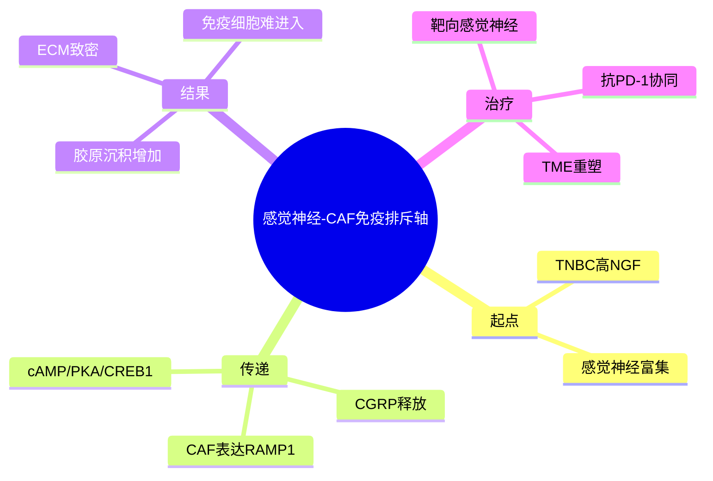

# 感觉神经基质免疫排斥
- 发表时间：2026-02-19（Epub 2026-02-05）
- 期刊：Cell
- PubMed：[PMID: 41650969](https://pubmed.ncbi.nlm.nih.gov/41650969/)
- DOI：[10.1016/j.cell.2026.01.001](https://doi.org/10.1016/j.cell.2026.01.001)
- 研究类型：TNBC 肿瘤微环境机制研究（神经-CAF-ECM-免疫排斥）

## 研究问题
三阴性乳腺癌中的感觉神经是否通过重塑细胞外基质而驱动免疫排斥型微环境，并影响免疫治疗敏感性？

## 摘要式结论
作者把乳腺癌微环境里常被边缘化的“神经”真正放到了因果链上：TNBC 微环境中高浓度 `NGF` 激活感觉神经，诱导其分泌神经肽 `CGRP`；`CGRP` 主要作用于 CAF 上的 `RAMP1`，进一步经 `cAMP/PKA/CREB1` 通路增加胶原沉积，形成致密 ECM 和免疫排斥型 TME。靶向感觉神经后，肿瘤微环境重排，并能与抗 PD-1 协同。对课题最重要的启发是：免疫冷肿瘤并不只是“免疫细胞少”，而可能是被神经-成纤维细胞轴主动封堵。

## 文章行文逻辑
1. 从 TNBC 神经支配现象切入，指出其在 TME 中的功能未明。
2. 确认感觉神经是 TNBC 生态中的主要神经类型。
3. 证明 NGF 刺激感觉神经释放 CGRP。
4. 证明 CAF 是主要响应细胞，且通过 RAMP1-cAMP/PKA/CREB1 促进胶原生成。
5. 把 ECM 致密化与免疫排斥、PD-1 疗效受限连接起来。
6. 通过干预感觉神经或相关轴验证治疗协同潜力。

## 主要创新点
- 将“神经科学”真正接入乳腺癌免疫微环境，而不是停留在相关性观察。
- 把感觉神经与 CAF/胶原重塑串成完整通路，解释免疫排斥的物理屏障来源。
- 提出可转化药理抓手 `CGRP-RAMP1` 轴，具备免疫增敏潜力。

## 关键数据类型与是否可下载
- PubMed 页面明确提到该研究使用了 TNBC 相关模型及微环境分析数据。
- 公开摘要未直接给出 accession；是否公开 scRNA-seq 或配套组学数据，需要后续去期刊正文/补充材料核实。
- 即便没有完整原始数据，文中提出的 `CGRP-RAMP1-CAF-collagen` 轴本身已足以作为验证假设。

## 可借鉴的方法
- 微环境研究可以把“细胞数量变化”与“物理屏障变化”并行建模。
- 做单细胞分析时，建议把神经样信号、CAF 状态和 ECM 模块一起纳入，而不是只分析免疫细胞。
- 免疫治疗失败队列可优先检验 `NGF/CGRP/RAMP1/collagen` 相关程序是否升高。

## 可借鉴的创新点
- 用神经-基质互作解释免疫排斥，比单独看 CAF 亚群更具因果穿透力。
- 将已存在药理轴（如 CGRP 相关拮抗剂）迁移到肿瘤免疫场景，转化路径清晰。

## 与用户课题的潜在关联
- 若课题聚焦肿瘤微环境/免疫冷热点转化，这篇文章很值得作为机制拓展阅读。
- 可与转移灶研究联动：在脑、肺、骨等器官微环境里检查是否也存在“神经或基质先行、免疫后果跟随”的现象。
- 适合作为后续设计 CAF/ECM/免疫排斥 signature 的理论来源。

## 局限性
- 以 TNBC 为主，其他分型乳腺癌是否同样依赖该轴需要额外验证。
- 目前快速检索只能确认摘要级机制链，参数、样本量和数据入口仍需补充核查。
- ECM 致密化与免疫排斥并非唯一因果路径，外推到转移器官时要注意器官特异性。

## 相关笔记
- 乳腺癌脑转移免疫景观-2026
- 核PD-L1驱动肺转移-2025
