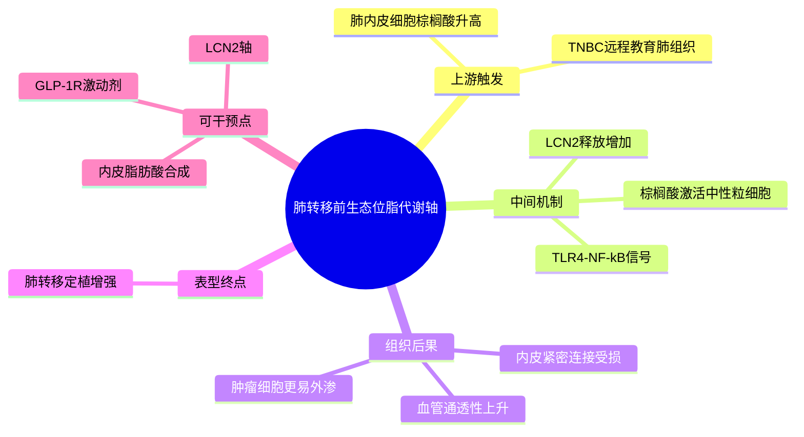

# 棕榈酸-中性粒细胞-LCN2肺转移前生态位-2026

- 发表时间：2026-04-24
- 期刊：Immunity
- PubMed：[PMID: 42034064](https://pubmed.ncbi.nlm.nih.gov/42034064/)
- DOI：[10.1016/j.immuni.2026.03.026](https://doi.org/10.1016/j.immuni.2026.03.026)
- 研究类型：机制研究 + 代谢微环境 + 转移前生态位

## 研究问题
三阴性乳腺癌肺转移前生态位中，究竟是什么因素先让肺血管屏障变“松”，从而提高肿瘤细胞外渗和定植效率？作者聚焦脂代谢，追问肺内皮来源的棕榈酸是否通过重编程中性粒细胞来破坏血管完整性。

## 摘要式结论
这篇文章把“脂代谢异常促进转移”从泛泛描述推进成了一条相对闭合的因果链：TNBC 先在肺部建立富棕榈酸的转移前生态位，肺内皮细胞是重要来源；棕榈酸通过 `TLR4-NF-kB` 轴激活中性粒细胞分泌 `LCN2`；中性粒细胞来源的 `LCN2` 进一步破坏内皮紧密连接、增加血管通透性，促进肿瘤细胞外渗和肺定植。更关键的是，作者提示抑制内皮脂肪酸合成或利用 `GLP-1R` 激动剂保护血管屏障，可能成为阻断肺转移的代谢干预策略。

## 文章行文逻辑
1. 从 TNBC 易发生肺转移、且转移前生态位存在血管重塑切入。
2. 证明肺部在转移发生前已出现棕榈酸富集，而不是等转移灶形成后才改变。
3. 追踪棕榈酸来源，定位到肺内皮细胞而非单纯归因于肿瘤细胞代谢外溢。
4. 证明棕榈酸可重编程中性粒细胞，诱导其分泌 `LCN2`，并解析上游为 `TLR4-NF-kB`。
5. 证明 `LCN2` 直接损伤内皮屏障、提高血管渗漏，最终促进肿瘤细胞外渗与肺转移。
6. 用代谢干预收尾，说明抑制内皮脂肪酸合成可以降低肺转移负担。

## 主要创新点
- 把肺转移前生态位中的“脂代谢信号”具体化为内皮来源棕榈酸，而不是笼统讨论肥胖或脂肪酸。
- 把中性粒细胞从“被招募的伴随者”推进成破坏血管屏障的功能执行者。
- 给出了从代谢改变到血管渗漏再到外渗定植的完整链条，较适合迁移到器官嗜性转移研究中。
- 提出 `GLP-1R` 激动剂这一具有转化潜力的干预入口，增强了文章的可操作性。

## 关键数据类型与是否可下载
- 动物模型肺转移前生态位数据：用于定义时间顺序和组织表型，通常可复现实验思路，但不一定形成标准公共队列。
- 脂质相关检测：支撑“棕榈酸富集”这一核心前提，适合借鉴检测框架。
- 中性粒细胞功能实验：适合借鉴机制验证路径。
- 公开可下载性判断：当前通过 PubMed/期刊摘要可确认文章已正式上线，但未在摘要页直接看到明确 accession；更适合作为机制假说来源，而非立即下载复算的标准公开数据包。

## 可借鉴的方法
- 先做“器官层面的代谢异常定位”，再下钻到具体宿主细胞来源，而不是直接从肿瘤细胞端假设机制。
- 用“代谢物变化 -> 免疫细胞重编程 -> 屏障功能变化 -> 转移表型”的四段式框架组织验证。
- 若后续分析肺转移单细胞/空间数据，可重点关注内皮细胞脂代谢程序、中性粒细胞 `LCN2`、以及屏障相关紧密连接分子。
- 若做跨器官比较，可把“促进外渗的宿主屏障破坏”作为与脑转移 BBB、骨转移血窦微环境对照的共性维度。

## 可借鉴的创新点
- 将宿主内皮细胞而非肿瘤细胞设为脂代谢重塑的关键起点。
- 将“转移前血管屏障脆弱化”作为器官嗜性的重要中介表型来观察。
- 为代谢药物再利用提供了具体应用场景，而不是停留在相关性层面。

## 与用户课题的潜在关联
- 对乳腺癌肺转移课题尤其直接：可把 `LCN2+` 中性粒细胞、内皮脂代谢和血管通透性作为重点验证轴。
- 对脑/骨等器官嗜性研究也有方法学启发：先问宿主屏障或基质细胞是否被远程重编程，再问免疫细胞如何放大该效应。
- 若用户后续结合单细胞、空间转录组或蛋白组，可据此构建“宿主细胞来源代谢信号 -> 免疫执行者 -> 器官定植效率”的分析框架。

## 局限性
- 摘要可见证据提示核心模型偏向 TNBC 与肺转移，外推到 ER+ 或 HER2+ 需谨慎。
- 文章强调代谢和中性粒细胞轴，但未必能覆盖肺转移前生态位中的全部宿主细胞互作。
- 当前可直接核验的公开信息主要来自 PubMed/期刊页面；若后续要复算具体数据，还需要再追踪全文数据可用性说明。

## 相关笔记
- [[肺泡巨噬细胞与肺转移时序-2024]]
- [[核PD-L1驱动肺转移-2025]]
- [[感觉神经-CAF免疫排斥-2026]]

