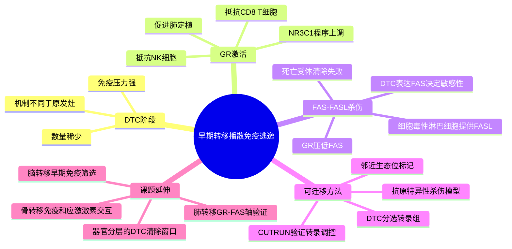

# 糖皮质激素-FAS转移播散免疫逃逸-2026

- 标题：A glucocorticoid-FAS axis controls immune evasion during metastatic seeding
- 发表时间：2026-03-04；Nature 653:567-575，期刊 issue date 为 2026-05-14
- 期刊：Nature
- PubMed：[41781620](https://pubmed.ncbi.nlm.nih.gov/41781620/)
- DOI：[10.1038/s41586-026-10222-2](https://doi.org/10.1038/s41586-026-10222-2)
- 研究类型：三阴性乳腺癌早期转移播散机制研究；结合 4T1 肺定植模型、抗原特异性 CD8+ T 细胞压力、NK/T 细胞杀伤实验、niche labeling 单细胞测序、bulk RNA-seq、CUT&RUN 和药物联合免疫治疗

## 研究问题
早期播散肿瘤细胞（DTC）刚进入肺等远处器官时，数量稀少、免疫压力强，却仍有少数细胞能存活并进入后续转移扩增。文章核心问题是：这些刚定植的 DTC 是否使用了不同于原发灶或宏观转移灶的免疫逃逸程序？如果存在，能否找到可药物干预的关键轴？

## 摘要式结论
文章提出一个清晰的早期转移免疫逃逸模型：在 TNBC 4T1 肺播散模型中，存活下来的 DTC 富集糖皮质激素受体（GR/NR3C1）激活程序；GR 激活使 DTC 同时抵抗 CD8+ T 细胞和 NK 细胞杀伤。机制上，细胞毒性淋巴细胞对 DTC 的关键杀伤通路之一是 FAS-FASL，而 GR 激活会压低肿瘤细胞 FAS，从而降低死亡受体介导的清除。药物抑制 GR 与抗 PD-1 联合可降低转移负荷并延长小鼠生存。

对用户课题最有价值的点不只是“GR 促进转移”，而是它把转移级联中的“播散后早期免疫筛选”单独抽出来：同一批肿瘤细胞在原发灶、循环、DTC、微转移和大转移阶段面对的免疫选择压力不同，因此不能只用终末转移灶的免疫组成反推早期定植机制。

## 文章行文逻辑
1. 先用带可见抗原的 4T1 TNBC 模型和 cognate CD8+ T 细胞，建立一个能观察免疫压力下 DTC 存活的早期肺定植系统。
2. 对免疫压力下存活的 DTC 做转录组分析，发现 GR 激活程序显著富集，并与 DTC 对 T 细胞和 NK 细胞杀伤的抗性相关。
3. 通过优化的 niche labeling 策略捕捉 DTC 及其邻近细胞，识别 FAS-FASL 是针对 DTC 的泛细胞毒性通路。
4. 进一步用功能实验和 GR 结合/调控证据说明，GR 激活可直接或间接压低 FAS，从而让 DTC 躲过 FAS 介导的死亡。
5. 最后把机制推到治疗层面：GR 抑制与免疫治疗联合，比单独免疫治疗更能清除早期 DTC 和降低转移负荷。

## 主要创新点
- 把免疫逃逸定位到“metastatic seeding/DTC 存活”阶段，而不是只分析已经形成的转移灶。
- 将 GR 程序与 FAS-FASL 死亡受体杀伤连接起来，机制链条相对完整：GR 激活 -> FAS 下调 -> DTC 对 CD8+ T/NK 细胞杀伤不敏感 -> 肺转移负荷增加。
- 使用 niche labeling 捕获 DTC 邻近细胞，为研究“少数早期播散细胞和局部免疫细胞接触”提供了比整块组织平均测序更贴近问题的设计。
- 直接给出可测试的治疗组合：GR 抑制加免疫治疗，提示抗转移治疗窗口可早于可见转移灶形成。

## 关键数据类型与是否可下载
- bulk RNA-seq：GEO `GSE313249` 和 `GSE313241`，用于比较不同免疫背景、不同 disease stage 或 Jedi/NSG 条件下肺 DTC 的转录程序。
- scRNA-seq：GEO `GSE313245`，4T1-GFP 与 4T1-Thy1.1 DTC 在 adoptive transfer 后第 7 天从肺中 FACS 分选。
- niche labeling scRNA-seq：GEO `GSE313243`，4T1-shGR 与 shControl DTC 及其标记邻近生态位细胞，用于分析 GR 敲低如何改变 DTC 周围免疫接触。
- CUT&RUN：GEO `GSE313250`，地塞米松处理 4T1 细胞后的 GR 结合/占位数据，用于支持 GR 对 FAS 轴的转录调控。
- 临床数据：TBCRC-030 数据需合理请求；AURORA US、TCGA、TNBC meta-analysis 等为再分析公共资源。

## 可借鉴的方法
- 如果用户后续分析乳腺癌脑/肺/骨/卵巢转移单细胞数据，可把“终末转移灶”拆成阶段假设：DTC 清除、微转移免疫编辑、宏观转移免疫重塑三层，不要把所有转移样本合并成一个 metastasis 类别。
- 在 scRNA 中对恶性细胞计算 GR activation signature、FAS/TNFRSF6 表达、apoptosis/death receptor 模块，并与 CD8+ T、NK、FASLG+ 细胞的邻近或配体-受体关系联动。
- 对肺转移数据，优先测试 `NR3C1`/GR 目标基因高的恶性细胞是否伴随 `FAS` 低表达、细胞毒性邻近信号弱、转移灶免疫清除失败。
- 对脑转移和骨转移，不应直接假设同一方向成立；可以把 GR-FAS 轴作为“早期定植免疫筛选”的候选模块，再看器官生态位是否改变 FASL 来源细胞和死亡受体敏感性。

## 可借鉴的创新点
- 用户课题可以把“激素/应激状态”纳入转移微环境解释：GR 程序既可能来自肿瘤细胞内在状态，也可能受宿主应激、治疗用激素或器官局部炎症背景影响。
- 对 CellChat 或 ligand-receptor 分析，FASLG-FAS 不应只作为普通凋亡通路；它可被定义为“播散细胞清除压力”，再与 GR 目标基因分数做负相关验证。
- 该文提示免疫治疗响应不能只看大转移灶中 T 细胞是否存在，还要看早期 DTC 是否保留对细胞毒性通路的敏感性。

## 与用户课题的潜在关联
这篇文章适合作为乳腺癌远处转移微环境研究的机制支架，尤其服务于肺转移和脑转移的“定植早期免疫逃逸”问题。用户若整合多器官转移单细胞数据，可以把 GR-FAS 轴作为跨器官候选程序：先在恶性细胞中打分，再按转移部位、免疫邻近细胞、FASLG 来源、细胞毒性 T/NK 状态分层。若某个器官中 GR 高但 FAS 未下降，或 FASLG 来源细胞稀缺，则说明器官生态位可能重写了这条轴，不能机械套用肺模型。

## 局限性
- 核心功能证据主要来自 4T1 小鼠肺播散模型，不等同于人源乳腺癌脑、骨、卵巢或临床肺转移队列。
- 模型强调早期 DTC 和肺定植，第 7 天等时间点更适合解释“播散后清除窗口”，不宜直接外推到晚期大转移灶。
- GR 抑制联合免疫治疗的可转化性仍需考虑临床激素使用、免疫相关不良反应和肿瘤亚型差异。
- 数据中的单细胞资源样本数有限，且主要是分选/标记后的模型系统；适合作机制验证和 signature 迁移，不适合直接作为患者分层结论。

## 相关笔记
- [[棕榈酸-中性粒细胞-LCN2肺转移前生态位-2026]]
- [[CHI3L1中性粒细胞肺转移-2026]]
- [[肺泡巨噬细胞与肺转移时序-2024]]
- [[器官嗜性转移营养需求-2026]]
