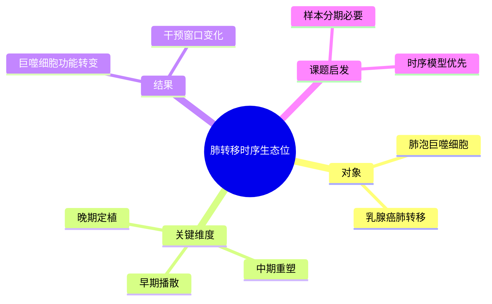

# 肺泡巨噬细胞与肺转移时序

- 发表时间：2024-10-17
- 期刊：Cell
- PubMed：[PMID: 39386358](https://pubmed.ncbi.nlm.nih.gov/39386358/)
- DOI：[10.1016/j.cell.2024.09.036](https://doi.org/10.1016/j.cell.2024.09.036)
- 研究类型：肺转移微环境机制研究 + 单细胞时序分析

## 研究问题
肺驻留肺泡巨噬细胞在乳腺癌肺转移形成过程中起什么作用，它们是在促进还是延缓转移，以及作用时间窗如何界定。

## 摘要式结论
这篇 Cell 的核心贡献是把肺转移微环境从静态描述推进到“时间维度调控”。作者提出肺驻留肺泡巨噬细胞并非始终同质地促癌，而是在转移演进不同阶段扮演具有时序性的调控角色。对用户课题最重要的启发是：分析肺转移 niche 时，必须明确样本处于早期播散、免疫重塑还是成熟转移阶段，否则容易把动态现象误判成稳定 marker。

## 文章行文逻辑
1. 先提出肺是常见转移靶器官，但早期生态位动态不清。
2. 结合模型和单细胞分析描绘肺转移前后免疫重塑。
3. 锁定肺泡巨噬细胞并验证其时序性作用。
4. 讨论微环境窗口期与干预机会。

## 主要创新点
- 把肺转移免疫生态位做成时间序列问题。
- 聚焦肺驻留细胞而非泛化“巨噬细胞总量”。
- 对实验设计非常有指导意义，尤其适合做干预时间窗研究。

## 关键数据类型与是否可下载
- 单细胞 RNA-seq：文中可检索到 BioProject [PRJNA706068](https://www.ncbi.nlm.nih.gov/bioproject/PRJNA706068) 相关线索。
- 小鼠模型时序样本：通常可下载矩阵或原始序列，复现成本中等。
- 功能实验数据：主要来自正文和补充材料。

## 可借鉴的方法
- 做肺转移研究时，按时间点拆分单细胞数据而不是把所有样本混合。
- 可借鉴“宿主肺驻留细胞优先”的分析视角，避免只盯肿瘤细胞。
- 若用户有多时间点模型，可复刻其时序差异分析框架。

## 可借鉴的创新点
- 把器官微环境研究从静态横截面提升为动态生态位研究。
- 为“何时干预”提供比“干预什么”更具体的问题框架。

## 与用户课题的潜在关联
- 对乳腺癌肺转移验证价值很高，尤其适合单细胞或流式验证设计。
- 可与脑转移研究形成对照，看驻留免疫细胞是否同样存在阶段性功能转换。

## 局限性
- 以模型系统为主，向人样本迁移时需谨慎。
- 时序研究依赖取样精度，稍有偏差就会改变解释。
