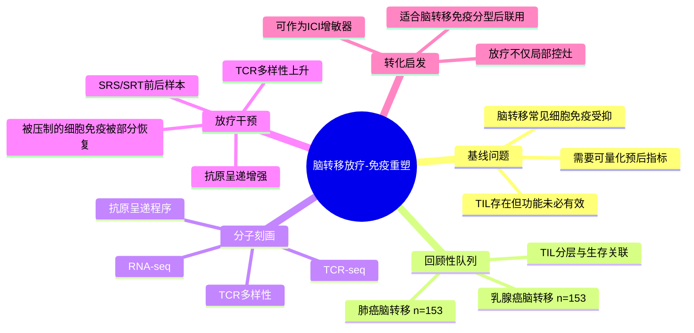

# 脑转移放疗重塑细胞免疫-2026

- 标题：Ionizing radiation enhances prognostically significant cellular immunity programs in the brain metastasis microenvironment
- 发表时间：2026-03-12
- 期刊：Clinical Cancer Research
- PubMed：[PMID 41817317](https://pubmed.ncbi.nlm.nih.gov/41817317/)
- DOI：[10.1158/1078-0432.CCR-25-3525](https://doi.org/10.1158/1078-0432.CCR-25-3525)
- 研究类型：转化研究；回顾性脑转移患者队列结合病理评分、TCR-seq、RNA-seq，并嵌入前瞻性 SRS/SRT 临床试验的放疗前后分子比较

## 研究问题
脑转移灶为什么普遍呈现细胞免疫受抑状态？这种免疫抑制在乳腺癌脑转移中是否具有可量化的预后意义？局部电离辐射是否不仅是“局部控制”手段，还能重新激活脑转移微环境中的 T 细胞免疫程序，从而为放疗联合免疫治疗提供分子依据？

## 摘要式结论
这篇文章把脑转移免疫问题从“有没有免疫细胞浸润”推进到“浸润是否具备克隆多样性和功能活性”。作者在乳腺癌和肺癌脑转移的大样本病理队列中证明：较高的 TIL 水平与更好的结局相关；在乳腺癌脑转移的分子子集中，较高 TCR 多样性同样对应更优预后。进一步利用前瞻性 SRS/SRT 队列的放疗前后样本，作者显示电离辐射可提升 TCR 多样性、增强抗原加工与呈递通路，并部分恢复脑转移灶原本被压制的细胞免疫信号。对用户课题最重要的一点是：放疗在脑转移里不是单纯细胞毒打击，而是可能把“免疫冷”的脑转移推向可被 ICI 利用的免疫活化状态。

## 文章行文逻辑
1. 先在两个独立的脑转移来源队列中建立病理层面的免疫分层，验证 TIL 丰度与生存的关系在乳腺癌和肺癌脑转移中都成立。
2. 再把乳腺癌脑转移样本推进到 TCR-seq 和 RNA-seq，寻找比传统 TIL 评分更可量化、可分子化的预后指标，提出 TCR 多样性是关键读数。
3. 随后比较高低免疫状态样本的转录程序，归纳出有利预后对应的抗原呈递与 T 细胞活化框架，以及不良预后对应的细胞免疫压制状态。
4. 最后引入前瞻性 SRS/SRT 临床试验的放疗前后配对材料，直接测试放疗是否能把上述“有利免疫程序”重新推高，完成从观察关联到干预可塑性的闭环。

## 主要创新点
- 把脑转移免疫预后指标从传统病理 TIL 读数推进到 TCR 多样性这一更接近功能层的分子指标。
- 不是停留在回顾性相关性，而是利用前瞻性放疗前后样本直接展示脑转移免疫程序可被临床干预重塑。
- 提出“脑转移免疫冷环境并非完全固定”，为放疗联合 ICI 的时序设计提供了具体分子支点。

## 关键数据类型与是否可下载
- 病理数据：TIL 分级、临床结局，适合构建免疫分层框架，但通常需依赖原始论文或补充材料二次整理。
- 分子数据：乳腺癌脑转移子集的 TCR-seq 与 RNA-seq；前瞻性 SRS/SRT 队列的放疗前后 TCR/RNA 数据。
- 当前可直接确认的公开入口：论文关联了 [immuneACCESS TCR 数据页面](https://clients.adaptivebiotech.com/pub/fukumura-2026-s)。
- 当前未确认到稳定、明确的全量 RNA-seq GEO/SRA accession；因此本轮将其视为“部分公开、仍需复核共享声明”的资源，而不是已完全验证的下载入口。

## 可借鉴的方法
- 用病理 TIL 分级先做粗分层，再用 TCR 多样性把“浸润多但未必有效”与“真正活跃的细胞免疫”区分开。
- 采用临床干预前后配对样本，而不是只比较不同患者横截面差异，更容易支撑“放疗重塑免疫程序”的因果论证。
- 在后续分析里可把 TCR 多样性、抗原呈递通路、T 细胞效应通路作为一个组合模块，而非拆成零散 marker。

## 可借鉴的创新点
- 将脑转移局部治疗与免疫微环境重编程放在同一分析框架里，适合迁移到“器官定植阶段干预窗口”的研究设计。
- 用“预后相关免疫程序是否被治疗重新拉起”来评价治疗，而不只看肿瘤体积或单个免疫 marker。

## 与用户课题的潜在关联
这篇文章与用户现有脑转移主线高度契合。它可以和 [[脑转移TRM与TLS景观-2026]] 形成互补：后者强调脑转移内部的免疫结构异质性，这篇则强调放疗能否把低活性的脑转移推向更有利的细胞免疫状态。它也可与 [[ACSS2抑制铁死亡驱动脑转移-2026]]、[[FGF2-NCAM1-FGFR1脑转移？2026]] 一起组成“脑转移适应”三层框架：
- 代谢耐受层：`ACSS2/SLC7A11`
- 生态位输入层：`FGF2/NCAM1-FGFR1`
- 免疫可塑性层：TIL/TCR diversity/antigen presentation

如果后续用户整合脑转移 bulk 或单细胞队列，可以优先验证：
- 低免疫脑转移是否同时伴随抗原呈递程序下调。
- 放疗相关样本中，TCR 多样性升高是否伴随 TRM/TLS 或 IFN 响应模块变化。
- 哪些脑转移亚群最可能从“先局部放疗、再免疫治疗”中获益。

## 局限性
- 研究对象是脑转移总体框架，虽然纳入了乳腺癌脑转移大队列，但结论并非乳腺癌独占机制。
- 当前公开可直接确认的数据共享以 TCR 页面为主，全量 RNA 原始入口尚未在本轮检索中确认。
- 放疗诱导的免疫激活不等于所有病例都能从 ICI 获益，临床转化仍需要更细的分层和时序验证。

## 相关笔记
- [[脑转移TRM与TLS景观-2026]]
- [[ACSS2抑制铁死亡驱动脑转移-2026]]
- [[乳腺癌脑转移配对RNA队列-2026-06-04]]

