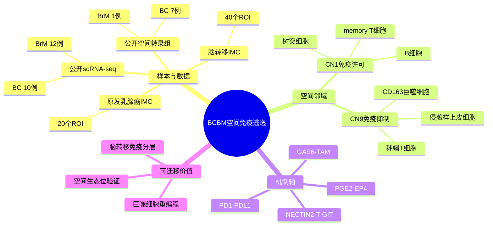

# 脑转移空间免疫 CD163 巨噬细胞-2026

- 标题：Spatial immune atlas of breast cancer brain metastasis reveals CD163(+) macrophage reprogramming associated with immune escape
- 发表时间：2026-06-24
- 期刊：Journal for ImmunoTherapy of Cancer
- PubMed/DOI 链接：
  - PubMed：https://pubmed.ncbi.nlm.nih.gov/42342408/
  - DOI：https://doi.org/10.1136/jitc-2025-014421
- 研究类型：人类乳腺癌脑转移空间免疫图谱；整合 IMC、高维组织邻域分析、公开 scRNA-seq、公开空间转录组、配体-受体推断和体内功能验证

## 选择理由

本轮检索 2026-06-24 至 2026-06-26 的 PubMed 新入库窗口后，多数条目是治疗方案、病例、纳米材料或泛免疫综述；这篇 JITC 文章直接覆盖乳腺癌脑转移、空间免疫微环境、巨噬细胞重编程和免疫逃逸，且和 vault 中已有的 `Cancer Cell 2026` 脑转移免疫分型资源互补。因此本轮优先精读这篇新文，而不是继续添加低信号的泛癌或纯预后模型文章。

## 研究问题

乳腺癌脑转移的免疫逃逸是否由可定位的空间生态位驱动？原发乳腺癌与脑转移之间，巨噬细胞、T 细胞、B 细胞、树突细胞和肿瘤上皮细胞的空间邻域是否发生系统性重排？这些空间结构能否指向可组合干预的免疫抑制轴？

## 摘要式结论

作者用人类原发乳腺癌和脑转移组织的 IMC 数据重建单细胞级组织架构，发现脑转移不是简单的“免疫冷”状态，而是从较免疫许可的 CN1 邻域转向含 CD163(+) 巨噬细胞、侵袭样上皮细胞和耗竭 T 细胞的 CN9 抑制性生态位。公开 scRNA-seq 与空间转录组复核支持这种巨噬细胞重编程和邻域重排。配体-受体分析进一步提示 PD-1/PD-L1、GAS6-TAM、NECTIN2-TIGIT、PGE2-EP4 等免疫抑制通路可能共同维持脑转移免疫逃逸。

## 文章行文逻辑

1. 以脑转移免疫治疗反应差为临床背景，提出问题不只是免疫细胞数量不足，而是空间组织方式和细胞互作不清楚。
2. 用高通量 IMC 对人类原发乳腺癌和脑转移 ROI 建图，先识别主要细胞类别和上皮、髓系、T 细胞亚群。
3. 比较原发灶和脑转移，突出巨噬细胞极化转变和 CD163 相关亚群保留。
4. 通过细胞邻域分析发现 CN1 免疫许可结构丢失、CN9 免疫抑制结构扩张。
5. 整合公开 scRNA-seq 与空间转录组，验证细胞注释、CD163 表达模式和 CN1/CN9 类空间域。
6. 最后用配体-受体推断与体内模型验证，把空间图谱推进到可干预的免疫调节通路。

## 主要创新点

- 把乳腺癌脑转移免疫逃逸从“细胞比例差异”推进到“空间邻域重排”，尤其是 CN1 丢失和 CN9 扩张。
- 将 CD163(+) 巨噬细胞放在脑转移免疫抑制生态位的空间中心，而不是只作为 bulk 或 scRNA marker 解读。
- 用 IMC、scRNA-seq、空间转录组和配体-受体推断形成互证链条，避免单一组学直接推断空间互作。
- 给出多个可组合免疫干预轴，适合连接用户课题中的 TAM/MTC、TRM/TLS、TIMP1-星形胶质细胞和脑转移免疫逃逸线索。

## 关键数据类型与是否可下载

- 新生成或核心数据：人类原发乳腺癌 20 个 ROI、脑转移 40 个 ROI 的高维 IMC 图像/单细胞空间定量。PubMed 摘要未显示稳定 accession；未核验全文前，不应写成可直接下载数据集。
- 复用公开数据：scRNA-seq 覆盖 BC 10 例、BrM 12 例；空间转录组覆盖 BC 7 例、BrM 1 例。摘要未列出 accession，需要从全文方法或补充材料继续核验。
- 立即可用的邻近验证资源：vault 中已有 `GSE322943`、`GSE324453/GHGA` 等乳腺癌脑转移免疫图谱线索，可用于做 CD163/TAM、TIGIT/NECTIN2、PGE2/EP4 方向的外部验证，但它们不是本文新增 accession。

## 可借鉴的方法

- 先用高维空间蛋白图谱定义细胞邻域，再用 scRNA-seq 精细化细胞状态，最后用空间转录组验证解剖定位。
- 对脑转移免疫微环境不要只做细胞比例差异；应显式比较免疫许可邻域和免疫抑制邻域的面积、组成和互作轴。
- 配体-受体分析需要落回空间邻域中解释：只在抑制性 CN9 或相关生态位富集的互作，更适合提出机制假设。
- 用户后续做跨器官转移时，可把“生态位类型”作为中间层变量，比较脑、肺、骨、卵巢转移是否分别对应不同的髓系-上皮-淋巴细胞空间组合。

## 可借鉴的创新点

- 把 CD163(+) 巨噬细胞从单个 marker 提升为脑转移空间免疫抑制生态位的组织者。
- 将 CN1/CN9 这类空间邻域逻辑迁移到用户课题：先问“哪个生态位扩张或消失”，再问“哪个细胞群或通路驱动”。
- 把多个免疫检查点和代谢炎症通路放在同一空间框架内，适合设计组合验证，而不是逐个 marker 解释。

## 与用户课题的潜在关联

- 脑转移：可直接服务于乳腺癌脑转移免疫抑制、TAM/MTC、TRM/TLS 缺失或保留、巨噬细胞重编程等方向。
- 肺/骨/卵巢转移：虽然本文不直接覆盖这些器官，但 CN1/CN9 的思路可作为跨器官空间生态位比较模板。
- 公共数据验证：优先在已有 BCBM 资源中测试 `CD163`、`MRC1`、`TIGIT`、`NECTIN2`、`AXL/MERTK`、`PTGER4` 等轴是否与免疫冷/热分层、髓系富集和预后相关。
- 机制叙事：可以和既有 `TIMP1星形胶质细胞脑转移免疫抑制-2025`、`脑转移TAM-MTC单细胞图谱-2026`、`脑转移单细胞空间免疫图谱-2023` 互相连接，形成“脑生态位细胞互作 -> 髓系重编程 -> 免疫逃逸”的层级。

## 局限性

- 摘要层面未确认 IMC 原始数据或单细胞空间表格是否公开，也未列出复用公开数据的 accession；后续正式下载前必须查全文数据可用性和补充材料。
- IMC ROI 数量有限，适合提出空间生态位假设，但不宜单独支持强临床分层结论。
- 公开 scRNA-seq 与 ST 数据来自外部队列，存在批次、平台和样本构成差异；整合结果应当被视为互证而非完全等价复制。
- 体内功能验证支持通路可干预性，但模型中的脑转移免疫生态位不能直接等同于人类 BCBM。

## 相关笔记

- [[乳腺癌脑转移免疫景观-2026]]
- [[脑转移单细胞空间免疫图谱-2023]]
- [[脑转移TAM-MTC单细胞图谱-2026]]
- [[TIMP1星形胶质细胞脑转移免疫抑制-2025]]
- [[乳腺癌脑转移空间多组学线索-2026-05-26]]
