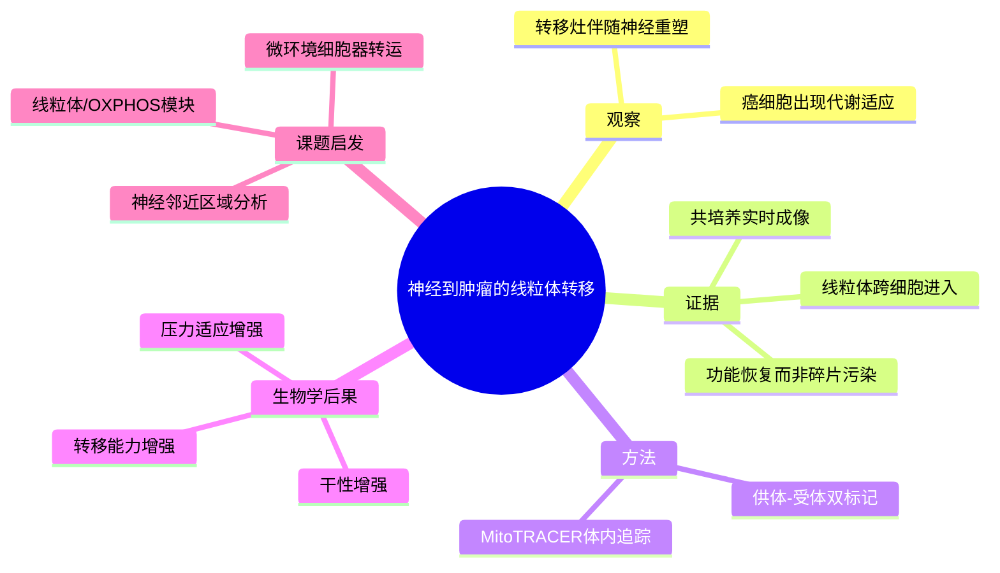

# 神经线粒体转移

- 标题：Nerve-to-cancer transfer of mitochondria during cancer metastasis
- 发表时间：2025-08-27
- 期刊：Nature
- PubMed：[PMID: 40838300](https://pubmed.ncbi.nlm.nih.gov/40838300/)
- DOI：[10.1038/s41586-025-09176-8](https://doi.org/10.1038/s41586-025-09176-8)
- 研究类型：机制研究 + 成像追踪 + 跨癌种验证

## 研究问题
转移过程中，肿瘤细胞如何在远处微环境中获得额外代谢支持？周围神经是否直接向癌细胞转移功能性线粒体？

## 摘要式结论
这篇文章的核心不是“神经参与肿瘤”，而是更具体地证明：神经元能够把完整、可工作的线粒体转交给癌细胞，帮助其应对代谢压力并提升干性与转移能力。作者还建立了 `MitoTRACER` 谱系追踪体系，使这类细胞器跨细胞转移第一次能在体内较有说服力地被追踪。

## 文章行文逻辑
1. 从转移灶周围神经重塑与癌细胞代谢适应现象切入。
2. 用共培养、实时成像和功能阻断证明神经元到癌细胞存在线粒体转移。
3. 用缺失线粒体 DNA 的受体细胞和代谢读出证明这些线粒体是“功能性的”，不是碎片污染。
4. 开发体内追踪系统 `MitoTRACER`，把现象从体外推进到体内。
5. 最后回到生物学意义：获得神经来源线粒体的癌细胞更具干性，更利于转移扩增。

## 主要创新点
- 不是传统的神经营养因子或轴突分泌物，而是直接研究细胞器级别的供给。
- `MitoTRACER` 很有方法学价值，后续完全可迁移到免疫细胞-肿瘤细胞、基质细胞-肿瘤细胞互作研究。
- 把“微环境支持转移”从分泌信号层推进到代谢器官层。

## 关键数据类型与是否可下载
- 成像与谱系追踪数据：期刊页面 source data 可获取。
- 转录组/功能实验数据：按论文数据共享说明可下载。
- 体内追踪系统与构建策略：方法细节公开，复现主要卡在模型构建和成像条件，而不是算法黑箱。

## 可借鉴的方法
- `MitoTRACER`：适合追踪供体细胞到受体细胞的线粒体迁移。
- 共培养设计：神经元-肿瘤细胞直接接触与隔离培养要并行，才能区分可溶性因子和物理转移。
- 受体功能验证：建议像文中一样把“是否转移”与“是否恢复代谢功能”分开测。
- 压力条件设置：转移相关低营养/高压力条件下更容易看出线粒体借用的生物学意义。

## 可借鉴的创新点
- 对微环境互作不只做配体-受体，可以进一步问“细胞器、代谢物、囊泡”是否被转运。
- 若你做单细胞或空间组学，可考虑建立“神经邻近-代谢激活-转移潜能”三段式分析框架。

## 与用户课题的潜在关联
- 脑转移场景尤其相关，因为神经环境本身就是核心生态位。
- 若课题中已有脑转移单细胞/空间数据，可优先看神经标志邻近区域是否伴随 OXPHOS、线粒体转运、干性程序升高。
- 如果计划做机制延伸，这篇文章提供了“神经微环境支持乳腺癌远处转移”的新角度。

## 局限性
- 跨癌种结论很强，但乳腺癌特异性证据需要单独加固。
- 体内细胞器转移虽被更好地追踪，但定量标准和背景噪声控制仍是复现难点。
- 对免疫系统在这一过程中的调节作用讨论不多。

## 思维导图

