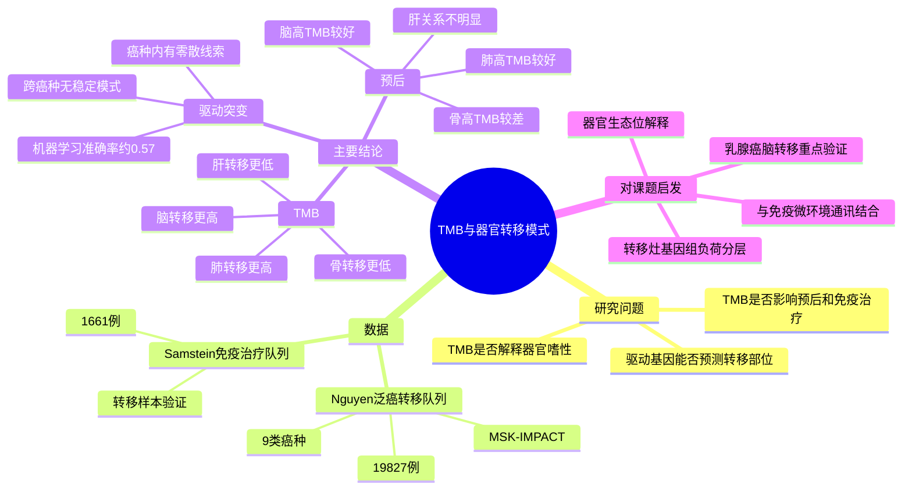

# TMB 器官转移模式 - 2026

## 基本信息

- 原始论文：Tumor mutational burden as a determinant of metastatic dissemination patterns.
- 中文科普来源：微信公众号 GENE火花花《刷新认知！TMB居然决定癌细胞往哪儿转移？脑/肺转移多为高TMB，免疫效果好；骨/肝转移多为低TMB，别盲目用免疫》
- 期刊：Molecular Oncology
- 年份：2026
- PMID：41589477
- PMCID：PMC13155152
- DOI：10.1002/1878-0261.70200
- 链接：
  - PubMed：https://pubmed.ncbi.nlm.nih.gov/41589477/
  - PMC full text：https://pmc.ncbi.nlm.nih.gov/articles/PMC13155152/
  - DOI：https://doi.org/10.1002/1878-0261.70200
- 研究类型：泛癌转移样本基因组回顾性分析；独立免疫治疗队列验证
- 核心关键词：TMB、organotropism、metastasis、immunotherapy、brain metastasis、lung metastasis、bone metastasis、liver metastasis

## 一句话结论

这篇文章的核心不是“某一个驱动基因决定癌细胞转移到哪里”，而是：在泛癌转移样本中，转移灶的整体突变负荷 TMB 与器官转移模式、预后和免疫治疗获益存在部位依赖的统计关联；其中 CNS/脑转移和肺转移整体 TMB 更高，肝转移和骨转移整体 TMB 更低。

## 研究问题

传统的 seed and soil 假说强调转移不是随机事件，而是肿瘤细胞内在特征与器官微环境共同筛选的结果。本文问了一个偏基因组层面的问题：

1. 是否存在跨癌种、跨器官通用的驱动突变组合，可以解释癌细胞为什么偏向脑、肺、肝或骨？
2. 如果单个驱动突变解释力有限，整体突变负荷 TMB 是否能更好地反映器官嗜性转移？
3. 不同转移部位中，高 TMB 是否对应不同的预后或免疫治疗获益？

## 数据与方法

- 主分析队列来自 cBioPortal 中 Nguyen et al. 泛癌转移测序数据。
- 总样本：19,827 例，覆盖膀胱癌、乳腺癌、结直肠癌、子宫内膜癌、黑色素瘤、非小细胞肺癌、卵巢癌、胰腺癌、前列腺癌。
- 原始数据包括 25,775 个样本，筛选后用于最终分析；其中 12,030 个原发肿瘤样本，7,797 个转移样本。
- 重点分析四类最常见的血行远处转移部位：骨、CNS/脑、肝、肺。
- TMB 分析为控制 panel size，主要使用 MSK-IMPACT468 测序样本。
- 免疫治疗验证队列来自 Samstein et al. 数据，共 1,661 名接受免疫治疗患者；其中 590 例转移患者进入对应分析。
- 机器学习模型包括 XGBoost、elastic net 和 random forest，用于检验突变谱能否预测转移部位。
- 高 TMB 阈值采用 10 Mut/Mb，这是实体瘤免疫治疗相关研究中常见的 pan-cancer cut-off。

## 主要发现

### 1. 跨癌种看，驱动基因突变不能稳定预测转移部位

论文先比较了各转移部位中高频突变基因的模式。PCA 和层次聚类显示，转移样本主要按原发癌种聚类，而不是按转移器官聚类。也就是说，一个肺癌脑转移样本在突变谱上更像肺癌，而不是更像“脑转移”这一类器官生态。

机器学习模型进一步验证了这个判断：XGBoost、elastic net 和 random forest 平均准确率约 0.57，说明仅靠常见突变谱很难可靠判断转移部位。

### 2. 分癌种看，有一些器官相关突变，但不是统一规律

论文并没有否认所有突变和器官转移都无关。按癌种拆开后，确实出现若干部位相关信号：

- 乳腺癌 CNS/脑转移中 MAP2K2 突变更富集。
- 非小细胞肺癌肺转移中 EGFR 突变更常见；肾上腺转移中 NF1、FAT1、ARID1A、PTPRD、EPHA5 更富集。
- 结直肠癌淋巴结转移中 BRAF 突变更富集，腹腔内转移中 APC 突变更少。
- 黑色素瘤肺转移中 PTPRT 信号较突出。
- 胰腺癌淋巴结转移中 RB1、SETD2 更富集，肺转移中 KMT2C 更少见。
- 卵巢癌中 MED12 与 genital relapse 相关。

这些结果更适合被理解为“癌种内的线索”，不能被简化为通用的器官转移密码。

### 3. TMB 与转移部位之间的关联更清晰

主队列显示，CNS/脑转移和肺转移的 TMB 高于肝转移和骨转移。独立免疫治疗队列中，CNS/脑转移高 TMB 的趋势被验证，肺转移也有偏高趋势。

更细地看：

- CNS/脑转移在 NSCLC、卵巢癌、乳腺癌中是 TMB 较高的转移部位。
- 黑色素瘤肺转移 TMB 明显偏高。
- Sankey 图显示，约一半 CNS/脑转移样本属于高 TMB；肺转移其次；肝和骨大多为低 TMB。

这提示 TMB 可能比单个驱动突变更能描述“哪些肿瘤细胞更容易适应某类器官生态位”。

### 4. 高 TMB 的预后意义依赖转移部位

整体上，高 TMB 与更长总生存相关，这与免疫治疗领域对 TMB 的一般认识相符。但按转移部位拆开后，方向并不完全一致：

- CNS/脑转移：高 TMB 与更好预后相关。
- 肺转移：高 TMB 与更好预后相关。
- 骨转移：高 TMB 反而与更差预后相关。
- 肝转移：TMB 与预后关系不明显。

在免疫治疗队列中，CNS/脑转移高 TMB 患者的获益信号最明显。公众号文章把这一点解释为“脑转移高 TMB 免疫治疗效果好”，但临床上仍要结合癌种、PD-L1、MSI/MMR、驱动突变、治疗线数、脑病灶状态和局部治疗史判断。

## 公众号文章的准确部分与需要降调的部分

### 基本准确

- “单个致癌/驱动基因很难决定癌细胞往哪里转移”：与论文主结论一致。
- “脑/肺转移总体 TMB 较高，肝/骨转移总体较低”：与主分析一致。
- “TMB 和免疫治疗获益有关，尤其 CNS/脑转移高 TMB 有较强信号”：有论文支持。

### 需要谨慎

- “TMB 决定癌细胞往哪儿转移”：表述过强。论文更准确的说法是 TMB may have greater influence，属于关联和候选解释，不是单因素决定论。
- “骨/肝转移别盲目用免疫”：方向上可作为提醒，但不能推出骨或肝转移患者都不适合免疫治疗；还要看癌种、MSI/MMR、PD-L1、药物组合和临床证据。
- “脑/肺转移高 TMB 首选免疫治疗”：临床建议过于直接，论文不等于治疗指南。
- “转移灶 TMB 一定比原发灶更准确”：论文支持转移部位 TMB 有价值，但临床检测还受样本可及性、panel、肿瘤纯度、治疗压力和时序影响。

## 对我们课题的可复用价值

1. 器官嗜性转移解释框架  
   可作为一个“基因组负荷层”的补充维度，和已有的脑、肺、骨、卵巢转移微环境笔记并列：不是只看细胞通讯和 niche，也要看转移灶本身的突变负荷。

2. 图表和分层思路  
   可借鉴其按 organ site 分层的方式：brain / lung / liver / bone 作为主轴，再叠加 cancer type、TMB high/low、immunotherapy exposure、OS。

3. 与 CellChat / 细胞通讯分析的结合  
   如果后续有转移灶 WES 或 panel 数据，可以把 TMB high/low 作为样本分组，再比较巨噬细胞、T cell、成纤维细胞或内皮细胞通讯轴是否不同。例如：
   - 高 TMB 脑转移是否伴随更强 antigen presentation / T cell exhaustion / checkpoint ligand 轴？
   - 低 TMB 骨转移是否更依赖 osteogenic niche、CAF、myeloid suppression 或 ECM remodeling？
   - 肝转移中 TMB 解释力弱，是否说明肝脏免疫耐受和代谢生态比肿瘤突变负荷更主导？

4. 对乳腺癌转移的直接启发  
   论文中乳腺癌 CNS/脑转移 TMB 较高，并提示 MAP2K2 富集。这可以和已有的乳腺癌脑转移免疫景观、TIMP1-星形胶质细胞、p53-脂代谢、TRM/TLS 等笔记互相连接。

## 可借鉴的方法

- 使用公开泛癌转移队列做 organ-site 分层，不只按癌种分组。
- 对驱动基因与 TMB 分开建模，避免把“某个突变”和“总体突变负荷”混在一起解释。
- 控制测序 panel 尺寸后再比较 TMB，避免不同 panel 引起系统偏差。
- 用独立免疫治疗队列验证 TMB 与预后的方向。
- 对结果做癌种内和泛癌两个层级的解释，避免泛癌结论掩盖癌种特异性。

## 局限性

- 主要是回顾性公开队列分析，不能证明 TMB 直接因果决定转移器官。
- MSK-IMPACT panel 数据不是全外显子组，TMB 估计受 panel、肿瘤纯度和检测流程影响。
- 转移部位样本量不均衡，肝转移数量远高于脑、骨、肺，可能影响统计稳定性。
- 泛癌结果受癌种构成影响：NSCLC 和黑色素瘤天然 TMB 较高，也更常见脑/肺转移。
- 免疫治疗队列用于验证很有价值，但并不是随机临床试验，治疗方案、线数和病灶状态存在异质性。
- 对乳腺癌而言，这篇文章提供方向性线索，但不是乳腺癌专属机制研究；后续仍需乳腺癌转移灶队列验证。

## 思维导图

## 相关笔记

- [[乳腺癌脑转移单细胞图谱-2026]]
- [[脑转移TRM与TLS景观-2026]]
- [[TIMP1星形胶质细胞脑转移免疫抑制-2025]]
- [[器官嗜性转移营养需求-2026]]
- [[前转移生态位形成与干预综述-2024]]
