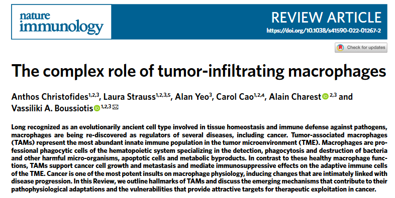

> [!note] 🗓️ 创建时间
> **2025-12-17 02:35**

# 🧾 肿瘤浸润巨噬细胞的复杂作用
[[]]

| 项目             | 信息                      |
| -------------- | ----------------------- |
| 🏷️ **期刊**     | Nature immunology       |
| 📅 **发表时间**    | 2022-8                  |
| ✉️ **通讯作者**    | Vassiliki A. Boussiotis |
| 🏛️ **单位/实验室** | 哈佛医学院, 波士顿, 美国          |
| 🔗 **PMID**    | 35879449                |
| 🔗**类型**       | **综述**                  |
|                |                         |
Boussiotis实验室    
- Beth Israel Deaconess Medical Center, Division of Hematology-Oncology       
- 长期致力于T细胞共刺激/共抑制通路（尤其是PD-1）、骨髓类细胞免疫调节及肿瘤免疫微环境（TME）的研究。
- 

---

# 🧩 1. 摘要

> [!tip] 提示： ① **放摘要截图**（拖进来即可）；② 摘要全文。

**📌 摘要截图**  

**🈶 摘要中文  
- 长期以来，巨噬细胞被认为是一种进化上古老的细胞类型，参与**组织稳态和免疫防御**，如今它们正被重新发现为多种疾病的**调控子**，包括癌症。
- 肿瘤相关巨噬细胞是肿瘤微环境中最丰富的先天免疫群体。
- 巨噬细胞是造血系统的专业吞噬细胞，专门检测、吞噬和消灭病菌及其他有害微生物、凋亡细胞和代谢副产物。
- 与这些健康的巨噬细胞功能相反，TAMs支持癌症生长和转移，并对TME的适应性免疫细胞产生免疫抑制作用。
- 癌症是巨噬细胞生理中最强烈的伤害之一，会引发与疾病进展密切相关的变化。
- 在本综述中，我们概述了TAMs的特征，并讨论促成其病理生理适应的新机制，以及为癌症治疗开发提供有吸引力的靶点的脆弱性。

---

# 🎯 2. 经典单核和巡逻单核细胞，组织驻留巨噬细胞

> [!tip] 提示： 用 1–2 句话写清：**作者想解决什么关键难题**/空白？

紧急骨髓形成，分化受阻导致具有免疫抑制和肿瘤促进特性的骨髓细胞积累，这些细胞称为MDSCs。
![[Pasted image 20251217143544.png]]

**骨髓来源单核细胞**在转移部位的招募和保留主要由 ==CCR2-CCL2== 调控。
**巡逻性单核细胞**在转移部位积累，协调 ==IL-15== 介导的NK细胞招募和激活，从而抑制癌症的侵袭和生长。
**组织驻留巨噬细胞**在癌症生长中的作用似乎具有**器官特异性**。

备注：
病原体相关分子模式
损伤相关分子模式

# 🧭 3. 骨髓来源单核细胞转化为TAMs

![[Pasted image 20251217145503.png]]

肿瘤中髓系细胞（尤其 BM 来源单核细胞）被招募进肿瘤后，在特定信号与微环境压力下“转化”为 TAM；这一过程高度依赖==**整合素激活**==与 ==PI3Kγ== 轴，并产生空间/功能异质的 TAM 亚群，从而驱动血管生成、免疫抑制与转移。

TME 分泌的 ==**GM-CSF、IL-1β、SDF1α、VEGF、CSF1、CCL2**== 等细胞因子和趋化因子，促进应急髓系生成、白细胞趋化、外渗。

**IL-1β / SDF1α / VEGF** 等通过 **GPCR、RTK、TLR/IL-1R** 触发
- **Ras → PI3Kγ**（髓系细胞中主表达的 PI3K 亚型）
    
- **PI3Kγ → BTK / PLC / RasGRP/CalDAG-GEFs → Rap1 → RIAM**
    
- **Rap1–RIAM** 模块驱动 **肌动蛋白重排 + talin 构象变化 → 整合素激活**
    
- 最终结果：更强的**黏附与迁移** → 单核细胞更有效进入肿瘤并形成 TAM。

---

同一个肿瘤内的 TAM 子群可因**空间生态位**不同而功能不同：
- ==**Tie2⁺== TAM（血管周围）**：支持血管生成、肿瘤生长，并与化疗后复发相关。
    
- **缺氧区 TAM（==Sema3A–Nrp1== 轴）**：被招募到无血管/缺氧区域后获得促血管生成和免抑特性；之后 **Nrp1 下调**，Sema3A 通过 plexinA1/A4 的“停止信号”把 TAM **困**在缺氧区。
    
- **代谢塑形**：缺氧区 TAM 上调 ==**REDD1（mTOR 负调控）**== → 抑制糖酵解 → 促进异常血管形成 → 推动转移。
    
- **转移相关巨噬细胞（MAM）**：在远端位点“护送”癌细胞、帮助定植形成转移灶。
    
- **抗转移因素 ==IRF8**==：IRF8 imprint 的巨噬细胞程序可抑制转移（相当于“刹车”）。
    
- **分泌蛋白酶（MMP 等）** 的 TAM：促进组织重塑、单核迁移，也促进肿瘤细胞迁移/入血/远端定植，启动转移灶。

总结：
- **Tie2⁺ TAM**：TAM 中 TEK(Tie2) 高表达的亚群，常驻血管周围，响应 Angiopoietin 信号，促进血管生成与治疗后复发相关的血管重建。
    
- **Sema3A–Nrp1 轴**：缺氧肿瘤区域通过 Sema3A 招募 Nrp1⁺ TAM 并通过 plexin-stop signals 困留在缺氧生态位，使其获得促血管生成与免疫抑制表型。
    
- **空间生态位**：可按结构（血管/缺氧/边界）、距离梯度或邻域共定位模式来操作性定义，并用空间证据（距离/共定位/域识别）把“位置—状态—功能”串起来。

# 🧭 4. 原发性和转移性癌症中的BM来源巨噬细胞和Trm

TRMs（组织驻留巨噬细胞）因胚胎期定植且自我更新，往往在转移发生前就已存在于靶器官并能塑造“前转移生态位”；而转移灶更常由骨髓来源的单核/巨噬细胞（BM-derived macrophages/TAMs）主导，二者在原发与转移中的作用分工不同，并且肿瘤类型会对它们施加不同的基因调控模式。

在==乳腺癌转移小鼠模型==里，肺的 TRMs（**alveolar macrophages，肺泡巨噬细胞**）在转移前就能“预热”生态位：

- **通过补体 C5a 受体介导增殖** → 肺泡巨噬细胞在“前转移肺”累积
    
- 造成一串免疫抑制链条：
    
    - **肺 DC 数量和成熟下降**
        
    - **TH1 反应被抑制**
        
    - → **肺转移负荷上升**

三个**==肺癌模型==**的结论:

- **BM-derived macrophages**：更偏向促进**转移扩散**
    
- **TRMs**：更偏向支持**原发灶肿瘤细胞增殖**

==肝==的 TRMs 是 **Kupffer cells (KCs)**，这段强调“复杂性”：

- **TREM-1 激活 KC** → 分泌 IL-6、IL-1β、TNF、CCL2、CXCL10 等 → 炎症性肝损伤 → 促进肝癌发生（carcinogenesis）
    
- HCC 里 **CCL2 高表达**；阻断 **CCL2–CCR2** 能减少 TAM 累积并抑制肿瘤增长（提示 KC/CCL2 轴在塑造免疫 TME 中很关键）
    
- 但 KC 也可能有**抗转移**作用：KC 缺失小鼠里 CRC 肝转移更多

总结：
- 肺：**TRM（肺泡巨噬细胞）可在转移前通过 C5aR 增殖、抑制 DC 成熟与 TH1 反应来建立前转移生态位。**
    
- 分工：**BM-derived macrophages 更促进转移扩散，而 TRMs 更支持原发肿瘤细胞增殖（模型依赖）。**
    
- 肝：**Kupffer cells 通过 TREM-1→炎症因子促进致癌，但也可能作为门卫限制 CRC 肝转移，体现 TRMs 的情境依赖性。**
    
- 脑：**GBM（原发）由 microglia/TRMs 与 BM-derived TAMs 混合构成且转录印记独特；脑转移瘤则主要由 BM-derived TAMs 主导。**

# 🧭 5. 癌症中的巨噬细胞多样性

TAM 在同一肿瘤内、不同肿瘤间都高度异质；传统 M1/M2 二分法已不够，但仍常被用作经验标记。更准确的理解是：TME 的营养/代谢物/氧梯度塑造 TAM 的免疫代谢状态（尤其脂质、ER stress、谷氨酰胺、乳酸等），进而决定其免抑或抗肿瘤功能；单细胞与空间技术正在把这种异质性系统化。

- 过去把 TAM 简化成“偏 M2、远离 M1”的极简框架。
    
- **M1（经典促炎/杀肿瘤）**常用标记：CD80、CD86、MHCII、iNOS、CD68；与吞噬肿瘤细胞、招募 T 细胞相关。
    
- **M2（抗炎/免疫静息）**常用标记：CD206、CD204、VEGF、CD163、Arg-1；与免抑和促肿瘤相关。
    
- 老框架曾强调代谢对应：M1 靠糖酵解，M2 靠脂肪酸氧化（FAO）。
    
- **现在认为这个框架不够准确**，但由于临床预后关联、历史经验丰富，很多研究仍会用这些 markers 当“操作性描述”。

### A) 脂质组成 → ER stress → TAM 促肿瘤极化

- 肿瘤产生的 **β-glucosylceramide** 改变 ER 膜脂质组成 → 触发 **IRE1 依赖的 ER stress**。
    
- ER stress 中 ==**IRE1–XBP1**== 与 ==**IRE1–STAT3**== 两条轴共同被激活 → 推动 TAM **促肿瘤极化 + 生存优势**。
    
- 干预这些轴（或维持 ER 膜脂质组成）→ **削弱 TAM 促肿瘤能力**，抑制肿瘤进展。  
    👉 关键点：**脂质对 TAM 的影响不一定通过“供能”，而是通过“膜组成/应激信号/转录网络”。**
    

### B) 谷氨酰胺代谢：决定免抑 vs APC 功能

- 阻断谷氨酰胺代谢的小分子抑制剂，在乳腺癌小鼠模型中可通过：
    
    - **增强巨噬细胞活化**
        
    - **抑制 MDSC 生成**  
        → 降低肿瘤生长与转移。
        
- 抑制 ==**谷氨酰胺合成酶（glutamine synthetase）==**甚至能把 TAM 转成**效应型 APC**，产生更强抗肿瘤作用。
    
- 多组学转录-代谢 profiling 指出：**免抑 M2-like 状态依赖谷氨酰胺分解（catabolism）**，缺谷氨酰胺会让它“站不住”。
    
- 机制层面：谷氨酰胺分解产生 **αKG**（α-ketoglutarate）对 M2-like activation 很重要；并且 **αKG/琥珀酸（succinate）比值**高更偏 M2，低更偏 M1。  
    👉 关键点：**TAM 的“免抑倾向”可以被代谢节点（谷氨酰胺–αKG–表观遗传）塑形。**
    

### C) ==乳酸==与 MHCII^lo / MHCII^hi TAM：代谢→功能→预后

- 不同 MHCII 水平的 TAM（MHCII^lo vs MHCII^hi）对应不同代谢特征与功能。
    
- **MHCII^lo TAM** 能利用 TME 中丰富的乳酸：
    
    - 支持氧化代谢
        
    - 增强精氨酸代谢
        
    - **增强对 T 细胞的抑制能力**  
        👉 关键点：**同样是 TAM，亚群之间可能是“不同燃料 + 不同免疫功能”的组合。**

# 🧭 6. TAM在炎症和免疫抑制中的应用
![[Pasted image 20251217172256.png]]

- 驱动突变/癌基因 → (M-CSF/GM-CSF, IL-6/IL-1/IL-8, CCL2/CCL5/CXCL12)
    
- DAMPs → PRRs → 炎症级联
    
- 外泌体 DNA/RNA → STING/AIM2/TLR3 (+ NLRP3) → 单核招募
    
- BM 应急髓系生成 → PMN-MDSC / M-MDSC → 入肿瘤 → TAM
    
- 促炎通路（Type I IFN 等）招 CD8，但被劫持 → 免抑并存
    
- TAM 吞噬肿瘤 → AIM2 切 cGAS → PD-L1/IDO ↑
    
- TAM TLR/吞噬 → Tim3/Tim4/PD-1/PD-L1 ↑ + SIRPα–CD47 → 吞噬/炎症小体/效应因子 ↓
    
- PD-1/PD-L1 阻断 → TAM 功能恢复（但亚群/条件待定义）

